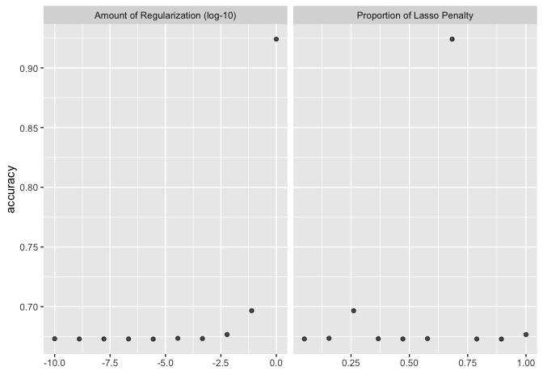
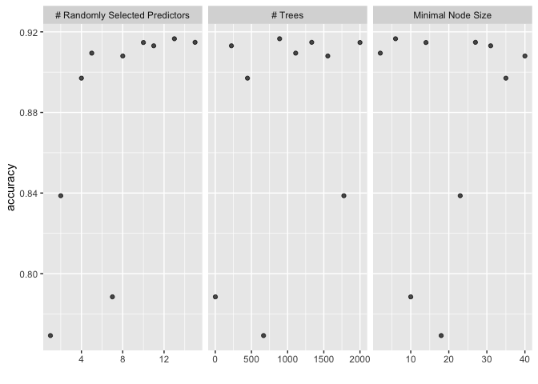
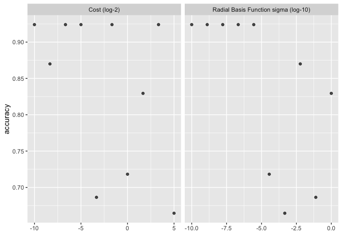
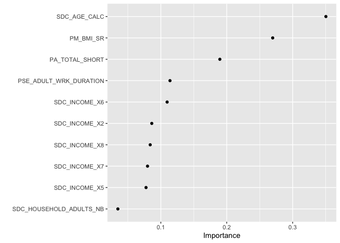
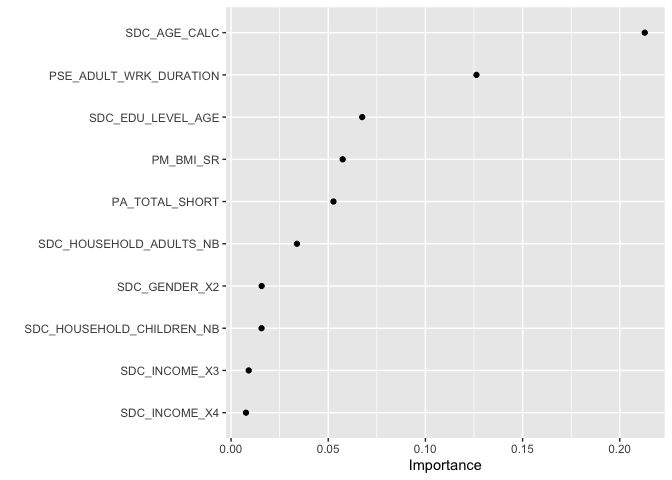

``` r
knitr::opts_chunk$set(echo = TRUE)
library(tidyverse)
library(tidymodels)
library(sjPlot)
library(finalfit)
library(knitr)
library(gtsummary)
library(mlbench)
library(kernlab)
library(vip)
library(rsample)
library(tune)
library(recipes)
library(yardstick)
library(parsnip)
library(glmnet)
library(themis)
library(microbenchmark)
```

# Support Vector Machines

## Research question and data

We are using an imputed (ie. no missing data) version of the CanPath student dataset [https://canpath.ca/student-dataset/](https://canpath.ca/student-dataset/). The nice thing about this dataset is that it's pretty big in terms of sample size, has lots of variables, and we can use it for free. 

Our research question is:  

- **Can we develop a model that will predict type 2 diabetes**

### Reading in data

Here are reading in data and getting organized to run our models. 


``` r
data <- read_csv("mice_all_imp.csv")
```

```
## Rows: 41187 Columns: 93
## ── Column specification ────────────────────────────────────────────────────────
## Delimiter: ","
## chr  (1): ID
## dbl (92): ADM_STUDY_ID, SDC_GENDER, SDC_AGE_CALC, SDC_MARITAL_STATUS, SDC_ED...
## 
## ℹ Use `spec()` to retrieve the full column specification for this data.
## ℹ Specify the column types or set `show_col_types = FALSE` to quiet this message.
```

``` r
data <- data %>% mutate_at(3, factor)
data <- data %>% mutate_at(5:6, factor)
data <- data %>% mutate_at(8:9, factor)
data <- data %>% mutate_at(12:12, factor)
data <- data %>% mutate_at(15:81, factor)
data <- data %>% mutate_at(83:93, factor)

table(data$DIS_DIAB_EVER)
```

```
## 
##     0     1     2 
## 36714  3114  1359
```

``` r
data <- data %>%
	mutate(diabetes = case_when(
		DIS_DIAB_EVER == 0 ~ 0,
		DIS_DIAB_EVER == 1 ~ 1,
		DIS_DIAB_EVER == 2 ~ 0)) %>%
		mutate(diabetes = as.factor(diabetes))

table(data$DIS_DIAB_EVER, data$diabetes)
```

```
##    
##         0     1
##   0 36714     0
##   1     0  3114
##   2  1359     0
```

``` r
data$DIS_DIAB_EVER <- NULL
```


``` r
data <- select(data, diabetes, 
                            PSE_ADULT_WRK_DURATION, 
                            PM_BMI_SR, 
                            PA_TOTAL_SHORT, 
                            SDC_HOUSEHOLD_CHILDREN_NB, 
                            SDC_HOUSEHOLD_ADULTS_NB, 
                            SDC_EDU_LEVEL_AGE, 
                            SDC_AGE_CALC, 
                            SDC_GENDER, 
                            SDC_INCOME)
```

## Prepare the data split and cross validation folds

This works across all models so we only need to run this once. 


``` r
set.seed(10)

#### Cross Validation Split
cv_split <- initial_validation_split(data, 
                            strata = diabetes, 
                            prop = c(0.70, 0.20))

# Create data frames for the two sets:
train_data <- training(cv_split)
table(train_data$diabetes)
```

```
## 
##     0     1 
## 26640  2190
```

``` r
test_data  <- testing(cv_split)
table(test_data$diabetes)
```

```
## 
##    0    1 
## 3813  306
```

### V folds


``` r
folds <- vfold_cv(training(cv_split), v = 5, strata = diabetes)
```

## Prepare the recipe for the data 

This works across all models so we only need to run this once. 


``` r
diabetes_recipe <- 
  recipe(diabetes ~ ., data = train_data) %>%
  step_smotenc(diabetes, over_ratio = 0.9) %>%
  step_dummy(all_nominal_predictors()) %>%
  step_zv(all_predictors(), -all_outcomes()) %>%
  step_normalize(all_numeric_predictors())
```

## Prepare the models 

Here we need to understand the tuning parameters, which are different for each type of model and specify which parameters we will run and how we will run the grid search for tuning. I'm going to do this in one chunk for each just to make it easier to follow. 

### Logistic regression

Tuning parameters

* __mixture__: A number between zero and one (inclusive) giving the proportion of L1 regularization (i.e. lasso) in the model.
    * mixture = 1 specifies a pure lasso model
    * mixture = 0 specifies a ridge regression model
    * ⁠0 < mixture < 1⁠ specifies an elastic net model, interpolating lasso and ridge
* __penalty__: A non-negative number representing the total amount of regularization (specific engines only). For keras models, this corresponds to purely L2 regularization (aka weight decay) while the other models can be either or a combination of L1 and L2 (depending on the value of mixture).


``` r
logistic_model <- logistic_reg(penalty = tune(), mixture = tune(),
                                mode = "classification",
                                engine = "glmnet"
                               )

logistic_workflow <- workflow() %>% 
          add_model(logistic_model) %>% 
          add_recipe(diabetes_recipe) %>% 
          tune_grid(resamples = folds,
                    control = control_grid(save_pred = TRUE, 
                                            verbose = FALSE)) ## Edit for running live

collect_metrics(logistic_workflow) 
```

```
## # A tibble: 30 × 8
##         penalty mixture .metric     .estimator  mean     n  std_err .config     
##           <dbl>   <dbl> <chr>       <chr>      <dbl> <int>    <dbl> <chr>       
##  1 0.0000000167   0.05  accuracy    binary     0.673     5 0.00253  Preprocesso…
##  2 0.0000000167   0.05  brier_class binary     0.211     5 0.000701 Preprocesso…
##  3 0.0000000167   0.05  roc_auc     binary     0.659     5 0.00425  Preprocesso…
##  4 0.0000359      0.156 accuracy    binary     0.674     5 0.00256  Preprocesso…
##  5 0.0000359      0.156 brier_class binary     0.211     5 0.000704 Preprocesso…
##  6 0.0000359      0.156 roc_auc     binary     0.659     5 0.00428  Preprocesso…
##  7 0.0774         0.261 accuracy    binary     0.697     5 0.00455  Preprocesso…
##  8 0.0774         0.261 brier_class binary     0.214     5 0.000459 Preprocesso…
##  9 0.0774         0.261 roc_auc     binary     0.655     5 0.00620  Preprocesso…
## 10 0.0000000001   0.367 accuracy    binary     0.673     5 0.00241  Preprocesso…
## # ℹ 20 more rows
```

``` r
show_best(logistic_workflow, metric='accuracy', n=5)  # only show the results for the best 5 models
```

```
## # A tibble: 5 × 8
##     penalty mixture .metric  .estimator  mean     n std_err .config             
##       <dbl>   <dbl> <chr>    <chr>      <dbl> <int>   <dbl> <chr>               
## 1 1           0.683 accuracy binary     0.924     5 0.00203 Preprocessor1_Model…
## 2 0.0774      0.261 accuracy binary     0.697     5 0.00455 Preprocessor1_Model…
## 3 0.00599     1     accuracy binary     0.677     5 0.00277 Preprocessor1_Model…
## 4 0.0000359   0.156 accuracy binary     0.674     5 0.00256 Preprocessor1_Model…
## 5 0.000464    0.578 accuracy binary     0.673     5 0.00244 Preprocessor1_Model…
```

``` r
autoplot(logistic_workflow, metric = 'accuracy') 
```

<!-- -->

### Random Forest

Tuning parameters

* __mtry__: An integer for the number of predictors that will be randomly sampled at each split when creating the tree models.
* __trees__: An integer for the number of trees contained in the ensemble.
* __min_n__: An integer for the minimum number of data points in a node that are required for the node to be split further.


``` r
cores <- parallel::detectCores()
cores
```

```
## [1] 8
```

``` r
rf_model <- rand_forest(mtry = tune(), min_n = tune(), trees = tune()) %>% 
              set_engine("ranger", num.threads = cores) %>% 
              set_mode("classification")

rf_workflow <- workflow() %>% 
          add_model(rf_model) %>% 
          add_recipe(diabetes_recipe) %>% 
          tune_grid(resamples = folds,
                    control = control_grid(save_pred = TRUE, 
                                            verbose = FALSE)) ## Edit for running live
```

```
## i Creating pre-processing data to finalize unknown parameter: mtry
```

``` r
collect_metrics(rf_workflow) 
```

```
## # A tibble: 30 × 9
##     mtry trees min_n .metric     .estimator  mean     n  std_err .config        
##    <int> <int> <int> <chr>       <chr>      <dbl> <int>    <dbl> <chr>          
##  1     1   667    18 accuracy    binary     0.769     5 0.00373  Preprocessor1_…
##  2     1   667    18 brier_class binary     0.201     5 0.000358 Preprocessor1_…
##  3     1   667    18 roc_auc     binary     0.629     5 0.00442  Preprocessor1_…
##  4     2  1777    23 accuracy    binary     0.839     5 0.00160  Preprocessor1_…
##  5     2  1777    23 brier_class binary     0.148     5 0.000688 Preprocessor1_…
##  6     2  1777    23 roc_auc     binary     0.634     5 0.00406  Preprocessor1_…
##  7     4   445    35 accuracy    binary     0.897     5 0.00187  Preprocessor1_…
##  8     4   445    35 brier_class binary     0.108     5 0.000896 Preprocessor1_…
##  9     4   445    35 roc_auc     binary     0.635     5 0.00271  Preprocessor1_…
## 10     5  1111     2 accuracy    binary     0.909     5 0.00214  Preprocessor1_…
## # ℹ 20 more rows
```

``` r
show_best(rf_workflow, metric='accuracy', n=5)  # only show the results for the best 5 models
```

```
## # A tibble: 5 × 9
##    mtry trees min_n .metric  .estimator  mean     n std_err .config             
##   <int> <int> <int> <chr>    <chr>      <dbl> <int>   <dbl> <chr>               
## 1    13   889     6 accuracy binary     0.917     5 0.00142 Preprocessor1_Model…
## 2    15  1333    27 accuracy binary     0.915     5 0.00216 Preprocessor1_Model…
## 3    10  2000    14 accuracy binary     0.915     5 0.00179 Preprocessor1_Model…
## 4    11   223    31 accuracy binary     0.913     5 0.00196 Preprocessor1_Model…
## 5     5  1111     2 accuracy binary     0.909     5 0.00214 Preprocessor1_Model…
```

``` r
autoplot(rf_workflow, metric = 'accuracy') 
```

<!-- -->

### Support Vector Machine

Tuning parameters

* __cost__ (default: 1.0): A positive number for the cost of predicting a sample within or on the wrong side of the margin. 
Low cost, points that are misclassified are penalized less than with a higher cost. 
How much do we are about misclassification? 
* __margin__ (default: 0.1): Insensitivity margin, how wide a margin do we want to make to select the support vectors. (Does not apply in classification)
* __rbf_sigma__  rbf_sigma (no default – estimated based on data) : A positive number for the radial basis function. Tune me!


``` r
svm_model <- svm_rbf(cost = tune(), rbf_sigma = tune()) %>% 
  set_mode("classification") %>%
  set_engine("kernlab")

svm_workflow <- workflow() %>% 
          add_model(svm_model) %>% 
          add_recipe(diabetes_recipe) %>% 
          tune_grid(resamples = folds,
                    control = control_grid(save_pred = FALSE, 
                                            verbose = FALSE)) ## Edit for running live
```

```
## → A | error:   $ operator is invalid for atomic vectors
```

```
## 
There were issues with some computations   A: x1

There were issues with some computations   A: x2

There were issues with some computations   A: x3

There were issues with some computations   A: x4

There were issues with some computations   A: x5

There were issues with some computations   A: x6

There were issues with some computations   A: x7

There were issues with some computations   A: x8

There were issues with some computations   A: x8
```

``` r
collect_metrics(svm_workflow) 
```

```
## # A tibble: 30 × 8
##        cost    rbf_sigma .metric     .estimator  mean     n  std_err .config    
##       <dbl>        <dbl> <chr>       <chr>      <dbl> <int>    <dbl> <chr>      
##  1 0.000977 0.000000215  accuracy    binary     0.924     5 0.00203  Preprocess…
##  2 0.000977 0.000000215  brier_class binary     0.228     5 0.000108 Preprocess…
##  3 0.000977 0.000000215  roc_auc     binary     0.657     5 0.00521  Preprocess…
##  4 0.00310  0.00599      accuracy    binary     0.870     4 0.00707  Preprocess…
##  5 0.00310  0.00599      brier_class binary     0.292     4 0.00221  Preprocess…
##  6 0.00310  0.00599      roc_auc     binary     0.659     4 0.00498  Preprocess…
##  7 0.00984  0.0000000001 accuracy    binary     0.924     5 0.00203  Preprocess…
##  8 0.00984  0.0000000001 brier_class binary     0.228     5 0.000107 Preprocess…
##  9 0.00984  0.0000000001 roc_auc     binary     0.655     5 0.00429  Preprocess…
## 10 0.0312   0.00000278   accuracy    binary     0.924     5 0.00203  Preprocess…
## # ℹ 20 more rows
```

``` r
show_best(svm_workflow, metric='accuracy', n=5)  # only show the results for the best 5 models
```

```
## # A tibble: 5 × 8
##        cost     rbf_sigma .metric  .estimator  mean     n std_err .config       
##       <dbl>         <dbl> <chr>    <chr>      <dbl> <int>   <dbl> <chr>         
## 1  0.000977 0.000000215   accuracy binary     0.924     5 0.00203 Preprocessor1…
## 2  0.00984  0.0000000001  accuracy binary     0.924     5 0.00203 Preprocessor1…
## 3  0.0312   0.00000278    accuracy binary     0.924     5 0.00203 Preprocessor1…
## 4  0.315    0.00000000129 accuracy binary     0.924     5 0.00203 Preprocessor1…
## 5 10.1      0.0000000167  accuracy binary     0.924     5 0.00203 Preprocessor1…
```

``` r
autoplot(svm_workflow, metric = 'accuracy') 
```

<!-- -->

## Best models 

### Logistic Regression


``` r
logistic_best <- 
  logistic_workflow %>% 
  select_best(metric = "brier_class")

logistic_final_model <- finalize_model(
                          logistic_model,
                          logistic_best
                          )
logistic_final_model
```

```
## Logistic Regression Model Specification (classification)
## 
## Main Arguments:
##   penalty = 1.66810053720006e-08
##   mixture = 0.05
## 
## Computational engine: glmnet
```

``` r
final_logistic_workflow <- workflow() %>%
                      add_recipe(diabetes_recipe) %>%
                      add_model(logistic_final_model)

final_logistic_results <- final_logistic_workflow %>%
                    last_fit(cv_split)

lr_results <- final_logistic_results %>% collect_metrics()
```

### Random Forest


``` r
rf_best <- 
  rf_workflow %>% 
  select_best(metric = "brier_class")

rf_final_model <- finalize_model(
                          rf_model,
                          rf_best
                          )
rf_final_model
```

```
## Random Forest Model Specification (classification)
## 
## Main Arguments:
##   mtry = 13
##   trees = 889
##   min_n = 6
## 
## Engine-Specific Arguments:
##   num.threads = cores
## 
## Computational engine: ranger
```

``` r
final_rf_workflow <- workflow() %>%
                      add_recipe(diabetes_recipe) %>%
                      add_model(rf_final_model)

final_rf_results <- final_rf_workflow %>%
                    last_fit(cv_split)

rf_results <- final_rf_results %>% collect_metrics()
```

### Support Vector Machine


``` r
svm_best <- 
  svm_workflow %>% 
  select_best(metric = "brier_class")

svm_final_model <- finalize_model(
                          svm_model,
                          svm_best
                          )
svm_final_model
```

```
## Radial Basis Function Support Vector Machine Model Specification (classification)
## 
## Main Arguments:
##   cost = 3.1748021039364
##   rbf_sigma = 1
## 
## Computational engine: kernlab
```

``` r
final_svm_workflow <- workflow() %>%
                      add_recipe(diabetes_recipe) %>%
                      add_model(svm_final_model)

final_svm_results <- final_svm_workflow %>%
                      last_fit(cv_split)

svm_results <- final_svm_results %>% collect_metrics()
```


## Final Results


``` r
### Logistic Regression
kable(lr_results)
```


|.metric     |.estimator | .estimate|.config              |
|:-----------|:----------|---------:|:--------------------|
|accuracy    |binary     | 0.6722505|Preprocessor1_Model1 |
|roc_auc     |binary     | 0.6567376|Preprocessor1_Model1 |
|brier_class |binary     | 0.2101871|Preprocessor1_Model1 |

``` r
### Random Forest
kable(rf_results)
```


|.metric     |.estimator | .estimate|.config              |
|:-----------|:----------|---------:|:--------------------|
|accuracy    |binary     | 0.9203690|Preprocessor1_Model1 |
|roc_auc     |binary     | 0.6426664|Preprocessor1_Model1 |
|brier_class |binary     | 0.0793559|Preprocessor1_Model1 |

``` r
### SVM
kable(svm_results)
```


|.metric     |.estimator | .estimate|.config              |
|:-----------|:----------|---------:|:--------------------|
|accuracy    |binary     | 0.8351542|Preprocessor1_Model1 |
|roc_auc     |binary     | 0.5703896|Preprocessor1_Model1 |
|brier_class |binary     | 0.1119784|Preprocessor1_Model1 |

## Variable Importance

### Logistic Regression


``` r
prep <- prep(diabetes_recipe)

logistic_final_model %>%
  set_engine("glmnet", importance = "permutation") %>%
  fit(diabetes ~ .,
    data = juice(prep)) %>%
  vip(geom = "point")
```

<!-- -->

### Random Forest


``` r
prep <- prep(diabetes_recipe)

rf_final_model %>%
  set_engine("ranger", importance = "permutation") %>%
  fit(diabetes ~ .,
    data = juice(prep)) %>%
  vip(geom = "point")
```

<!-- -->

### Benchmarks 

We can check how long each model took to run using the `microbenchmark` package. These are nanoseconds, so there is no real difference here but this is a simple model with small data. 


``` r
microbenchmark(logistic_workflow, rf_workflow, svm_workflow)
```

```
## Unit: nanoseconds
##               expr min lq mean median uq max neval cld
##  logistic_workflow   0  0 3.28      0  0 328   100   a
##        rf_workflow   0  0 4.51      0  0 451   100   a
##       svm_workflow   0  0 3.69      0  0 328   100   a
```

## Session Info


``` r
sessionInfo()
```

```
## R version 4.4.2 (2024-10-31)
## Platform: aarch64-apple-darwin20
## Running under: macOS Sequoia 15.3.2
## 
## Matrix products: default
## BLAS:   /Library/Frameworks/R.framework/Versions/4.4-arm64/Resources/lib/libRblas.0.dylib 
## LAPACK: /Library/Frameworks/R.framework/Versions/4.4-arm64/Resources/lib/libRlapack.dylib;  LAPACK version 3.12.0
## 
## locale:
## [1] en_US.UTF-8/en_US.UTF-8/en_US.UTF-8/C/en_US.UTF-8/en_US.UTF-8
## 
## time zone: America/Regina
## tzcode source: internal
## 
## attached base packages:
## [1] stats     graphics  grDevices utils     datasets  methods   base     
## 
## other attached packages:
##  [1] ranger_0.17.0        microbenchmark_1.5.0 themis_1.0.3        
##  [4] glmnet_4.1-8         Matrix_1.7-1         vip_0.4.1           
##  [7] kernlab_0.9-33       mlbench_2.1-6        gtsummary_2.1.0     
## [10] knitr_1.49           finalfit_1.0.8       sjPlot_2.8.17       
## [13] yardstick_1.3.2      workflowsets_1.1.0   workflows_1.2.0     
## [16] tune_1.3.0           rsample_1.2.1        recipes_1.1.1       
## [19] parsnip_1.3.1        modeldata_1.4.0      infer_1.0.7         
## [22] dials_1.4.0          scales_1.3.0         broom_1.0.7         
## [25] tidymodels_1.3.0     lubridate_1.9.4      forcats_1.0.0       
## [28] stringr_1.5.1        dplyr_1.1.4          purrr_1.0.4         
## [31] readr_2.1.5          tidyr_1.3.1          tibble_3.2.1        
## [34] ggplot2_3.5.1        tidyverse_2.0.0     
## 
## loaded via a namespace (and not attached):
##  [1] rstudioapi_0.17.1   jsonlite_1.9.1      shape_1.4.6.1      
##  [4] datawizard_1.0.1    magrittr_2.0.3      TH.data_1.1-3      
##  [7] jomo_2.7-6          farver_2.1.2        nloptr_2.2.0       
## [10] rmarkdown_2.29      vctrs_0.6.5         minqa_1.2.8        
## [13] sparsevctrs_0.3.0   htmltools_0.5.8.1   sjmisc_2.8.10      
## [16] mitml_0.4-5         sass_0.4.9          parallelly_1.42.0  
## [19] bslib_0.9.0         sandwich_3.1-1      zoo_1.8-13         
## [22] cachem_1.1.0        lifecycle_1.0.4     iterators_1.0.14   
## [25] pkgconfig_2.0.3     sjlabelled_1.2.0    R6_2.6.1           
## [28] fastmap_1.2.0       rbibutils_2.3       future_1.34.0      
## [31] digest_0.6.37       colorspace_2.1-1    furrr_0.3.1        
## [34] labeling_0.4.3      timechange_0.3.0    compiler_4.4.2     
## [37] bit64_4.6.0-1       withr_3.0.2         backports_1.5.0    
## [40] performance_0.13.0  pan_1.9             MASS_7.3-61        
## [43] lava_1.8.1          sjstats_0.19.0      tools_4.4.2        
## [46] future.apply_1.11.3 nnet_7.3-19         glue_1.8.0         
## [49] nlme_3.1-166        grid_4.4.2          generics_0.1.3     
## [52] gtable_0.3.6        tzdb_0.4.0          class_7.3-22       
## [55] data.table_1.17.0   hms_1.1.3           utf8_1.2.4         
## [58] foreach_1.5.2       pillar_1.10.1       vroom_1.6.5        
## [61] splines_4.4.2       lhs_1.2.0           lattice_0.22-6     
## [64] sfd_0.1.0           survival_3.7-0      bit_4.6.0          
## [67] tidyselect_1.2.1    reformulas_0.4.0    xfun_0.51          
## [70] hardhat_1.4.1       timeDate_4041.110   stringi_1.8.4      
## [73] DiceDesign_1.10     yaml_2.3.10         boot_1.3-31        
## [76] evaluate_1.0.3      codetools_0.2-20    cli_3.6.4          
## [79] rpart_4.1.23        Rdpack_2.6.2        munsell_0.5.1      
## [82] jquerylib_0.1.4     Rcpp_1.0.14         ROSE_0.0-4         
## [85] globals_0.16.3      ggeffects_2.2.1     parallel_4.4.2     
## [88] gower_1.0.2         GPfit_1.0-8         lme4_1.1-36        
## [91] listenv_0.9.1       mvtnorm_1.3-3       ipred_0.9-15       
## [94] prodlim_2024.06.25  insight_1.1.0       crayon_1.5.3       
## [97] rlang_1.1.5         multcomp_1.4-28     mice_3.17.0
```

