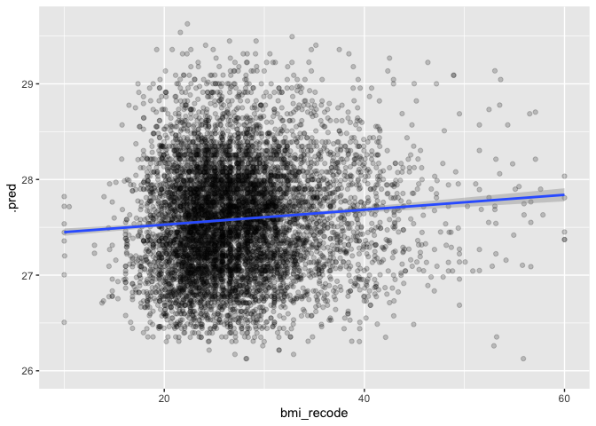
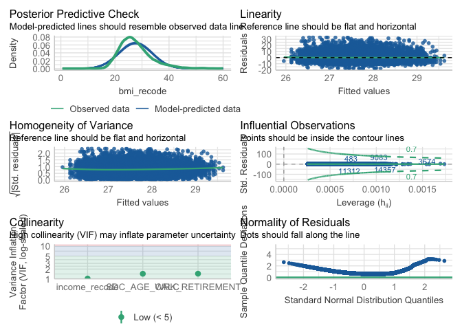

## Linear Regression

A linear regression is a type of regression where the outcome variable is continuous and we assume it has a normal distribution. 

#### Feature selection

Feature selection is an important topic in ML because good predictor requires many features that are able to predict unique aspects of the outcome variable. 

## Research question and data

Our research question is:  

- **What factors are associated with BMI?**

Here we are going to subset our variables because we have lots of related variables and missing. We are going to keep all of the sociodemographic variables `SDC_` and all of the `_EVER` variables that indicated if the person has ever had the given disease or symptom. 


``` r
data_working <- data %>% select(ID:HS_GEN_HEALTH, PM_BMI_SR, contains("_EVER"), contains("WRK_"))
```

#### Outcome variable

Let's look at the outcome variable, recode, and drop observations that are not relevant. We need to do a histogram and check the distribution. Then we might deal with outliers.  


``` r
summary(data_working$PM_BMI_SR)
```

```
##    Min. 1st Qu.  Median    Mean 3rd Qu.    Max.    NA's 
##    8.86   23.38   26.58   27.55   30.55   69.40   11976
```

``` r
bmi_histogram <- ggplot(data = data_working, aes(PM_BMI_SR)) +
                  geom_histogram()
plot(bmi_histogram)
```

```
## `stat_bin()` using `bins = 30`. Pick better value with `binwidth`.
```

```
## Warning: Removed 11976 rows containing non-finite outside the scale range
## (`stat_bin()`).
```

<!-- -->

Nice normal(ish) distribution here. We probably have some outliers on the low and high end with values of 8.86 and 69.40 

We can recode people who are less than 10 and greater than 60 to values of 10 and 60 respectively. 


``` r
data_working <- data_working %>%
          mutate(bmi_recode = case_when(
            PM_BMI_SR < 10 ~ 10, 
            PM_BMI_SR > 60 ~ 60,
            TRUE ~ PM_BMI_SR
          ))
summary(data_working$bmi_recode)
```

```
##    Min. 1st Qu.  Median    Mean 3rd Qu.    Max.    NA's 
##   10.00   23.38   26.58   27.55   30.55   60.00   11976
```

``` r
bmi_recode_histogram <- ggplot(data = data_working, aes(bmi_recode)) +
                  geom_histogram()
plot(bmi_recode_histogram)
```

```
## `stat_bin()` using `bins = 30`. Pick better value with `binwidth`.
```

```
## Warning: Removed 11976 rows containing non-finite outside the scale range
## (`stat_bin()`).
```

<!-- -->

### Preparing predictor variables

All of the predictors are coded as 0,1,2 are read in as numeric by R so we need to fix that. We could manually fix each variable but we are going to do something a bit different. All of the `_EVER` variables are coded as

    * 0 Never had disease
    * 1 Ever had disease
    * 2 Presumed - Never had disease
    * -7 Not Applicable

We can batch recode all of these variables and make sure that they are factor and not numeric.


``` r
data_working <- data_working %>% mutate(across(contains("_EVER"), as.factor)) # select character columns
data_working <- data_working %>% mutate(across(contains("WRK_"), as.factor)) # select character columns
```

**Age**


``` r
summary(data_working$SDC_AGE_CALC) 
```

```
##    Min. 1st Qu.  Median    Mean 3rd Qu.    Max. 
##   30.00   43.00   52.00   51.48   60.00   74.00
```

``` r
### Checking NA

data_working %>% summarise(
                  n = n_distinct(SDC_AGE_CALC),
                  na = sum(is.na(SDC_AGE_CALC)
                           ))
```

```
## # A tibble: 1 × 2
##       n    na
##   <int> <int>
## 1    45     0
```

**Income**


``` r
glimpse(data_working$SDC_INCOME)
```

```
##  num [1:41187] 6 6 4 3 NA 4 5 3 3 5 ...
```

``` r
table(data_working$SDC_INCOME)
```

```
## 
##    1    2    3    4    5    6    7    8 
##  472 1985 5745 6831 6602 7600 3463 2555
```

``` r
data_working <- data_working %>%
	mutate(income_recode = case_when(
		SDC_INCOME == 1 ~ "Less than 25 000 $",
		SDC_INCOME == 2 ~ "Less than 25 000 $",
		SDC_INCOME == 3 ~ "25 000 $ - 49 999 $",
		SDC_INCOME == 4 ~ "50 000 $ - 74 999 $",
		SDC_INCOME == 5 ~ "75 000 $ - 99 999 $",
		SDC_INCOME == 6 ~ "100 000 $ - 149 999 $",		
		SDC_INCOME == 7 ~ "150 000 $ - 199 999 $",
		SDC_INCOME == 8 ~ "200 000 $ or more"
	))

glimpse(data_working$income_recode)
```

```
##  chr [1:41187] "100 000 $ - 149 999 $" "100 000 $ - 149 999 $" ...
```

``` r
data_working$income_recode <- as_factor(data_working$income_recode)

data_working$income_recode <- fct_relevel(data_working$income_recode, "Less than 25 000 $", 
                                                          "25 000 $ - 49 999 $",
                                                          "50 000 $ - 74 999 $",
                                                          "75 000 $ - 99 999 $",
                                                          "100 000 $ - 149 999 $",
                                                          "150 000 $ - 199 999 $",
                                                          "200 000 $ or more"
                                          )
table(data_working$income_recode)
```

```
## 
##    Less than 25 000 $   25 000 $ - 49 999 $   50 000 $ - 74 999 $ 
##                  2457                  5745                  6831 
##   75 000 $ - 99 999 $ 100 000 $ - 149 999 $ 150 000 $ - 199 999 $ 
##                  6602                  7600                  3463 
##     200 000 $ or more 
##                  2555
```

``` r
table(data_working$income_recode, data_working$SDC_INCOME)
```

```
##                        
##                            1    2    3    4    5    6    7    8
##   Less than 25 000 $     472 1985    0    0    0    0    0    0
##   25 000 $ - 49 999 $      0    0 5745    0    0    0    0    0
##   50 000 $ - 74 999 $      0    0    0 6831    0    0    0    0
##   75 000 $ - 99 999 $      0    0    0    0 6602    0    0    0
##   100 000 $ - 149 999 $    0    0    0    0    0 7600    0    0
##   150 000 $ - 199 999 $    0    0    0    0    0    0 3463    0
##   200 000 $ or more        0    0    0    0    0    0    0 2555
```

### Preliminary analysis

Correlations 


We want to start by doing bivariable regression on the outcome and each variable. This can a be a bit of a process if we have lots of variables. Here we are using the `glm` (General Linear Model) function. 


``` r
model_income <- glm(bmi_recode ~ income_recode, data = data_working, family = "gaussian")
summary(model_income)
```

```
## 
## Call:
## glm(formula = bmi_recode ~ income_recode, family = "gaussian", 
##     data = data_working)
## 
## Coefficients:
##                                    Estimate Std. Error t value Pr(>|t|)    
## (Intercept)                         28.3253     0.1433 197.676  < 2e-16 ***
## income_recode25 000 $ - 49 999 $    -0.3235     0.1719  -1.882 0.059816 .  
## income_recode50 000 $ - 74 999 $    -0.5768     0.1671  -3.451 0.000558 ***
## income_recode75 000 $ - 99 999 $    -0.7720     0.1674  -4.611 4.02e-06 ***
## income_recode100 000 $ - 149 999 $  -1.1052     0.1643  -6.727 1.76e-11 ***
## income_recode150 000 $ - 199 999 $  -1.2951     0.1870  -6.927 4.39e-12 ***
## income_recode200 000 $ or more      -1.2653     0.2014  -6.282 3.39e-10 ***
## ---
## Signif. codes:  0 '***' 0.001 '**' 0.01 '*' 0.05 '.' 0.1 ' ' 1
## 
## (Dispersion parameter for gaussian family taken to be 37.06133)
## 
##     Null deviance: 968480  on 26033  degrees of freedom
## Residual deviance: 964595  on 26027  degrees of freedom
##   (15153 observations deleted due to missingness)
## AIC: 167940
## 
## Number of Fisher Scoring iterations: 2
```

``` r
model_income_table <- tbl_regression(model_income) 

model_income_table %>% as_kable()
```


|**Characteristic**    | **Beta** |  **95% CI**  | **p-value** |
|:---------------------|:--------:|:------------:|:-----------:|
|income_recode         |          |              |             |
|Less than 25 000 $    |    —     |      —       |             |
|25 000 $ - 49 999 $   |  -0.32   | -0.66, 0.01  |    0.060    |
|50 000 $ - 74 999 $   |  -0.58   | -0.90, -0.25 |   <0.001    |
|75 000 $ - 99 999 $   |  -0.77   | -1.1, -0.44  |   <0.001    |
|100 000 $ - 149 999 $ |   -1.1   | -1.4, -0.78  |   <0.001    |
|150 000 $ - 199 999 $ |   -1.3   | -1.7, -0.93  |   <0.001    |
|200 000 $ or more     |   -1.3   | -1.7, -0.87  |   <0.001    |

There are advantages and disadvantages to different was to display models. The `summary` method is good because we all of relevant output from the models. On the downside it's very ugly and hard to make nice tables with. The `tbl_regression` way is nice because we get nice output but we can miss things that might be relevant to our models. 

We always want to look at all of the bivariate associations for each independent variable. We can do this quickly with the final fit package. For now ignore the multivariable model results. We just want to look at the bivariable. 

## Machine Learning - Linear Regression 

In a machine learning approach, in general, our interest is less on the specific associations we see between individual variables and the outcome and more on the overall performance of the model in terms of predicting the outcome. You might remember this like AIC, BIC, or -2Log-Likelihood, or Pseudo-R2 for model fit in logistic regression. In ML, another key concept is model performance on unseen data. With the biostatistics approach, we want to know if the model fits some known distriution (think linear regression) but with ML we don't really care about that, we care about model performance with unseen data. Hopefully, that will sense later. 

### Resampling (Part 1)

More machine learning we need a way to split the data into a training set and a test set. There are a few different approaches too this. Here we are going to use an 70/30 split with 70% of the data going to training and 30 going to testing. This is sort of an older way to split data and I would say that a k-fold cross validation is probably more in line with modern practice. We will test this out later.  


``` r
# Fix the random numbers by setting the seed 
# This enables the analysis to be reproducible when random numbers are used 
set.seed(10)

data_split <- initial_split(data_working, prop = 0.70)

# Create data frames for the two sets:
train_data <- training(data_split)
summary(train_data$bmi_recode)
```

```
##    Min. 1st Qu.  Median    Mean 3rd Qu.    Max.    NA's 
##   10.00   23.40   26.61   27.59   30.59   60.00    8437
```

``` r
test_data  <- testing(data_split)
summary(test_data$bmi_recode)
```

```
##    Min. 1st Qu.  Median    Mean 3rd Qu.    Max.    NA's 
##   10.00   23.25   26.55   27.45   30.41   60.00    3539
```

Now we have split the data, we want to create the model for the training data and save it so it can be applied to the testing set. This is basically exactly what we did before. __Note that we only run the model on the training data__ Not all of the data like you would in a traditional linear regression. Here we won't get the exact same result as our original linear regression because we don't have the same data. We expect there will be some variation but that the results should relatively similar. 

### 3.2 Running the regression


``` r
glimpse(data_working)
```

```
## Rows: 41,187
## Columns: 196
## $ ID                                  <chr> "SYN_58621", "SYN_58622", "SYN_586…
## $ ADM_STUDY_ID                        <dbl> 5, 5, 5, 5, 5, 5, 5, 5, 5, 5, 5, 5…
## $ SDC_GENDER                          <dbl> 2, 2, 2, 2, 2, 2, 2, 2, 2, 2, 1, 2…
## $ SDC_AGE_CALC                        <dbl> 47, 57, 62, 58, 64, 40, 36, 63, 58…
## $ SDC_MARITAL_STATUS                  <dbl> 1, 1, 1, 1, 1, 1, 1, 3, 1, 3, 1, 1…
## $ SDC_EDU_LEVEL                       <dbl> 4, 4, 4, 3, 6, 4, 6, 7, 7, 6, 3, 2…
## $ SDC_EDU_LEVEL_AGE                   <dbl> 20, 22, 18, 17, 40, 20, 22, 27, 38…
## $ SDC_INCOME                          <dbl> 6, 6, 4, 3, NA, 4, 5, 3, 3, 5, 8, …
## $ SDC_INCOME_IND_NB                   <dbl> 3, NA, 2, 2, 2, 4, 4, 1, 2, 2, 5, …
## $ SDC_HOUSEHOLD_ADULTS_NB             <dbl> 2, 2, 2, 2, 2, 2, 2, 2, 2, 1, 2, 2…
## $ SDC_HOUSEHOLD_CHILDREN_NB           <dbl> 1, NA, 0, 0, 0, 2, 2, 0, 0, 0, 3, …
## $ HS_GEN_HEALTH                       <dbl> 3, 4, 3, 4, 3, 5, 5, 3, 3, 4, 4, 4…
## $ PM_BMI_SR                           <dbl> NA, 28.32615, 25.50819, 22.45917, …
## $ HS_ROUTINE_VISIT_EVER               <fct> 1, 1, 1, 1, 1, 1, 1, 1, 1, 1, 1, 1…
## $ HS_DENTAL_VISIT_EVER                <fct> 1, 1, 1, 1, 1, 1, 1, 1, 1, 1, 1, 1…
## $ HS_FOBT_EVER                        <fct> 1, 1, 0, 0, 0, 0, 0, 1, NA, NA, 0,…
## $ HS_COL_EVER                         <fct> 1, 1, NA, 1, NA, NA, 0, 1, NA, 1, …
## $ HS_SIG_EVER                         <fct> 0, 1, NA, NA, NA, NA, 1, 0, NA, 0,…
## $ HS_SIG_COL_EVER                     <fct> 1, 1, 1, 1, 1, 0, 1, 1, NA, 1, 0, …
## $ HS_POLYP_EVER                       <fct> 2, 2, NA, 2, NA, NA, 2, 2, NA, 2, …
## $ HS_PSA_EVER                         <fct> -7, -7, -7, -7, -7, -7, -7, -7, -7…
## $ WH_CONTRACEPTIVES_EVER              <fct> 1, 1, 1, 1, 1, 1, 1, 1, 1, 1, -7, …
## $ WH_HFT_EVER                         <fct> 0, 0, 0, 0, 0, 0, 0, 0, 0, 0, -7, …
## $ WH_MENOPAUSE_EVER                   <fct> 0, 1, 1, 1, 1, 0, 0, 1, 1, 1, -7, …
## $ WH_HRT_EVER                         <fct> 0, 0, 1, 0, 1, 0, NA, 0, 0, 1, -7,…
## $ WH_HYSTERECTOMY_EVER                <fct> 0, 0, 1, 0, 0, 0, 0, 1, 1, 0, -7, …
## $ WH_OOPHORECTOMY_EVER                <fct> 0, 0, 1, 0, 0, 0, 0, 1, 1, 0, -7, …
## $ HS_MMG_EVER                         <fct> 1, 1, 1, 1, 1, 0, 0, 1, 1, 1, NA, …
## $ HS_PAP_EVER                         <fct> 1, 1, 1, 1, 1, 1, 1, 1, 1, 1, NA, …
## $ DIS_HBP_EVER                        <fct> 0, 0, 1, 0, 1, 2, 0, 1, 0, 0, 0, 1…
## $ DIS_MI_EVER                         <fct> 0, 0, 2, 0, 2, 2, 0, 0, 0, 0, 0, 0…
## $ DIS_STROKE_EVER                     <fct> 0, 0, 2, 0, 2, 2, 0, 0, 0, 0, 0, 0…
## $ DIS_ASTHMA_EVER                     <fct> 0, 0, 2, 0, 1, 2, 0, NA, 0, 0, NA,…
## $ DIS_EMPHYSEMA_EVER                  <fct> NA, NA, 2, NA, 2, 2, NA, NA, 0, NA…
## $ DIS_CB_EVER                         <fct> NA, NA, 2, NA, 2, 2, NA, NA, 0, NA…
## $ DIS_COPD_EVER                       <fct> 0, 0, 2, NA, 2, 2, 0, 0, 0, 0, 0, …
## $ DIS_DEP_EVER                        <fct> 0, 0, NA, 0, NA, NA, 0, 0, NA, 0, …
## $ DIS_DIAB_EVER                       <fct> 0, 0, 2, NA, 2, 2, 0, 0, 0, 0, 0, …
## $ DIS_LC_EVER                         <fct> 0, 0, 2, 0, 2, 2, 0, 0, 0, 0, 0, 0…
## $ DIS_CH_EVER                         <fct> 0, 0, 2, 0, 2, 2, 0, 0, 0, 0, 0, 0…
## $ DIS_CROHN_EVER                      <fct> 0, 0, 2, 0, 2, 2, 0, 0, 0, 0, 0, 0…
## $ DIS_UC_EVER                         <fct> 0, 0, 2, 0, 2, 2, 0, 0, 0, 0, 0, 0…
## $ DIS_IBS_EVER                        <fct> 1, 0, 2, 0, 1, 2, 0, 0, 0, 0, 0, 0…
## $ DIS_ECZEMA_EVER                     <fct> 0, 0, 2, 0, 2, 1, 0, 0, 0, 0, 1, 0…
## $ DIS_SLE_EVER                        <fct> 0, 0, 2, 0, 2, 2, 0, 0, 0, 0, 0, 0…
## $ DIS_PS_EVER                         <fct> 0, 0, 2, 1, 2, 2, 0, 0, 0, 0, 0, 0…
## $ DIS_MS_EVER                         <fct> 0, 0, 2, 0, 2, 2, 0, 0, 0, 0, 0, 0…
## $ DIS_OP_EVER                         <fct> 0, 0, 2, 0, 2, 2, 0, 0, 0, 0, 0, 0…
## $ DIS_ARTHRITIS_EVER                  <fct> 0, 1, 1, 1, 1, 2, 0, 0, 0, 1, 0, 0…
## $ DIS_CANCER_EVER                     <fct> 0, 0, 0, 0, 0, 0, 0, 0, 0, 0, 0, 0…
## $ DIS_HBP_FAM_EVER                    <fct> 1, 1, NA, 1, NA, NA, 1, 2, NA, 1, …
## $ DIS_MI_FAM_EVER                     <fct> 1, 2, NA, 1, NA, NA, 2, 1, NA, 1, …
## $ DIS_STROKE_FAM_EVER                 <fct> 2, 2, NA, 0, NA, NA, 2, 2, NA, 2, …
## $ DIS_ASTHMA_FAM_EVER                 <fct> 2, 2, NA, NA, NA, NA, 2, 2, NA, 2,…
## $ DIS_EMPHYSEMA_FAM_EVER              <fct> NA, NA, NA, NA, NA, NA, NA, NA, NA…
## $ DIS_CB_FAM_EVER                     <fct> NA, NA, NA, NA, NA, NA, NA, NA, NA…
## $ DIS_COPD_FAM_EVER                   <fct> NA, 2, NA, NA, NA, NA, 2, 1, NA, 2…
## $ DIS_DEP_FAM_EVER                    <fct> 2, 2, NA, NA, NA, NA, 1, 2, NA, 1,…
## $ DIS_DIAB_FAM_EVER                   <fct> 1, 1, NA, 1, NA, NA, 1, 2, NA, 2, …
## $ DIS_LC_FAM_EVER                     <fct> 2, 2, NA, NA, NA, NA, 2, 2, NA, 2,…
## $ DIS_CH_FAM_EVER                     <fct> 2, 2, NA, NA, NA, NA, 2, 2, NA, 1,…
## $ DIS_CROHN_FAM_EVER                  <fct> 2, 2, NA, NA, NA, NA, 2, 2, NA, 2,…
## $ DIS_UC_FAM_EVER                     <fct> 2, 2, NA, NA, NA, NA, 2, 2, NA, 2,…
## $ DIS_IBS_FAM_EVER                    <fct> 2, 2, NA, 1, NA, NA, 2, 1, NA, 2, …
## $ DIS_ECZEMA_FAM_EVER                 <fct> NA, 2, 1, NA, NA, 1, 2, 1, NA, 2, …
## $ DIS_SLE_FAM_EVER                    <fct> 2, 2, NA, NA, NA, NA, 2, 1, NA, 2,…
## $ DIS_PS_FAM_EVER                     <fct> 2, 2, 1, NA, NA, NA, 2, 2, NA, 2, …
## $ DIS_MS_FAM_EVER                     <fct> 2, 2, NA, NA, NA, NA, 2, 2, NA, 2,…
## $ DIS_OP_FAM_EVER                     <fct> 2, 2, NA, NA, NA, NA, 1, 2, NA, 2,…
## $ DIS_ARTHRITIS_FAM_EVER              <fct> 1, 2, NA, NA, 1, NA, 2, 2, NA, 1, …
## $ DIS_CANCER_FAM_EVER                 <fct> 1, 1, NA, 1, NA, NA, 1, 1, NA, 1, …
## $ DIS_CANCER_F_EVER                   <fct> 0, 1, NA, 0, NA, NA, 1, 1, NA, 1, …
## $ DIS_CANCER_M_EVER                   <fct> 1, 0, NA, 1, NA, NA, 1, 1, NA, 0, …
## $ DIS_CANCER_SIB_EVER                 <fct> NA, 1, NA, 1, NA, NA, NA, 0, NA, 1…
## $ DIS_CANCER_CHILD_EVER               <fct> 0, 0, NA, 0, NA, NA, 0, 0, NA, 0, …
## $ ALC_EVER                            <fct> 1, 1, 1, 1, 1, 1, 1, 1, 1, 1, 1, 1…
## $ SMK_CIG_EVER                        <fct> 0, 1, 1, 0, 0, 1, 0, 0, 1, 0, 0, 1…
## $ SMK_CIG_WHOLE_EVER                  <fct> 1, -7, NA, 0, NA, NA, 0, 1, NA, 1,…
## $ DIS_ENDO_EVER                       <fct> NA, NA, NA, NA, NA, NA, NA, NA, NA…
## $ DIS_ENDO_HB_CHOL_EVER               <fct> NA, NA, NA, NA, NA, NA, NA, NA, NA…
## $ DIS_ENDO_SUGAR_EVER                 <fct> NA, NA, NA, NA, NA, NA, NA, NA, NA…
## $ DIS_ENDO_TD_EVER                    <fct> NA, NA, NA, NA, NA, NA, NA, NA, NA…
## $ DIS_ENDO_TD_HYPO_EVER               <fct> NA, NA, NA, NA, NA, NA, NA, NA, NA…
## $ DIS_ENDO_TD_HYPER_EVER              <fct> NA, NA, NA, NA, NA, NA, NA, NA, NA…
## $ DIS_ENDO_TD_NODULE_EVER             <fct> NA, NA, NA, NA, NA, NA, NA, NA, NA…
## $ DIS_ENDO_TD_THYROIDITIS_EVER        <fct> NA, NA, NA, NA, NA, NA, NA, NA, NA…
## $ DIS_CARDIO_PREM_HD_MALE_EVER        <fct> NA, NA, NA, NA, NA, NA, NA, NA, NA…
## $ DIS_CARDIO_PREM_HD_FEMALE_EVER      <fct> NA, NA, NA, NA, NA, NA, NA, NA, NA…
## $ DIS_CARDIO_EVER                     <fct> NA, NA, NA, NA, NA, NA, NA, NA, NA…
## $ DIS_CARDIO_DVT_EVER                 <fct> NA, NA, NA, NA, NA, NA, NA, NA, NA…
## $ DIS_CARDIO_PE_EVER                  <fct> NA, NA, NA, NA, NA, NA, NA, NA, NA…
## $ DIS_CARDIO_ANGINA_EVER              <fct> NA, NA, NA, NA, NA, NA, NA, NA, NA…
## $ DIS_CARDIO_TIA_EVER                 <fct> NA, NA, NA, NA, NA, NA, NA, NA, NA…
## $ DIS_CARDIO_HF_EVER                  <fct> NA, NA, NA, NA, NA, NA, NA, NA, NA…
## $ DIS_CARDIO_HD_EVER                  <fct> NA, NA, NA, NA, NA, NA, NA, NA, NA…
## $ DIS_CARDIO_VHD_EVER                 <fct> NA, NA, NA, NA, NA, NA, NA, NA, NA…
## $ DIS_CARDIO_VHD_AORTIC_EVER          <fct> NA, NA, NA, NA, NA, NA, NA, NA, NA…
## $ DIS_CARDIO_VHD_MITRAL_STENOSIS_EVER <fct> NA, NA, NA, NA, NA, NA, NA, NA, NA…
## $ DIS_CARDIO_VHD_MITRAL_VALVE_EVER    <fct> NA, NA, NA, NA, NA, NA, NA, NA, NA…
## $ DIS_CARDIO_VHD_RHEUMATIC_EVER       <fct> NA, NA, NA, NA, NA, NA, NA, NA, NA…
## $ DIS_CARDIO_VHD_OTHER_EVER           <fct> NA, NA, NA, NA, NA, NA, NA, NA, NA…
## $ DIS_CARDIO_CHD_EVER                 <fct> NA, NA, NA, NA, NA, NA, NA, NA, NA…
## $ DIS_CARDIO_PERI_EVER                <fct> NA, NA, NA, NA, NA, NA, NA, NA, NA…
## $ DIS_CARDIO_ATRIAL_EVER              <fct> NA, NA, NA, NA, NA, NA, NA, NA, NA…
## $ DIS_CARDIO_ATRIAL_THINNERS_EVER     <fct> NA, NA, NA, NA, NA, NA, NA, NA, NA…
## $ DIS_CARDIO_ARRH_EVER                <fct> NA, NA, NA, NA, NA, NA, NA, NA, NA…
## $ DIS_CARDIO_OTHER_EVER               <fct> NA, NA, NA, NA, NA, NA, NA, NA, NA…
## $ DIS_RESP_EVER                       <fct> NA, NA, NA, NA, NA, NA, NA, NA, NA…
## $ DIS_RESP_HAYFEVER_EVER              <fct> NA, NA, NA, NA, NA, NA, NA, NA, NA…
## $ DIS_RESP_SLEEP_APNEA_EVER           <fct> NA, NA, NA, NA, NA, NA, NA, NA, NA…
## $ DIS_RESP_OTHER_EVER                 <fct> NA, NA, NA, NA, NA, NA, NA, NA, NA…
## $ DIS_GASTRO_EVER                     <fct> NA, NA, NA, NA, NA, NA, NA, NA, NA…
## $ DIS_GASTRO_ULCERS_EVER              <fct> NA, NA, NA, NA, NA, NA, NA, NA, NA…
## $ DIS_GASTRO_GERD_EVER                <fct> NA, NA, NA, NA, NA, NA, NA, NA, NA…
## $ DIS_GASTRO_H_PYLORI_EVER            <fct> NA, NA, NA, NA, NA, NA, NA, NA, NA…
## $ DIS_GASTRO_BARRETTS_EVER            <fct> NA, NA, NA, NA, NA, NA, NA, NA, NA…
## $ DIS_GASTRO_INDIGESTION_EVER         <fct> NA, NA, NA, NA, NA, NA, NA, NA, NA…
## $ DIS_GASTRO_DIVERTICULAR_EVER        <fct> NA, NA, NA, NA, NA, NA, NA, NA, NA…
## $ DIS_GASTRO_EOE_EVER                 <fct> NA, NA, NA, NA, NA, NA, NA, NA, NA…
## $ DIS_GASTRO_CELIAC_EVER              <fct> NA, NA, NA, NA, NA, NA, NA, NA, NA…
## $ DIS_LIVER_EVER                      <fct> NA, NA, NA, NA, NA, NA, NA, NA, NA…
## $ DIS_LIVER_FATTY_EVER                <fct> NA, NA, NA, NA, NA, NA, NA, NA, NA…
## $ DIS_LIVER_PANCREATITIS_EVER         <fct> NA, NA, NA, NA, NA, NA, NA, NA, NA…
## $ DIS_LIVER_GALLSTONES_EVER           <fct> NA, NA, NA, NA, NA, NA, NA, NA, NA…
## $ DIS_RD_EVER                         <fct> NA, NA, NA, NA, NA, NA, NA, NA, NA…
## $ DIS_MH_EVER                         <fct> NA, NA, NA, NA, NA, NA, NA, NA, NA…
## $ DIS_MH_BIPOLAR_EVER                 <fct> NA, NA, NA, NA, NA, NA, NA, NA, NA…
## $ DIS_MH_ANXIETY_EVER                 <fct> NA, NA, NA, NA, NA, NA, NA, NA, NA…
## $ DIS_MH_EATING_EVER                  <fct> NA, NA, NA, NA, NA, NA, NA, NA, NA…
## $ DIS_MH_ANOREXIA_EVER                <fct> NA, NA, NA, NA, NA, NA, NA, NA, NA…
## $ DIS_MH_BULIMIA_EVER                 <fct> NA, NA, NA, NA, NA, NA, NA, NA, NA…
## $ DIS_MH_BINGE_EAT_EVER               <fct> NA, NA, NA, NA, NA, NA, NA, NA, NA…
## $ DIS_MH_PTSD_EVER                    <fct> NA, NA, NA, NA, NA, NA, NA, NA, NA…
## $ DIS_MH_SCHIZOPHRENIA_EVER           <fct> NA, NA, NA, NA, NA, NA, NA, NA, NA…
## $ DIS_MH_OCD_EVER                     <fct> NA, NA, NA, NA, NA, NA, NA, NA, NA…
## $ DIS_MH_ADDICTION_EVER               <fct> NA, NA, NA, NA, NA, NA, NA, NA, NA…
## $ DIS_NEURO_EVER                      <fct> NA, NA, NA, NA, NA, NA, NA, NA, NA…
## $ DIS_NEURO_PARKINSON_EVER            <fct> NA, NA, NA, NA, NA, NA, NA, NA, NA…
## $ DIS_NEURO_MIGRAINE_EVER             <fct> NA, NA, NA, NA, NA, NA, NA, NA, NA…
## $ DIS_NEURO_AUTISM_EVER               <fct> NA, NA, NA, NA, NA, NA, NA, NA, NA…
## $ DIS_NEURO_EPILEPSY_EVER             <fct> NA, NA, NA, NA, NA, NA, NA, NA, NA…
## $ DIS_NEURO_SPINAL_EVER               <fct> NA, NA, NA, NA, NA, NA, NA, NA, NA…
## $ DIS_BONE_EVER                       <fct> NA, NA, NA, NA, NA, NA, NA, NA, NA…
## $ DIS_BONE_GOUT_EVER                  <fct> NA, NA, NA, NA, NA, NA, NA, NA, NA…
## $ DIS_BONE_CBP_EVER                   <fct> NA, NA, NA, NA, NA, NA, NA, NA, NA…
## $ DIS_BONE_CNP_EVER                   <fct> NA, NA, NA, NA, NA, NA, NA, NA, NA…
## $ DIS_BONE_FIBROMYALGIA_EVER          <fct> NA, NA, NA, NA, NA, NA, NA, NA, NA…
## $ DIS_BONE_OSTEOPENIA_EVER            <fct> NA, NA, NA, NA, NA, NA, NA, NA, NA…
## $ DIS_INFEC_EVER                      <fct> NA, NA, NA, NA, NA, NA, NA, NA, NA…
## $ DIS_INFEC_MENINGITIS_EVER           <fct> NA, NA, NA, NA, NA, NA, NA, NA, NA…
## $ DIS_INFEC_HIV_EVER                  <fct> NA, NA, NA, NA, NA, NA, NA, NA, NA…
## $ DIS_INFEC_MALARIA_EVER              <fct> NA, NA, NA, NA, NA, NA, NA, NA, NA…
## $ DIS_INFEC_TB_EVER                   <fct> NA, NA, NA, NA, NA, NA, NA, NA, NA…
## $ DIS_INFEC_CHLAMYDIA_EVER            <fct> NA, NA, NA, NA, NA, NA, NA, NA, NA…
## $ DIS_INFEC_HERPES_EVER               <fct> NA, NA, NA, NA, NA, NA, NA, NA, NA…
## $ DIS_INFEC_GONORRHEA_EVER            <fct> NA, NA, NA, NA, NA, NA, NA, NA, NA…
## $ DIS_INFEC_SYPHILIS_EVER             <fct> NA, NA, NA, NA, NA, NA, NA, NA, NA…
## $ DIS_INFEC_HPV_EVER                  <fct> NA, NA, NA, NA, NA, NA, NA, NA, NA…
## $ DIS_INFEC_STI_EVER                  <fct> NA, NA, NA, NA, NA, NA, NA, NA, NA…
## $ DIS_GYN_EVER                        <fct> NA, NA, NA, NA, NA, NA, NA, NA, NA…
## $ DIS_GYN_PCOS_EVER                   <fct> NA, NA, NA, NA, NA, NA, NA, NA, NA…
## $ DIS_GYN_FIBROIDS_EVER               <fct> NA, NA, NA, NA, NA, NA, NA, NA, NA…
## $ DIS_GYN_ENDOMETRIOSIS_EVER          <fct> NA, NA, NA, NA, NA, NA, NA, NA, NA…
## $ DIS_GEN_EVER                        <fct> NA, NA, NA, NA, NA, NA, NA, NA, NA…
## $ DIS_GEN_DS_EVER                     <fct> NA, NA, NA, NA, NA, NA, NA, NA, NA…
## $ DIS_GEN_SCA_EVER                    <fct> NA, NA, NA, NA, NA, NA, NA, NA, NA…
## $ DIS_GEN_THALASSEMIA_EVER            <fct> NA, NA, NA, NA, NA, NA, NA, NA, NA…
## $ DIS_GEN_CAH_EVER                    <fct> NA, NA, NA, NA, NA, NA, NA, NA, NA…
## $ DIS_GEN_AIS_EVER                    <fct> NA, NA, NA, NA, NA, NA, NA, NA, NA…
## $ DIS_GEN_HEMOPHILIA_EVER             <fct> NA, NA, NA, NA, NA, NA, NA, NA, NA…
## $ DIS_GEN_CF_EVER                     <fct> NA, NA, NA, NA, NA, NA, NA, NA, NA…
## $ DIS_GEN_KS_EVER                     <fct> NA, NA, NA, NA, NA, NA, NA, NA, NA…
## $ DIS_GEN_TS_EVER                     <fct> NA, NA, NA, NA, NA, NA, NA, NA, NA…
## $ DIS_EYE_EVER                        <fct> NA, NA, NA, NA, NA, NA, NA, NA, NA…
## $ DIS_EYE_MACULAR_EVER                <fct> NA, NA, NA, NA, NA, NA, NA, NA, NA…
## $ DIS_EYE_GLAUCOMA_EVER               <fct> NA, NA, NA, NA, NA, NA, NA, NA, NA…
## $ DIS_EYE_CATARACTS_EVER              <fct> NA, NA, NA, NA, NA, NA, NA, NA, NA…
## $ DIS_EYE_DIAB_RET_EVER               <fct> NA, NA, NA, NA, NA, NA, NA, NA, NA…
## $ DIS_EAR_EVER                        <fct> NA, NA, NA, NA, NA, NA, NA, NA, NA…
## $ DIS_EAR_TINNITUS_EVER               <fct> NA, NA, NA, NA, NA, NA, NA, NA, NA…
## $ DIS_EAR_LOSS_EVER                   <fct> NA, NA, NA, NA, NA, NA, NA, NA, NA…
## $ PSE_ADULT_WRK_DURATION              <fct> 15, 0, 5, 0, 6, 0, 0, 0, NA, NA, 2…
## $ PSE_WRK_FREQ                        <fct> 0, 2, 0, 0, NA, 0, 0, 2, 0, 1, 0, …
## $ WRK_FULL_TIME                       <fct> 1, 1, 1, 1, 0, 1, 1, 0, 0, 1, 1, 1…
## $ WRK_PART_TIME                       <fct> 0, 0, 0, 0, 0, 0, 0, 1, 1, 0, 0, 0…
## $ WRK_RETIREMENT                      <fct> 0, 0, 0, 0, 0, 0, 0, 0, 1, 0, 0, 0…
## $ WRK_HOME_FAMILY                     <fct> 0, 0, 0, 0, 0, 0, 0, 0, 0, 0, 0, 0…
## $ WRK_UNABLE                          <fct> 0, 0, 0, 0, 0, 0, 0, 0, 0, 0, 0, 0…
## $ WRK_UNEMPLOYED                      <fct> 0, 0, 0, 0, 0, 0, 0, 0, 0, 0, 0, 0…
## $ WRK_UNPAID                          <fct> 0, 0, 0, 0, 0, 0, 0, 0, 0, 0, 0, 0…
## $ WRK_STUDENT                         <fct> 0, 0, 0, 0, 0, 0, 0, 0, 0, 0, 0, 0…
## $ WRK_EMPLOYMENT                      <fct> 1, 1, 1, 1, 1, 1, 1, 1, 0, 1, 1, 1…
## $ WRK_IND_TYPE_CUR_CAT                <fct> NA, NA, 14, NA, 14, 14, NA, NA, -7…
## $ WRK_SCHEDULE_CUR_CAT                <fct> 1, 1, 6, 1, 4, 1, 1, 1, -7, 4, 1, …
## $ bmi_recode                          <dbl> NA, 28.32615, 25.50819, 22.45917, …
## $ income_recode                       <fct> 100 000 $ - 149 999 $, 100 000 $ -…
```

``` r
linear_model <- linear_reg() %>%
        set_engine("glm") %>%
        set_mode("regression") %>%
        fit(bmi_recode ~ income_recode + WRK_RETIREMENT + SDC_AGE_CALC, data = train_data)
```

### 3.3 Test the trained model

Once we `train the model` we want to understand how well our trained model works on new data the model has not seen. This is where the testing data comes in. We can use the `predict` feature for this. What we are doing here is predicting if someone has diabetes (yes/no) from the model we trained using the training data, on the testing data. We had 4293 observations in the training with 4077 people with on diabetes and 216 people with diabetes. Much of this example comes from [https://medium.com/the-researchers-guide/modelling-binary-logistic-regression-using-tidymodels-library-in-r-part-1-c1bdce0ac055](https://medium.com/the-researchers-guide/modelling-binary-logistic-regression-using-tidymodels-library-in-r-part-1-c1bdce0ac055)

The code below outputs the predict class `diabetes (yes/no)` for the test data. 


``` r
pred_bmi <- predict(linear_model,
                      new_data = test_data)
summary(pred_bmi$.pred)
```

```
##    Min. 1st Qu.  Median    Mean 3rd Qu.    Max.    NA's 
##   25.99   27.18   27.59   27.60   27.99   29.63    1897
```

``` r
summary(test_data$bmi_recode)
```

```
##    Min. 1st Qu.  Median    Mean 3rd Qu.    Max.    NA's 
##   10.00   23.25   26.55   27.45   30.41   60.00    3539
```

[https://quantifyinghealth.com/linear-regression-in-r-tidymodels/](https://quantifyinghealth.com/linear-regression-in-r-tidymodels/)

Now we want to combine all of our results into one dataframe and just do a quick check. 


``` r
pred_true <- test_data |>
  select(bmi_recode) |>
  bind_cols(pred_bmi)


ggplot(data = pred_true, aes(x = bmi_recode, y = .pred)) + 
        geom_point(alpha = 0.2) +
        geom_smooth(method = "lm")
```

```
## `geom_smooth()` using formula = 'y ~ x'
```

```
## Warning: Removed 4554 rows containing non-finite outside the scale range
## (`stat_smooth()`).
```

```
## Warning: Removed 4554 rows containing missing values or values outside the scale range
## (`geom_point()`).
```

<!-- -->

``` r
head(pred_true)
```

```
## # A tibble: 6 × 2
##   bmi_recode .pred
##        <dbl> <dbl>
## 1         NA  27.2
## 2         NA  28.2
## 3         NA  NA  
## 4         NA  26.7
## 5         NA  27.5
## 6         NA  NA
```

Here we can see the first 6 rows of data. The model predicts some people with NA but others are NA. We didn't do anything with the missing values just yet so the model is quite dependent on having data for the predictors and the outcome.

### 3.3 Model evaluation

There are a number of different methods we must use to evaluate machine learning models. We will walk through those. 


``` r
linear_model |> 
  extract_fit_engine() |> 
  check_model()
```

<!-- -->

#### Confusion Matrix

We can generate a confusion matrix by using the `conf_mat()` function by supplying the final data frame (`diabetes_results`), the truth column `diabetes_t2` and predicted class `.pred_class` in the estimate attribute.

A confusion matrix is sort of a 2x2 table with the true values on one side and predicted values in another column. If we look on the diagonal we see when the model correctly predicts the values `yes/no` and off diagonal is when the model does not predict the correct value. So this model correctly predicts that 4075 cases of diabetes and incorrectly predicts that 212 people do not have diabetes when they do have it. The model correctly predicts 4 cases of diabetes. It also incorrectly predicts that two people who do not have diabetes do have diabetes. 

```{}
conf_mat(diabetes_results, truth = diabetes_t2,
         estimate = .)
```

#### Accuracy

We can calculate the classification accuracy by using the `accuracy()` function by supplying the final data frame `diabetes_results`, the truth column `diabetes_t2` and predicted class `.pred_class` in the estimate attribute. The model classification accuracy on test dataset is about ~94%. This looks good but it's a bit of fake result as we will see later. 

```{}
accuracy(diabetes_results, truth = bmi_recode,
         estimate = .pred_class)
```

#### Sensitivity

The sensitivity (also known as __Recall__) of a classifier is the ratio between what was correctly identified as positive (True Positives) and all positives (False Negative + True Positive).

__Sensitivity = TP / FN + TP__

The sensitivity value is 1.0 indicating that we are able to correctly detect 100% of the positive values.  

```{}
sens(diabetes_results, truth = diabetes_t2,
    estimate = .pred_class)
```

#### Specificity

Specificity of a classifier is the ratio between what was classified as negative (True Negatives) and all negative values (False Positive + True Native)

__Specificity = TN / FP + TN__

The specificity value is 0.004. Meaning that we correctly classify 0.4% of the negative values, which is pretty terrible. 

```{}
spec(diabetes_results, truth = diabetes_t2,
    estimate = .pred_class)
```

#### Precision

What percent of values are correctly classified as positive (True Positives) out of all positives (True Positive + False Positive)?

__Precision = TP / TP + FP__

The precision is 0.94, meaning we identify 81.8% of true positives compared to all positives. 

```{}
precision(diabetes_results, truth = diabetes_t2,
    estimate = .pred_class)
```

#### F-Score

F-score is the mean of precision and sensitivity. The value ranges from 1 (the best score) and 0 (the worst score). F-score gives us the balance between precision and sensitivity. The F1 score is about 0.97, which indicates that the trained model has a classification strength of 97%.

```{}
f_meas(diabetes_results, truth = diabetes_t2,
       estimate = .pred_class)
```

#### ROC Curve

The ROC curve is plotted with `sensitivity` against `1 - Specificity`, where `sensitivity` is on the y-axis and `1 - Specificity` is on the x-axis. A line is drawn diagonally to denote 50–50 partitioning of the graph. If the curve is more close to the line, lower the performance of the classifier, which is no better than a mere random guess.

You can generate a ROC Curve using the `roc_curve()` function where you need to supply the truth column `diabetes_t2` and predicted probabilities for the positive class `.pred_pos`.

Our model has got a ROC-AUC score of 0.227 indicating a good model that cannot distinguish between patients with diabetes and no diabetes.

```{}
roc_auc(diabetes_results,
        truth = diabetes_t2,
        .pred_0)

roc_curve <- diabetes_results %>%
  roc_curve(truth = diabetes_t2, .pred_0) %>%
  autoplot()

plot(roc_curve)
```

#### All the metrics 

We can produce all of the metrics using the `metric_set` function. 

```{}
metrics <- metric_set(accuracy, sens, spec, precision, recall, f_meas)

all_metrics_lr <- metrics(diabetes_results,
               truth = diabetes_t2,
               estimate = .pred_class)
               
kable(all_metrics_lr)
```

#### Feature Importance

Feature importance is the one way that ML models examine which variables are important to the predictions overall. It's not super common to see, except for people like Epi folks who think about specific associations between variables. 

```{}
coeff <- tidy(logistic_model) %>% 
  arrange(desc(abs(estimate))) %>% 
  filter(abs(estimate) > 0.5)

kable(coeff)
```

#### Plot of feature importance

```{}
ggplot(coeff, aes(x = term, y = estimate, fill = term)) + geom_col() + coord_flip()
```

#### 3.4 Model interpretation

So now we have to interpret the model. General guidelines to think about the bias variance trade off and weather our model performs well. Based on the evaluation metrics how do we fell about this model? 
Typically in ML types of problems a model with less than 80-90% accuracy is consider ok, but it depends a bit on the problem. Our model has an accuracy of 95%... maybe that's good. HOWEVER, when we look at the sensitivity it's 1 and the specificity is 0.4%. A sensitivity of 1 (perfect) is suspect and our specificity is very very bad.

Overall, this model is not very good. We don't have a sufficient number of features (variables) to do a good job with prediction. We have a high bias, our model underfits the data. The variance is also high. 

### 3.5. Up-Sampling

OK. So our model is terrible. There are a number of reasons for this that we are going to explore now. These are standard machine learning explorations that we would normally do as part of machine learning analysis workflow. First, we are going to explore up-sampling. One of the main problems with the diabetes data we have is the prevalence of diabetes is relatively low in the dataset. This is good normally in biostatistics approaches as we want the OR to approximate the RR in a case control study. BUT that's terrible for prediction. 

One thing that we can do is up-scale the lowest class (or classes) or the outcome variable. There are a bunch of different methods to do this and we are using the `themis` package [https://themis.tidymodels.org/reference/index.html](https://themis.tidymodels.org/reference/index.html). Here we are using the `step_upsample()` function. We only want to use the up scaling methods on the training set. We don't use it on the test set because that would create a false model performance. 

#### Up-scaling Example

```{}
### Showing the distribution of diabetes (yes/no) in the real data
table(train_data$diabetes_t2)

ggplot(train_data) + 
    geom_bar(aes(diabetes_t2))

### Creating a recipe were we upsample the diabetes yes category to be 50% of the diabetes no category. This is an arbitrary number and you will need to play with this.


diabetes_rec_oversamp <- 
  recipe(diabetes_t2 ~ ., data = train_data) %>%
  step_upsample(diabetes_t2, over_ratio = 0.5) %>%
  step_unknown() %>%
  step_dummy(all_nominal_predictors()) 

### Visualization of the 30% ratio
recipe(~., train_data) %>%
  step_upsample(diabetes_t2, over_ratio = 0.5) %>%
  prep() %>%
  bake(new_data = NULL) %>%
  ggplot(aes(diabetes_t2)) +
  geom_bar()
```

Here we upscale the `diabetes-Yes` category to 50% of the of the `diabetes-No` category. The figures show the differences but we go from 1514 cases of diabetes in the training set to over ~12000 cases of diabetes. 

**Up-scaling regression**

Setup the recipe and metrics. Here we are specifying the model we want to use. 

```{}
logistic_m <- logistic_reg(
                mode = "classification",
                engine = "glm"
              )
```

Logistic regression results based on up-scaling. Here we setup the workflow. A workflow must includ the following

* A Recipe `add_recipe` which is how we tell the workflow to process the data. 
* A Model `add_model` which specifies the model paramaters

Once we save the workflow we can run the same model in different ways. More on this later. 

```{}
diabetes_wflow_oversamp <- 
  workflow() %>% 
  add_model(logistic_m) %>% 
  add_recipe(diabetes_rec_oversamp)

diabetes_wflow_oversamp
```

Now we will actually fit the model to the data using the recipe and `fit` command. 

```{}
diabetes_fit_oversamp <- 
  diabetes_wflow_oversamp %>% 
  fit(data = train_data)
```

```{}
diabetes_fit_oversamp %>% 
  extract_fit_parsnip() %>% 
  tidy()

diabetes_aug_oversamp <- 
  augment(diabetes_fit_oversamp, test_data)

diabetes_fit_oversamp_all_metrics <- metrics(diabetes_aug_oversamp,
               truth = diabetes_t2,
               estimate = .pred_class)
               
kable(diabetes_fit_oversamp_all_metrics)
```

Here we have dramatically improved our specificity from 0.004 to 0.28. Overall, our accuracy and other metrics have gone down... which is good. This model is much better and less suspect than our previous model. Our up-sampling has done well here. We could test more up-sampling but you get the idea here. 

```{}
kable(all_metrics_lr)
```

### 3.6. Resampling (part 2)

So we know that the up-scaling worked well to improve the model. Another thing we always want to test with an ML model is using a different type of resampling (validation) approach. Originally, we used a 70/30 split in the data, which is not the optimal approach. A better general approach is k-fold cross validation. This approach is very common. There is some discussion of a bunch of other approaches here [https://www.stepbystepdatascience.com/ml-with-tidymodels](https://www.stepbystepdatascience.com/ml-with-tidymodels).

Here we will use our new up-scaled data and apply 10 fold cross-validation approach. We have already set the seed for the analysis in line 105. Setting that will make sure that we get a reproducible result. This resmapling approach 


