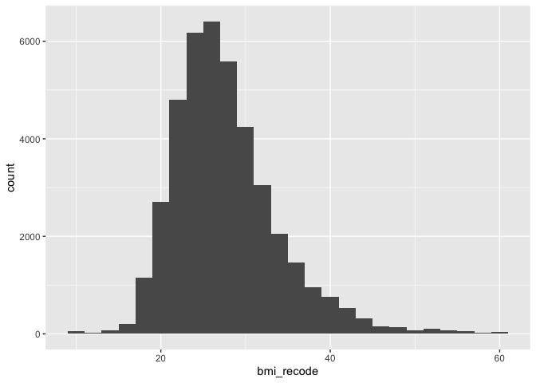

``` r
knitr::opts_chunk$set(echo = TRUE)
library(tidyverse)
```

```
## ── Attaching core tidyverse packages ──────────────────────── tidyverse 2.0.0 ──
## ✔ dplyr     1.1.4     ✔ readr     2.1.5
## ✔ forcats   1.0.0     ✔ stringr   1.5.1
## ✔ ggplot2   3.5.1     ✔ tibble    3.2.1
## ✔ lubridate 1.9.4     ✔ tidyr     1.3.1
## ✔ purrr     1.0.2     
## ── Conflicts ────────────────────────────────────────── tidyverse_conflicts() ──
## ✖ dplyr::filter() masks stats::filter()
## ✖ dplyr::lag()    masks stats::lag()
## ℹ Use the conflicted package (<http://conflicted.r-lib.org/>) to force all conflicts to become errors
```

``` r
library(tidymodels)
```

```
## ── Attaching packages ────────────────────────────────────── tidymodels 1.2.0 ──
## ✔ broom        1.0.7     ✔ rsample      1.2.1
## ✔ dials        1.3.0     ✔ tune         1.2.1
## ✔ infer        1.0.7     ✔ workflows    1.1.4
## ✔ modeldata    1.4.0     ✔ workflowsets 1.1.0
## ✔ parsnip      1.2.1     ✔ yardstick    1.3.2
## ✔ recipes      1.1.0     
## ── Conflicts ───────────────────────────────────────── tidymodels_conflicts() ──
## ✖ scales::discard() masks purrr::discard()
## ✖ dplyr::filter()   masks stats::filter()
## ✖ recipes::fixed()  masks stringr::fixed()
## ✖ dplyr::lag()      masks stats::lag()
## ✖ yardstick::spec() masks readr::spec()
## ✖ recipes::step()   masks stats::step()
## • Search for functions across packages at https://www.tidymodels.org/find/
```

``` r
library(sjPlot)
```

```
## Install package "strengejacke" from GitHub (`devtools::install_github("strengejacke/strengejacke")`) to load all sj-packages at once!
```

``` r
library(psych)
```

```
## 
## Attaching package: 'psych'
## 
## The following objects are masked from 'package:scales':
## 
##     alpha, rescale
## 
## The following objects are masked from 'package:ggplot2':
## 
##     %+%, alpha
```

``` r
library(parallel)
library(finalfit)
library(gtsummary)
library(mlbench)
library(vip)
```

```
## 
## Attaching package: 'vip'
## 
## The following object is masked from 'package:utils':
## 
##     vi
```

``` r
library(rsample)
library(tune)
library(recipes)
library(yardstick)
library(parsnip)
library(glmnet)
```

```
## Loading required package: Matrix
## 
## Attaching package: 'Matrix'
## 
## The following objects are masked from 'package:tidyr':
## 
##     expand, pack, unpack
## 
## Loaded glmnet 4.1-8
```

``` r
library(themis)
library(corrr)
library(performance)
```

```
## 
## Attaching package: 'performance'
## 
## The following objects are masked from 'package:yardstick':
## 
##     mae, rmse
```

``` r
library(utils)

data <- read_csv("mice_all_imp.csv")
```

```
## Rows: 41187 Columns: 93
## ── Column specification ────────────────────────────────────────────────────────
## Delimiter: ","
## chr  (1): ID
## dbl (92): ADM_STUDY_ID, SDC_GENDER, SDC_AGE_CALC, SDC_MARITAL_STATUS, SDC_ED...
## 
## ℹ Use `spec()` to retrieve the full column specification for this data.
## ℹ Specify the column types or set `show_col_types = FALSE` to quiet this message.
```

## Linear Regression

A linear regression is a type of regression where the outcome variable is continuous and we assume it has a normal distribution. 

#### Feature selection

Feature selection is an important topic in ML because good predictor requires many features that are able to predict unique aspects of the outcome variable. 

## Research question and data

Our research question is:  

**What factors are associated with BMI?**

We have already worked on the imputed data from the missing data class so we are going to use that imputed data here as a starting point for the work. This is partly to save time for the teaching part of the class. Remember from the missing data class that ideally we would

1. Conduct sensitivity analyses with a number of different imputation methods. 
2. Account for uncertainty using pooled models. 

We are going to skip that for now but I will show an example of how `tidymodels` imputes data later in this doc. 

#### Outcome variable

Let's look at the outcome variable, recode, and drop observations that are not relevant. We need to do a histogram and check the distribution. Then we might deal with outliers.  


``` r
summary(data$PM_BMI_SR)
```

```
##    Min. 1st Qu.  Median    Mean 3rd Qu.    Max. 
##    8.86   23.41   26.62   27.66   30.68   69.40
```

``` r
bmi_histogram <- ggplot(data = data, aes(PM_BMI_SR)) +
                  geom_histogram(binwidth = 2)
plot(bmi_histogram)
```

<!-- -->

Nice normal(ish) distribution here. We probably have some outliers on the low and high end with values of 8.86 and 69.40 

We can recode people who are less than 10 and greater than 60 to values of 10 and 60 respectively. 


``` r
data <- data %>%
          mutate(bmi_recode = case_when(
            PM_BMI_SR < 10 ~ 10, 
            PM_BMI_SR > 60 ~ 60,
            TRUE ~ PM_BMI_SR
          ))
summary(data$bmi_recode)
```

```
##    Min. 1st Qu.  Median    Mean 3rd Qu.    Max. 
##   10.00   23.41   26.62   27.65   30.68   60.00
```

``` r
bmi_recode_histogram <- ggplot(data = data, aes(bmi_recode)) +
                  geom_histogram(binwidth = 2)
plot(bmi_recode_histogram)
```

<!-- -->

### Preparing predictor variables

All of the predictors are coded as 0,1,2 are read in as numeric by R so we need to fix that. We could manually fix each variable but we are going to do something a bit different. All of the `_EVER` variables are coded as

    * 0 Never had disease
    * 1 Ever had disease
    * 2 Presumed - Never had disease
    * -7 Not Applicable

We can batch recode all of these variables and make sure that they are factor and not numeric.


``` r
data <- data %>% mutate_at(3, factor)
data <- data %>% mutate_at(5:6, factor)
data <- data %>% mutate_at(8:12, factor)
data <- data %>% mutate_at(14:81, factor)
data <- data %>% mutate_at(83:93, factor)
```

## Recoding

**Age**


``` r
summary(data$SDC_AGE_CALC) 
```

```
##    Min. 1st Qu.  Median    Mean 3rd Qu.    Max. 
##   30.00   43.00   52.00   51.48   60.00   74.00
```

``` r
### Checking NA

data %>% summarise(
                  n = n_distinct(SDC_AGE_CALC),
                  na = sum(is.na(SDC_AGE_CALC)
                           ))
```

```
## # A tibble: 1 × 2
##       n    na
##   <int> <int>
## 1    45     0
```

**Income**


``` r
glimpse(data$SDC_INCOME)
```

```
##  Factor w/ 8 levels "1","2","3","4",..: 6 6 4 3 4 4 5 3 3 5 ...
```

``` r
table(data$SDC_INCOME)
```

```
## 
##    1    2    3    4    5    6    7    8 
##  574 2447 6815 8008 7667 8826 3965 2885
```

``` r
data <- data %>%
	mutate(income_recode = case_when(
		SDC_INCOME == 1 ~ "Less than 25 000 $",
		SDC_INCOME == 2 ~ "Less than 25 000 $",
		SDC_INCOME == 3 ~ "25 000 $ - 49 999 $",
		SDC_INCOME == 4 ~ "50 000 $ - 74 999 $",
		SDC_INCOME == 5 ~ "75 000 $ - 99 999 $",
		SDC_INCOME == 6 ~ "100 000 $ - 149 999 $",		
		SDC_INCOME == 7 ~ "150 000 $ - 199 999 $",
		SDC_INCOME == 8 ~ "200 000 $ or more"
	))

glimpse(data$income_recode)
```

```
##  chr [1:41187] "100 000 $ - 149 999 $" "100 000 $ - 149 999 $" ...
```

``` r
data$income_recode <- as_factor(data$income_recode)

data$income_recode <- fct_relevel(data$income_recode, "Less than 25 000 $", 
                                                          "25 000 $ - 49 999 $",
                                                          "50 000 $ - 74 999 $",
                                                          "75 000 $ - 99 999 $",
                                                          "100 000 $ - 149 999 $",
                                                          "150 000 $ - 199 999 $",
                                                          "200 000 $ or more"
                                          )
table(data$income_recode)
```

```
## 
##    Less than 25 000 $   25 000 $ - 49 999 $   50 000 $ - 74 999 $ 
##                  3021                  6815                  8008 
##   75 000 $ - 99 999 $ 100 000 $ - 149 999 $ 150 000 $ - 199 999 $ 
##                  7667                  8826                  3965 
##     200 000 $ or more 
##                  2885
```

``` r
table(data$income_recode, data$SDC_INCOME)
```

```
##                        
##                            1    2    3    4    5    6    7    8
##   Less than 25 000 $     574 2447    0    0    0    0    0    0
##   25 000 $ - 49 999 $      0    0 6815    0    0    0    0    0
##   50 000 $ - 74 999 $      0    0    0 8008    0    0    0    0
##   75 000 $ - 99 999 $      0    0    0    0 7667    0    0    0
##   100 000 $ - 149 999 $    0    0    0    0    0 8826    0    0
##   150 000 $ - 199 999 $    0    0    0    0    0    0 3965    0
##   200 000 $ or more        0    0    0    0    0    0    0 2885
```

### Preliminary analysis

#### Correlations 


``` r
data1 <- data %>% select(1:10) ### Removing recoded variables so we don't try and regress them on themselves

pairs.panels(data1,
             scale = FALSE,      # If TRUE, scales the correlation text font
             method = "spearman", # Correlation method (also "spearman" or "kendall")
             lm = FALSE,         # If TRUE, plots linear fit rather than the LOESS (smoothed) fit
             cor = TRUE,         # If TRUE, reports correlations
             jiggle = FALSE,     # If TRUE, data points are jittered
             stars = FALSE)       # If TRUE, adds significance level with stars)          
```

<!-- -->

#### Univariable associations


``` r
data <- data %>% select(!c(ID, PM_BMI_SR, SDC_INCOME)) ### Removing recoded variables so we don't try and regress them on themselves

univ_table <- data %>%
  tbl_uvregression(
    method = glm,
    y = bmi_recode,
    method.args = list(family = gaussian)) 

univ_table %>% as_kable()
```


|**Characteristic**        | **N**  | **Beta** |  **95% CI**  | **p-value** |
|:-------------------------|:------:|:--------:|:------------:|:-----------:|
|ADM_STUDY_ID              | 41,187 |   0.72   |  0.66, 0.77  |   <0.001    |
|SDC_GENDER                | 41,187 |          |              |             |
|1                         |        |    —     |      —       |             |
|2                         |        |  -0.98   | -1.1, -0.86  |   <0.001    |
|SDC_AGE_CALC              | 41,187 |   0.03   |  0.03, 0.04  |   <0.001    |
|SDC_MARITAL_STATUS        | 41,187 |          |              |             |
|1                         |        |    —     |      —       |             |
|2                         |        |   0.17   | -0.05, 0.38  |    0.13     |
|3                         |        |   0.48   |  0.12, 0.84  |    0.008    |
|4                         |        |  -0.04   | -0.35, 0.28  |     0.8     |
|5                         |        |  -0.02   | -0.22, 0.17  |     0.8     |
|SDC_EDU_LEVEL             | 41,187 |          |              |             |
|0                         |        |    —     |      —       |             |
|1                         |        |   2.2    |  0.75, 3.7   |    0.003    |
|2                         |        |   1.2    |  -0.17, 2.6  |    0.086    |
|3                         |        |   1.5    |  0.16, 2.9   |    0.028    |
|4                         |        |   0.81   |  -0.56, 2.2  |     0.2     |
|5                         |        |   0.48   |  -0.91, 1.9  |     0.5     |
|6                         |        |   0.31   |  -1.1, 1.7   |     0.7     |
|7                         |        |   0.21   |  -1.2, 1.6   |     0.8     |
|SDC_EDU_LEVEL_AGE         | 41,187 |   0.00   | -0.01, 0.00  |     0.3     |
|SDC_INCOME_IND_NB         | 41,187 |          |              |             |
|1                         |        |    —     |      —       |             |
|2                         |        |   0.01   | -0.16, 0.17  |    >0.9     |
|3                         |        |  -0.09   | -0.30, 0.11  |     0.4     |
|4                         |        |  -0.38   | -0.58, -0.18 |   <0.001    |
|5                         |        |  -0.40   | -0.69, -0.11 |    0.007    |
|6                         |        |   0.00   | -0.50, 0.51  |    >0.9     |
|7                         |        |   0.49   |  -0.49, 1.5  |     0.3     |
|8                         |        |   0.59   |  -0.97, 2.2  |     0.5     |
|9                         |        |   -2.0   |  -5.8, 1.9   |     0.3     |
|10                        |        |   0.14   |  -4.5, 4.7   |    >0.9     |
|11                        |        |   -5.9   |   -13, 1.1   |    0.10     |
|12                        |        |   1.1    |  -7.4, 9.7   |     0.8     |
|13                        |        |   3.4    |   -5.2, 12   |     0.4     |
|22                        |        |   2.5    |  -4.5, 9.5   |     0.5     |
|SDC_HOUSEHOLD_ADULTS_NB   | 41,187 |          |              |             |
|1                         |        |    —     |      —       |             |
|2                         |        |  -0.14   | -0.29, 0.02  |    0.081    |
|3                         |        |   0.09   | -0.13, 0.30  |     0.4     |
|4                         |        |  -0.30   | -0.59, 0.00  |    0.049    |
|5                         |        |   0.41   |  -0.18, 1.0  |     0.2     |
|6                         |        |  -0.03   |  -1.6, 1.5   |    >0.9     |
|7                         |        |   1.5    |  -1.2, 4.1   |     0.3     |
|8                         |        |   1.7    |  -2.1, 5.6   |     0.4     |
|21                        |        |   1.0    |   -11, 13    |     0.9     |
|SDC_HOUSEHOLD_CHILDREN_NB | 41,187 |          |              |             |
|0                         |        |    —     |      —       |             |
|1                         |        |  -0.25   | -0.43, -0.07 |    0.005    |
|2                         |        |  -0.57   | -0.75, -0.39 |   <0.001    |
|3                         |        |  -0.47   | -0.79, -0.14 |    0.005    |
|4                         |        |  -0.23   | -0.93, 0.47  |     0.5     |
|5                         |        |   0.95   |  -0.75, 2.7  |     0.3     |
|6                         |        |   -3.4   |  -7.1, 0.22  |    0.066    |
|7                         |        |   2.4    |  -1.4, 6.3   |     0.2     |
|9                         |        |  -0.17   |  -6.2, 5.9   |    >0.9     |
|10                        |        |   -6.3   |   -18, 5.8   |     0.3     |
|HS_GEN_HEALTH             | 41,187 |          |              |             |
|1                         |        |    —     |      —       |             |
|2                         |        |   0.21   | -0.25, 0.67  |     0.4     |
|3                         |        |  -0.65   | -1.1, -0.23  |    0.003    |
|4                         |        |   -2.7   |  -3.1, -2.3  |   <0.001    |
|5                         |        |   -3.4   |  -3.8, -3.0  |   <0.001    |
|PA_TOTAL_SHORT            | 41,187 |   0.00   |  0.00, 0.00  |   <0.001    |
|HS_ROUTINE_VISIT_EVER     | 41,187 |          |              |             |
|0                         |        |    —     |      —       |             |
|1                         |        |  -0.65   | -1.2, -0.12  |    0.016    |
|HS_DENTAL_VISIT_EVER      | 41,187 |          |              |             |
|0                         |        |    —     |      —       |             |
|1                         |        |   1.5    |  0.36, 2.7   |    0.010    |
|HS_FOBT_EVER              | 41,187 |          |              |             |
|0                         |        |    —     |      —       |             |
|1                         |        |   0.32   |  0.20, 0.44  |   <0.001    |
|HS_COL_EVER               | 41,187 |          |              |             |
|0                         |        |    —     |      —       |             |
|1                         |        |   0.40   |  0.27, 0.52  |   <0.001    |
|HS_SIG_EVER               | 41,187 |          |              |             |
|0                         |        |    —     |      —       |             |
|1                         |        |   0.61   |  0.44, 0.77  |   <0.001    |
|HS_SIG_COL_EVER           | 41,187 |          |              |             |
|0                         |        |    —     |      —       |             |
|1                         |        |   0.40   |  0.28, 0.52  |   <0.001    |
|HS_POLYP_EVER             | 41,187 |          |              |             |
|1                         |        |    —     |      —       |             |
|2                         |        |  -0.12   | -0.33, 0.09  |     0.3     |
|3                         |        |  -0.50   | -0.69, -0.30 |   <0.001    |
|HS_PSA_EVER               | 41,187 |          |              |             |
|-7                        |        |    —     |      —       |             |
|0                         |        |   0.72   |  0.54, 0.90  |   <0.001    |
|1                         |        |   1.1    |  0.99, 1.3   |   <0.001    |
|WH_CONTRACEPTIVES_EVER    | 41,187 |          |              |             |
|-7                        |        |    —     |      —       |             |
|0                         |        |  -0.98   | -1.2, -0.74  |   <0.001    |
|1                         |        |  -0.99   | -1.1, -0.86  |   <0.001    |
|WH_HFT_EVER               | 41,187 |          |              |             |
|-7                        |        |    —     |      —       |             |
|0                         |        |  -0.98   | -1.1, -0.86  |   <0.001    |
|1                         |        |   -1.0   | -1.3, -0.70  |   <0.001    |
|WH_MENOPAUSE_EVER         | 41,187 |          |              |             |
|-7                        |        |    —     |      —       |             |
|0                         |        |   -1.3   |  -1.5, -1.2  |   <0.001    |
|1                         |        |  -0.65   | -0.79, -0.51 |   <0.001    |
|WH_HRT_EVER               | 41,187 |          |              |             |
|-7                        |        |    —     |      —       |             |
|0                         |        |   -1.1   | -1.2, -0.95  |   <0.001    |
|1                         |        |  -0.68   | -0.87, -0.50 |   <0.001    |
|WH_HYSTERECTOMY_EVER      | 41,187 |          |              |             |
|-7                        |        |    —     |      —       |             |
|0                         |        |   -1.1   | -1.2, -0.99  |   <0.001    |
|1                         |        |  -0.31   | -0.52, -0.10 |    0.004    |
|WH_OOPHORECTOMY_EVER      | 41,187 |          |              |             |
|-7                        |        |    —     |      —       |             |
|0                         |        |   -1.1   | -1.2, -0.94  |   <0.001    |
|1                         |        |  -0.18   | -0.45, 0.08  |     0.2     |
|HS_MMG_EVER               | 41,187 |          |              |             |
|0                         |        |    —     |      —       |             |
|1                         |        |   0.51   |  0.37, 0.65  |   <0.001    |
|HS_PAP_EVER               | 41,187 |          |              |             |
|0                         |        |    —     |      —       |             |
|1                         |        |  -0.21   | -0.54, 0.13  |     0.2     |
|DIS_HBP_EVER              | 41,187 |          |              |             |
|0                         |        |    —     |      —       |             |
|1                         |        |   2.4    |   2.2, 2.5   |   <0.001    |
|2                         |        |   3.1    |   2.7, 3.4   |   <0.001    |
|DIS_MI_EVER               | 41,187 |          |              |             |
|0                         |        |    —     |      —       |             |
|1                         |        |   1.3    |  0.88, 1.7   |   <0.001    |
|2                         |        |   2.0    |   1.7, 2.3   |   <0.001    |
|DIS_STROKE_EVER           | 41,187 |          |              |             |
|0                         |        |    —     |      —       |             |
|1                         |        |   0.87   |  0.36, 1.4   |   <0.001    |
|2                         |        |   1.9    |   1.6, 2.2   |   <0.001    |
|DIS_ASTHMA_EVER           | 41,187 |          |              |             |
|0                         |        |    —     |      —       |             |
|1                         |        |   0.40   |  0.22, 0.57  |   <0.001    |
|2                         |        |   2.2    |   1.9, 2.5   |   <0.001    |
|DIS_COPD_EVER             | 41,187 |          |              |             |
|0                         |        |    —     |      —       |             |
|1                         |        |   1.6    |   1.1, 2.0   |   <0.001    |
|2                         |        |   2.1    |   1.8, 2.4   |   <0.001    |
|DIS_DEP_EVER              | 41,187 |          |              |             |
|0                         |        |    —     |      —       |             |
|1                         |        |   0.53   |  0.35, 0.72  |   <0.001    |
|2                         |        |   2.4    |   2.0, 2.7   |   <0.001    |
|DIS_DIAB_EVER             | 41,187 |          |              |             |
|0                         |        |    —     |      —       |             |
|1                         |        |   2.1    |   1.9, 2.4   |   <0.001    |
|2                         |        |   2.7    |   2.4, 3.1   |   <0.001    |
|DIS_LC_EVER               | 41,187 |          |              |             |
|0                         |        |    —     |      —       |             |
|1                         |        |   0.83   |  -0.13, 1.8  |    0.092    |
|2                         |        |   2.1    |   1.8, 2.4   |   <0.001    |
|DIS_CH_EVER               | 41,187 |          |              |             |
|0                         |        |    —     |      —       |             |
|1                         |        |   0.51   |  -0.20, 1.2  |     0.2     |
|2                         |        |   2.1    |   1.8, 2.4   |   <0.001    |
|DIS_CROHN_EVER            | 41,187 |          |              |             |
|0                         |        |    —     |      —       |             |
|1                         |        |   0.71   |  0.06, 1.4   |    0.033    |
|2                         |        |   1.6    |   1.3, 1.9   |   <0.001    |
|DIS_UC_EVER               | 41,187 |          |              |             |
|0                         |        |    —     |      —       |             |
|1                         |        |   0.21   | -0.29, 0.71  |     0.4     |
|2                         |        |   1.6    |   1.4, 1.9   |   <0.001    |
|DIS_IBS_EVER              | 41,187 |          |              |             |
|0                         |        |    —     |      —       |             |
|1                         |        |   0.35   |  0.14, 0.55  |   <0.001    |
|2                         |        |   1.8    |   1.5, 2.1   |   <0.001    |
|DIS_ECZEMA_EVER           | 41,187 |          |              |             |
|0                         |        |    —     |      —       |             |
|1                         |        |   0.05   | -0.13, 0.23  |     0.6     |
|2                         |        |   2.8    |   2.5, 3.2   |   <0.001    |
|DIS_SLE_EVER              | 41,187 |          |              |             |
|0                         |        |    —     |      —       |             |
|1                         |        |   1.7    |  0.82, 2.6   |   <0.001    |
|2                         |        |   2.1    |   1.9, 2.4   |   <0.001    |
|DIS_PS_EVER               | 41,187 |          |              |             |
|0                         |        |    —     |      —       |             |
|1                         |        |   0.25   | -0.02, 0.51  |    0.070    |
|2                         |        |   2.3    |   2.0, 2.6   |   <0.001    |
|DIS_MS_EVER               | 41,187 |          |              |             |
|0                         |        |    —     |      —       |             |
|1                         |        |   0.89   |  0.20, 1.6   |    0.012    |
|2                         |        |   2.1    |   1.8, 2.3   |   <0.001    |
|DIS_OP_EVER               | 41,187 |          |              |             |
|0                         |        |    —     |      —       |             |
|1                         |        |   0.26   |  0.00, 0.53  |    0.049    |
|2                         |        |   1.8    |   1.5, 2.0   |   <0.001    |
|DIS_ARTHRITIS_EVER        | 41,187 |          |              |             |
|0                         |        |    —     |      —       |             |
|1                         |        |   0.72   |  0.58, 0.85  |   <0.001    |
|2                         |        |   2.6    |   2.3, 3.0   |   <0.001    |
|DIS_CANCER_EVER           | 41,187 |          |              |             |
|0                         |        |    —     |      —       |             |
|1                         |        |   0.22   |  0.03, 0.41  |    0.024    |
|DIS_HBP_FAM_EVER          | 41,187 |          |              |             |
|0                         |        |    —     |      —       |             |
|1                         |        |   0.41   |  0.27, 0.56  |   <0.001    |
|2                         |        |   0.36   |  0.15, 0.57  |   <0.001    |
|DIS_MI_FAM_EVER           | 41,187 |          |              |             |
|0                         |        |    —     |      —       |             |
|1                         |        |   0.55   |  0.41, 0.69  |   <0.001    |
|2                         |        |   0.40   |  0.24, 0.56  |   <0.001    |
|DIS_STROKE_FAM_EVER       | 41,187 |          |              |             |
|0                         |        |    —     |      —       |             |
|1                         |        |   0.47   |  0.32, 0.61  |   <0.001    |
|2                         |        |   0.32   |  0.18, 0.46  |   <0.001    |
|DIS_ASTHMA_FAM_EVER       | 41,187 |          |              |             |
|0                         |        |    —     |      —       |             |
|1                         |        |   0.33   |  0.18, 0.47  |   <0.001    |
|2                         |        |   0.22   |  0.08, 0.37  |    0.002    |
|DIS_COPD_FAM_EVER         | 41,187 |          |              |             |
|0                         |        |    —     |      —       |             |
|1                         |        |   0.53   |  0.36, 0.70  |   <0.001    |
|2                         |        |   0.30   |  0.17, 0.43  |   <0.001    |
|DIS_DEP_FAM_EVER          | 41,187 |          |              |             |
|0                         |        |    —     |      —       |             |
|1                         |        |   0.41   |  0.27, 0.56  |   <0.001    |
|2                         |        |   0.26   |  0.11, 0.40  |   <0.001    |
|DIS_DIAB_FAM_EVER         | 41,187 |          |              |             |
|0                         |        |    —     |      —       |             |
|1                         |        |   0.59   |  0.46, 0.73  |   <0.001    |
|2                         |        |   0.32   |  0.16, 0.48  |   <0.001    |
|DIS_LC_FAM_EVER           | 41,187 |          |              |             |
|0                         |        |    —     |      —       |             |
|1                         |        |   0.46   |  0.25, 0.66  |   <0.001    |
|2                         |        |   0.26   |  0.13, 0.38  |   <0.001    |
|DIS_CH_FAM_EVER           | 41,187 |          |              |             |
|0                         |        |    —     |      —       |             |
|1                         |        |   0.36   |  0.10, 0.62  |    0.006    |
|2                         |        |   0.30   |  0.17, 0.42  |   <0.001    |
|DIS_CROHN_FAM_EVER        | 41,187 |          |              |             |
|0                         |        |    —     |      —       |             |
|1                         |        |   0.47   |  0.23, 0.71  |   <0.001    |
|2                         |        |   0.34   |  0.21, 0.46  |   <0.001    |
|DIS_UC_FAM_EVER           | 41,187 |          |              |             |
|0                         |        |    —     |      —       |             |
|1                         |        |   0.48   |  0.26, 0.70  |   <0.001    |
|2                         |        |   0.30   |  0.17, 0.42  |   <0.001    |
|DIS_IBS_FAM_EVER          | 41,187 |          |              |             |
|0                         |        |    —     |      —       |             |
|1                         |        |   0.41   |  0.24, 0.57  |   <0.001    |
|2                         |        |   0.32   |  0.18, 0.45  |   <0.001    |
|DIS_ECZEMA_FAM_EVER       | 41,187 |          |              |             |
|0                         |        |    —     |      —       |             |
|1                         |        |   0.59   |  0.44, 0.74  |   <0.001    |
|2                         |        |   0.32   |  0.18, 0.46  |   <0.001    |
|DIS_SLE_FAM_EVER          | 41,187 |          |              |             |
|0                         |        |    —     |      —       |             |
|1                         |        |   1.1    |  0.70, 1.4   |   <0.001    |
|2                         |        |   0.37   |  0.25, 0.49  |   <0.001    |
|DIS_PS_FAM_EVER           | 41,187 |          |              |             |
|0                         |        |    —     |      —       |             |
|1                         |        |   0.71   |  0.54, 0.88  |   <0.001    |
|2                         |        |   0.33   |  0.19, 0.46  |   <0.001    |
|DIS_MS_FAM_EVER           | 41,187 |          |              |             |
|0                         |        |    —     |      —       |             |
|1                         |        |   0.80   |  0.45, 1.1   |   <0.001    |
|2                         |        |   0.33   |  0.21, 0.45  |   <0.001    |
|DIS_OP_FAM_EVER           | 41,187 |          |              |             |
|0                         |        |    —     |      —       |             |
|1                         |        |   0.53   |  0.38, 0.68  |   <0.001    |
|2                         |        |   0.30   |  0.16, 0.44  |   <0.001    |
|DIS_ARTHRITIS_FAM_EVER    | 41,187 |          |              |             |
|0                         |        |    —     |      —       |             |
|1                         |        |   0.56   |  0.42, 0.70  |   <0.001    |
|2                         |        |   0.31   |  0.14, 0.49  |   <0.001    |
|DIS_CANCER_FAM_EVER       | 41,187 |          |              |             |
|0                         |        |    —     |      —       |             |
|1                         |        |   0.27   |  0.15, 0.40  |   <0.001    |
|DIS_CANCER_F_EVER         | 41,187 |          |              |             |
|0                         |        |    —     |      —       |             |
|1                         |        |   0.14   |  0.01, 0.27  |    0.040    |
|DIS_CANCER_M_EVER         | 41,187 |          |              |             |
|0                         |        |    —     |      —       |             |
|1                         |        |   0.27   |  0.14, 0.40  |   <0.001    |
|DIS_CANCER_SIB_EVER       | 41,187 |          |              |             |
|0                         |        |    —     |      —       |             |
|1                         |        |   0.52   |  0.36, 0.67  |   <0.001    |
|DIS_CANCER_CHILD_EVER     | 41,187 |          |              |             |
|0                         |        |    —     |      —       |             |
|1                         |        |   0.03   | -0.32, 0.38  |     0.9     |
|ALC_EVER                  | 41,187 |          |              |             |
|0                         |        |    —     |      —       |             |
|1                         |        |  -0.19   | -0.44, 0.07  |    0.15     |
|SMK_CIG_EVER              | 41,187 |          |              |             |
|0                         |        |    —     |      —       |             |
|1                         |        |   0.42   |  0.30, 0.54  |   <0.001    |
|SMK_CIG_WHOLE_EVER        | 41,187 |          |              |             |
|-7                        |        |    —     |      —       |             |
|0                         |        |  -0.42   | -0.55, -0.29 |   <0.001    |
|1                         |        |  -0.41   | -0.58, -0.24 |   <0.001    |
|DIS_ENDO_HB_CHOL_EVER     | 41,187 |          |              |             |
|0                         |        |    —     |      —       |             |
|1                         |        |   0.86   |  0.73, 1.0   |   <0.001    |
|2                         |        |   -1.4   |  -1.6, -1.1  |   <0.001    |
|DIS_CARDIO_HD_EVER        | 41,187 |          |              |             |
|0                         |        |    —     |      —       |             |
|1                         |        |   0.83   |  0.51, 1.2   |   <0.001    |
|2                         |        |   0.86   |  0.62, 1.1   |   <0.001    |
|DIS_RESP_SLEEP_APNEA_EVER | 41,187 |          |              |             |
|0                         |        |    —     |      —       |             |
|1                         |        |   1.8    |   1.6, 2.0   |   <0.001    |
|2                         |        |   0.75   |  0.46, 1.0   |   <0.001    |
|DIS_MH_ANXIETY_EVER       | 41,187 |          |              |             |
|0                         |        |    —     |      —       |             |
|1                         |        |   0.37   |  0.19, 0.55  |   <0.001    |
|2                         |        |   0.08   | -0.37, 0.52  |     0.7     |
|DIS_MH_ADDICTION_EVER     | 41,187 |          |              |             |
|0                         |        |    —     |      —       |             |
|1                         |        |   0.46   |  0.08, 0.84  |    0.017    |
|2                         |        |   0.83   |  0.59, 1.1   |   <0.001    |
|DIS_NEURO_MIGRAINE_EVER   | 41,187 |          |              |             |
|0                         |        |    —     |      —       |             |
|1                         |        |  -0.19   | -0.33, -0.05 |    0.007    |
|2                         |        |   0.82   |  0.51, 1.1   |   <0.001    |
|PSE_ADULT_WRK_DURATION    | 41,187 |   0.04   |  0.04, 0.05  |   <0.001    |
|PSE_WRK_FREQ              | 41,187 |          |              |             |
|0                         |        |    —     |      —       |             |
|1                         |        |   0.16   | -0.05, 0.37  |    0.14     |
|2                         |        |   0.77   |  0.45, 1.1   |   <0.001    |
|3                         |        |   0.68   |  0.37, 0.98  |   <0.001    |
|4                         |        |   0.68   |  0.37, 0.99  |   <0.001    |
|WRK_FULL_TIME             | 41,187 |          |              |             |
|0                         |        |    —     |      —       |             |
|1                         |        |  -0.17   | -0.29, -0.05 |    0.007    |
|WRK_PART_TIME             | 41,187 |          |              |             |
|0                         |        |    —     |      —       |             |
|1                         |        |  -0.26   | -0.43, -0.10 |    0.002    |
|WRK_RETIREMENT            | 41,187 |          |              |             |
|0                         |        |    —     |      —       |             |
|1                         |        |   0.42   |  0.27, 0.57  |   <0.001    |
|WRK_HOME_FAMILY           | 41,187 |          |              |             |
|0                         |        |    —     |      —       |             |
|1                         |        |  -0.57   | -0.82, -0.33 |   <0.001    |
|WRK_UNABLE                | 41,187 |          |              |             |
|0                         |        |    —     |      —       |             |
|1                         |        |   1.2    |  0.94, 1.6   |   <0.001    |
|WRK_UNEMPLOYED            | 41,187 |          |              |             |
|0                         |        |    —     |      —       |             |
|1                         |        |   0.46   |  0.18, 0.73  |    0.001    |
|WRK_UNPAID                | 41,187 |          |              |             |
|0                         |        |    —     |      —       |             |
|1                         |        |  -0.28   | -0.64, 0.08  |    0.13     |
|WRK_STUDENT               | 41,187 |          |              |             |
|0                         |        |    —     |      —       |             |
|1                         |        |  -0.63   | -1.2, -0.07  |    0.028    |
|WRK_EMPLOYMENT            | 41,187 |          |              |             |
|0                         |        |    —     |      —       |             |
|1                         |        |  -0.33   | -0.46, -0.20 |   <0.001    |
|WRK_SCHEDULE_CUR_CAT      | 41,187 |          |              |             |
|-7                        |        |    —     |      —       |             |
|1                         |        |  -0.38   | -0.52, -0.25 |   <0.001    |
|2                         |        |  -0.01   | -0.54, 0.52  |    >0.9     |
|3                         |        |   0.23   | -0.52, 0.97  |     0.6     |
|4                         |        |   0.07   | -0.22, 0.36  |     0.6     |
|5                         |        |  -0.30   | -0.99, 0.39  |     0.4     |
|6                         |        |  -0.15   | -0.40, 0.10  |     0.2     |
|7                         |        |  -0.30   | -0.68, 0.08  |    0.12     |
|income_recode             | 41,187 |          |              |             |
|Less than 25 000 $        |        |    —     |      —       |             |
|25 000 $ - 49 999 $       |        |  -0.10   | -0.37, 0.16  |     0.4     |
|50 000 $ - 74 999 $       |        |  -0.28   | -0.54, -0.02 |    0.034    |
|75 000 $ - 99 999 $       |        |  -0.49   | -0.75, -0.23 |   <0.001    |
|100 000 $ - 149 999 $     |        |  -0.77   | -1.0, -0.51  |   <0.001    |
|150 000 $ - 199 999 $     |        |  -0.86   | -1.2, -0.57  |   <0.001    |
|200 000 $ or more         |        |  -0.90   | -1.2, -0.58  |   <0.001    |

We want to start by doing bivariable regression on the outcome and each variable. This can a be a bit of a process if we have lots of variables. Here we are using the `glm` (General Linear Model) function. 


``` r
model_income <- glm(bmi_recode ~ income_recode, data = data, family = "gaussian")
summary(model_income)
```

```
## 
## Call:
## glm(formula = bmi_recode ~ income_recode, family = "gaussian", 
##     data = data)
## 
## Coefficients:
##                                    Estimate Std. Error t value Pr(>|t|)    
## (Intercept)                         28.1268     0.1126 249.792  < 2e-16 ***
## income_recode25 000 $ - 49 999 $    -0.1046     0.1353  -0.774 0.439206    
## income_recode50 000 $ - 74 999 $    -0.2799     0.1321  -2.118 0.034167 *  
## income_recode75 000 $ - 99 999 $    -0.4879     0.1329  -3.670 0.000243 ***
## income_recode100 000 $ - 149 999 $  -0.7688     0.1305  -5.893 3.81e-09 ***
## income_recode150 000 $ - 199 999 $  -0.8582     0.1495  -5.742 9.44e-09 ***
## income_recode200 000 $ or more      -0.8995     0.1611  -5.583 2.38e-08 ***
## ---
## Signif. codes:  0 '***' 0.001 '**' 0.01 '*' 0.05 '.' 0.1 ' ' 1
## 
## (Dispersion parameter for gaussian family taken to be 38.30313)
## 
##     Null deviance: 1581109  on 41186  degrees of freedom
## Residual deviance: 1577323  on 41180  degrees of freedom
## AIC: 267041
## 
## Number of Fisher Scoring iterations: 2
```

``` r
model_income_table <- tbl_regression(model_income) 

model_income_table %>% as_kable()
```


|**Characteristic**    | **Beta** |  **95% CI**  | **p-value** |
|:---------------------|:--------:|:------------:|:-----------:|
|income_recode         |          |              |             |
|Less than 25 000 $    |    —     |      —       |             |
|25 000 $ - 49 999 $   |  -0.10   | -0.37, 0.16  |     0.4     |
|50 000 $ - 74 999 $   |  -0.28   | -0.54, -0.02 |    0.034    |
|75 000 $ - 99 999 $   |  -0.49   | -0.75, -0.23 |   <0.001    |
|100 000 $ - 149 999 $ |  -0.77   | -1.0, -0.51  |   <0.001    |
|150 000 $ - 199 999 $ |  -0.86   | -1.2, -0.57  |   <0.001    |
|200 000 $ or more     |  -0.90   | -1.2, -0.58  |   <0.001    |

There are advantages and disadvantages to different was to display models. The `summary` method is good because we all of relevant output from the models. On the downside it's very ugly and hard to make nice tables with. The `tbl_regression` way is nice because we get nice output but we can miss things that might be relevant to our models. 

We always want to look at all of the bivariate associations for each independent variable. We can do this quickly with the final fit package. For now ignore the multivariable model results. We just want to look at the bivariable. 

## Machine Learning - Linear Regression 

In a machine learning approach, in general, our interest is less on the specific associations we see between individual variables and the outcome and more on the overall performance of the model in terms of predicting the outcome. We can assess this with R2 or RMSE. In ML, another key concept is model performance on unseen data. With the biostatistics approach, we want to know if the model fits some known distribution (think linear regression) but with ML we don't really care about that, we care about model performance with unseen data. Hopefully, that will sense later. 

### Resampling (Part 1)

More machine learning we need a way to split the data into a training set and a test set. There are a few different approaches too this. Here we are going to use an 70/30 split with 70% of the data going to training and 30 going to testing. This is sort of an older way to split data and I would say that a k-fold cross validation is probably more in line with modern practice. We will test this out later.  


``` r
# Fix the random numbers by setting the seed 
# This enables the analysis to be reproducible when random numbers are used 
set.seed(10)

data_split <- initial_split(data, prop = 0.70)

# Create data frames for the two sets:
train_data <- training(data_split)
summary(train_data$bmi_recode)
```

```
##    Min. 1st Qu.  Median    Mean 3rd Qu.    Max. 
##   10.00   23.43   26.63   27.69   30.73   60.00
```

``` r
test_data  <- testing(data_split)
summary(test_data$bmi_recode)
```

```
##    Min. 1st Qu.  Median    Mean 3rd Qu.    Max. 
##   10.00   23.34   26.58   27.57   30.61   60.00
```

Now we have split the data, we want to create the model for the training data and save it so it can be applied to the testing set. This is basically exactly what we did before. __Note that we only run the model on the training data__ Not all of the data like you would in a traditional linear regression. Here we won't get the exact same result as our original linear regression because we don't have the same data. We expect there will be some variation but that the results should relatively similar. 

### 3.2 Running the regression

We need to decide what variables are going to go in our model. We could use traditional methods 

* Forward selection
* Backward selection
* Direct Acyclic Graphs

Here we are going to use Lasso and Ridge regression techniques, which are more akin to ML types of approaches. But first, let's just run a model with a few variables to show testing and training. 


``` r
lm_simple <- linear_reg() %>%
        set_engine("glm") %>%
        set_mode("regression") %>%
        fit(bmi_recode ~ SDC_GENDER + SDC_AGE_CALC + SDC_EDU_LEVEL_AGE + SDC_HOUSEHOLD_CHILDREN_NB + HS_GEN_HEALTH + DIS_DIAB_EVER, data = train_data)
```

### 3.3 Test the trained model

Once we `train the model` we want to understand how well our trained model works on new data the model has not seen. This is where the testing data comes in. We can use the `predict` feature for this. What we are doing here is predicting if someone has diabetes (yes/no) from the model we trained using the training data, on the testing data. We had 4293 observations in the training with 4077 people with on diabetes and 216 people with diabetes. Much of this example comes from [https://medium.com/the-researchers-guide/modelling-binary-logistic-regression-using-tidymodels-library-in-r-part-1-c1bdce0ac055](https://medium.com/the-researchers-guide/modelling-binary-logistic-regression-using-tidymodels-library-in-r-part-1-c1bdce0ac055)

The code below outputs the predict class `diabetes (yes/no)` for the test data. 


``` r
pred_bmi <- predict(lm_simple,
                      new_data = test_data)
summary(pred_bmi$.pred)
```

```
##    Min. 1st Qu.  Median    Mean 3rd Qu.    Max. 
##   21.09   26.38   27.51   27.67   28.91   33.33
```

``` r
summary(test_data$bmi_recode)
```

```
##    Min. 1st Qu.  Median    Mean 3rd Qu.    Max. 
##   10.00   23.34   26.58   27.57   30.61   60.00
```

Now we want to combine all of our results into one dataframe and just do a quick check. 


``` r
pred_true <- test_data |>
  select(bmi_recode) |>
  bind_cols(pred_bmi)

head(pred_true)
```

```
## # A tibble: 6 × 2
##   bmi_recode .pred
##        <dbl> <dbl>
## 1       23.4  28.3
## 2       41.3  26.6
## 3       21.7  25.7
## 4       22.1  29.0
## 5       28.1  26.2
## 6       23.9  26.4
```

Here we can see the first 6 rows of data. The model predicts some people with NA but others are NA. We didn't do anything with the missing values just yet so the model is quite dependent on having data for the predictors and the outcome.

### 3.3 Model evaluation

There are a number of different methods we must use to evaluate machine learning models. We will walk through those. 


``` r
lm_simple |> 
  extract_fit_engine() |> 
  check_model()
```

<!-- -->

#### Root Mean Squared Error

We can calculate the MAE (Mean absolute error) and RMSE (Root Mean Squared Error), which is typically reported in linear models for ML. 

* MAE: Is a metric that tells us the mean absolute difference between the predicted values and the actual values in a dataset. The lower the MAE, the better a model fits a dataset.
* RMSE: Is a metric that tells us the square root of the average squared difference between the predicted values and the actual values in a dataset. The lower the RMSE, the better a model fits a dataset.


``` r
rsq(pred_true, truth = bmi_recode,
         estimate = .pred)
```

```
## # A tibble: 1 × 3
##   .metric .estimator .estimate
##   <chr>   <chr>          <dbl>
## 1 rsq     standard      0.0512
```


``` r
rmse(lm_simple, truth = bmi_recode,
         estimate = .pred)
```

```
## [1] 6.015543
```

## Tidymodels 

We have started using `tidymodels` but we are going to get into a bit more detail now. Tidymodels uses a 4(ish) step process to make the process of running models, selecting variables, model tuning, and getting results relatively easy. This is different from what you will see in the Intro to Stat learning book. Both are fine, but Tidymodels makes the variable selection, tuning, and visualization process much, much easier. 

### Data splitting 

We already saw the data splitting part as well. 

```{}
# Fix the random numbers by setting the seed 
# This enables the analysis to be reproducible when random numbers are used 
set.seed(10)

data_split <- initial_split(data, prop = 0.70)

# Create data frames for the two sets:
train_data <- training(data_split)
summary(train_data$bmi_recode)

test_data  <- testing(data_split)
summary(test_data$bmi_recode)
```

### Models

We already saw the model building stuff above. Here we use the tidy models to setup a model using `glm` and `regression` and we call the specific model we want to fit. 


``` r
linear_model <- linear_reg() %>%
        set_engine("glm") %>%
        set_mode("regression")
```

### Recipes 

The recipe() function as we used it here has two arguments

1. A formula. Any variable on the left-hand side of the tilde (~) is considered the model outcome (here, arr_delay). On the right-hand side of the tilde are the predictors. Variables may be listed by name, or you can use the dot (.) to indicate all other variables as predictors.
2. The data. A recipe is associated with the data set used to create the model. This will typically be the training set, so data = train_data here. Naming a data set doesn’t actually change the data itself; it is only used to catalog the names of the variables and their types, like factors, integers, dates, etc.

Now we can add roles to this recipe. We can use the update_role() function to let recipes know that `ADM_STUDY_ID` is a variable with a custom role that we called "ID" (a role can have any character value). Whereas our formula included all variables in the training set other than bmi_recode as predictors (that's what the `.` does), this tells the recipe to keep these two variables but not use them as either outcomes or predictors.


``` r
bmi_recipe <- 
  recipe(bmi_recode ~ ., data = train_data) %>% 
  update_role(ADM_STUDY_ID, new_role = "ID") %>% 
  step_normalize(all_numeric_predictors()) %>% ### Mean center and standardize (z-score) the numeric predictors
  step_dummy(all_nominal_predictors()) %>% ### One hot encoding. Dramatically improves model performance with many factors
  step_zv(all_predictors()) ### Remove columns from the data when the training set data have a single value. Zero variance predictor

summary(bmi_recipe)
```

```
## # A tibble: 92 × 4
##    variable                  type      role      source  
##    <chr>                     <list>    <chr>     <chr>   
##  1 ADM_STUDY_ID              <chr [2]> ID        original
##  2 SDC_GENDER                <chr [3]> predictor original
##  3 SDC_AGE_CALC              <chr [2]> predictor original
##  4 SDC_MARITAL_STATUS        <chr [3]> predictor original
##  5 SDC_EDU_LEVEL             <chr [3]> predictor original
##  6 SDC_EDU_LEVEL_AGE         <chr [2]> predictor original
##  7 SDC_INCOME_IND_NB         <chr [3]> predictor original
##  8 SDC_HOUSEHOLD_ADULTS_NB   <chr [3]> predictor original
##  9 SDC_HOUSEHOLD_CHILDREN_NB <chr [3]> predictor original
## 10 HS_GEN_HEALTH             <chr [3]> predictor original
## # ℹ 82 more rows
```

### Workflow

A workflow connects our recipe with out model. The workflow let's us setup the models without actually have run things over and over again. This is helpful because as you will sometimes models can take a long time to run. 


``` r
bmi_workflow <- 
        workflow() %>% 
        add_model(linear_model) %>% 
        add_recipe(bmi_recipe)

bmi_workflow
```

```
## ══ Workflow ════════════════════════════════════════════════════════════════════
## Preprocessor: Recipe
## Model: linear_reg()
## 
## ── Preprocessor ────────────────────────────────────────────────────────────────
## 3 Recipe Steps
## 
## • step_normalize()
## • step_dummy()
## • step_zv()
## 
## ── Model ───────────────────────────────────────────────────────────────────────
## Linear Regression Model Specification (regression)
## 
## Computational engine: glm
```

### Fit a model 


``` r
bmi_fit <- 
  bmi_workflow %>% 
  fit(data = train_data)
```


``` r
bmi_fit %>% 
  extract_fit_parsnip() %>% 
  tidy()
```

```
## # A tibble: 194 × 5
##    term                   estimate std.error statistic  p.value
##    <chr>                     <dbl>     <dbl>     <dbl>    <dbl>
##  1 (Intercept)            26.0        2.99      8.68   4.15e-18
##  2 SDC_AGE_CALC            0.0238     0.0720    0.331  7.41e- 1
##  3 SDC_EDU_LEVEL_AGE       0.0617     0.0408    1.51   1.31e- 1
##  4 PA_TOTAL_SHORT         -0.137      0.0362   -3.80   1.47e- 4
##  5 PSE_ADULT_WRK_DURATION  0.0723     0.0411    1.76   7.84e- 2
##  6 SDC_GENDER_X2           1.70       1.57      1.09   2.77e- 1
##  7 SDC_MARITAL_STATUS_X2   0.00531    0.157     0.0339 9.73e- 1
##  8 SDC_MARITAL_STATUS_X3   0.00251    0.238     0.0105 9.92e- 1
##  9 SDC_MARITAL_STATUS_X4  -0.347      0.204    -1.70   8.90e- 2
## 10 SDC_MARITAL_STATUS_X5   0.0292     0.161     0.182  8.56e- 1
## # ℹ 184 more rows
```

### Predict on new data


``` r
bmi_predicted <- augment(bmi_fit, test_data)
```

### Ridge and lasso regression

We have run basic model with all variables but maybe that's too slow and maybe it's overfitting the data and we want to use a different approach for model selection. We can use ridge and lasso regression (as discussed in the slides). We already have our workflow and recipe from tidymodels so all we need to change is your regression part of the tidymodels section and we run a ridge regression. We can't use `glm` for the this as it does not support these methods. We need to change the engine to `glmnet`. 

The tuning parameter for the ridge regression is known has a __hyperparameter__. Different types of ML models will have different hyperparameters that you need to tune to make sure that they are optimized for your model. 

Here sort of randomly set the penalty for the ridge model but that's just to give us an example. We will tune the penalty a bit later. The code for this is mostly based from [https://juliasilge.com/blog/lasso-the-office/](https://juliasilge.com/blog/lasso-the-office/) this tutorial, with some modifications for explanability and because some functions are depricated. 


``` r
ridge_model <- linear_reg(penalty = 0.1, mixture = 0) %>%  ### mixture = 0 is ridge, mixture = 1 is lasso. 
  set_engine("glmnet")

ridge_workflow <- workflow() %>%
  add_recipe(bmi_recipe)

ridge_fit <- ridge_workflow %>%
  add_model(ridge_model) %>%
  fit(data = train_data)

ridge_fit %>%
        extract_fit_parsnip() %>%
        tidy()
```

```
## # A tibble: 194 × 3
##    term                   estimate penalty
##    <chr>                     <dbl>   <dbl>
##  1 (Intercept)            25.8         0.1
##  2 SDC_AGE_CALC            0.0241      0.1
##  3 SDC_EDU_LEVEL_AGE       0.0660      0.1
##  4 PA_TOTAL_SHORT         -0.142       0.1
##  5 PSE_ADULT_WRK_DURATION  0.0711      0.1
##  6 SDC_GENDER_X2          -0.0538      0.1
##  7 SDC_MARITAL_STATUS_X2   0.00208     0.1
##  8 SDC_MARITAL_STATUS_X3  -0.0129      0.1
##  9 SDC_MARITAL_STATUS_X4  -0.339       0.1
## 10 SDC_MARITAL_STATUS_X5   0.0180      0.1
## # ℹ 184 more rows
```

### Tunning the penalty. 

So we fit one lasso model, but how do we know the right regularization parameter penalty? We can figure that out using resampling and tuning the model. Let’s build a set of bootstrap resamples, and set penalty = tune() instead of to a single value. We can use a function penalty() to set up an appropriate grid for this kind of regularization model.

First, we need to setup the bootstrap for the training data to be able to easily run multiple iterations of the model. Here instead of giving a fixed penalty value `penalty = 0.1` like we did above. We are going to get that value to `tune()` so we can run a number of different iterations of the penatly value and see which one is best. We are going to use a regular grid for this with 25 different iterations of the tuning. 


``` r
set.seed(123)
data_boot <- bootstraps(train_data)

tune_penalty_ridge <- linear_reg(penalty = tune(), mixture = 0) %>%
  set_engine("glmnet")

lambda_grid <- grid_regular(penalty(), levels = 25) 
```

Here we are going to run the model 25 times with different penalty values. That's computationally expenvise so let's do this in parallel. 


``` r
detectCores()
```

```
## [1] 8
```

``` r
doParallel::registerDoParallel()

set.seed(123)
ridge_grid_tune <- tune_grid(
                ridge_workflow %>% 
                  add_model(tune_penalty_ridge),
                  resamples = data_boot,
                  grid = lambda_grid
                )
```

Let's pull the results and see what we get


``` r
ridge_grid_tune %>%
  collect_metrics()
```

```
## # A tibble: 50 × 7
##     penalty .metric .estimator   mean     n  std_err .config              
##       <dbl> <chr>   <chr>       <dbl> <int>    <dbl> <chr>                
##  1 1   e-10 rmse    standard   6.00      25 0.0118   Preprocessor1_Model01
##  2 1   e-10 rsq     standard   0.0701    25 0.000873 Preprocessor1_Model01
##  3 2.61e-10 rmse    standard   6.00      25 0.0118   Preprocessor1_Model02
##  4 2.61e-10 rsq     standard   0.0701    25 0.000873 Preprocessor1_Model02
##  5 6.81e-10 rmse    standard   6.00      25 0.0118   Preprocessor1_Model03
##  6 6.81e-10 rsq     standard   0.0701    25 0.000873 Preprocessor1_Model03
##  7 1.78e- 9 rmse    standard   6.00      25 0.0118   Preprocessor1_Model04
##  8 1.78e- 9 rsq     standard   0.0701    25 0.000873 Preprocessor1_Model04
##  9 4.64e- 9 rmse    standard   6.00      25 0.0118   Preprocessor1_Model05
## 10 4.64e- 9 rsq     standard   0.0701    25 0.000873 Preprocessor1_Model05
## # ℹ 40 more rows
```

We can visualize the tuning based on this code 


``` r
ridge_grid_tune %>%
  collect_metrics() %>%
  ggplot(aes(penalty, mean, color = .metric)) +
  geom_errorbar(aes(
    ymin = mean - std_err,
    ymax = mean + std_err
  ),
  alpha = 0.5
  ) +
  geom_line(linewidth = 1.5) +
  facet_wrap(~.metric, scales = "free", nrow = 2) +
  scale_x_continuous(labels = ~ format(.x, scientific = FALSE))
```

<!-- -->

``` r
  theme(legend.position = "none")
```

```
## List of 1
##  $ legend.position: chr "none"
##  - attr(*, "class")= chr [1:2] "theme" "gg"
##  - attr(*, "complete")= logi FALSE
##  - attr(*, "validate")= logi TRUE
```

We can see from the models that the models are getting better with more penalty. The best models have a penalty close to 1. We can get the results of the best models in terms of penalty by lowest RMSE and and rerun the model again with only that model with the lowest RMSE. 


``` r
lowest_rmse_ridge <- ridge_grid_tune %>%
                        select_best(metric = "rmse")
lowest_rmse_ridge
```

```
## # A tibble: 1 × 2
##   penalty .config              
##     <dbl> <chr>                
## 1       1 Preprocessor1_Model25
```

``` r
final_ridge_model_workflow <- finalize_workflow(
                    ridge_workflow %>% 
                    add_model(tune_penalty_ridge),
                    lowest_rmse_ridge
                  )

final_ridge_model_workflow
```

```
## ══ Workflow ════════════════════════════════════════════════════════════════════
## Preprocessor: Recipe
## Model: linear_reg()
## 
## ── Preprocessor ────────────────────────────────────────────────────────────────
## 3 Recipe Steps
## 
## • step_normalize()
## • step_dummy()
## • step_zv()
## 
## ── Model ───────────────────────────────────────────────────────────────────────
## Linear Regression Model Specification (regression)
## 
## Main Arguments:
##   penalty = 1
##   mixture = 0
## 
## Computational engine: glmnet
```

### Variable importance 


``` r
final_ridge_model <- final_ridge_model_workflow %>%
                        fit(data = train_data)

final_ridge_model %>%
        extract_fit_parsnip() %>%
        tidy()
```

```
## # A tibble: 194 × 3
##    term                    estimate penalty
##    <chr>                      <dbl>   <dbl>
##  1 (Intercept)            25.5            1
##  2 SDC_AGE_CALC            0.0235         1
##  3 SDC_EDU_LEVEL_AGE       0.0444         1
##  4 PA_TOTAL_SHORT         -0.141          1
##  5 PSE_ADULT_WRK_DURATION  0.0708         1
##  6 SDC_GENDER_X2          -0.135          1
##  7 SDC_MARITAL_STATUS_X2  -0.000721       1
##  8 SDC_MARITAL_STATUS_X3  -0.0118         1
##  9 SDC_MARITAL_STATUS_X4  -0.285          1
## 10 SDC_MARITAL_STATUS_X5   0.00461        1
## # ℹ 184 more rows
```

``` r
vip(final_ridge_model, num_features = 20)
```

<!-- -->

### Final model on testing data 

let’s return to our test data. The tune package has a function last_fit() which is nice for situations when you have tuned and finalized a model or workflow and want to fit it one last time on your training data and evaluate it on your testing data. You only have to pass this function your finalized model/workflow and your split. As we pass it the split object from the start of our code we get two processes for the price of one. We train/fit our selected model on 100% of Train and then it automatically scores up the Test set with the newly created, final model. 


``` r
last_fit_ridge <- last_fit(final_ridge_model_workflow, data_split)  %>%
                    collect_metrics()
last_fit_ridge
```

```
## # A tibble: 2 × 4
##   .metric .estimator .estimate .config             
##   <chr>   <chr>          <dbl> <chr>               
## 1 rmse    standard      5.96   Preprocessor1_Model1
## 2 rsq     standard      0.0672 Preprocessor1_Model1
```

## Cross validation 

So we know that the up-scaling worked well to improve the model. Another thing we always want to test with an ML model is using a different type of resampling (validation) approach. Originally, we used a 70/30 split in the data, which is not the optimal approach. A better general approach is k-fold cross validation. This approach is very common. There is some discussion of a bunch of other approaches here [https://www.stepbystepdatascience.com/ml-with-tidymodels](https://www.stepbystepdatascience.com/ml-with-tidymodels).

Here we will use our new up-scaled data and apply 10 fold cross-validation approach. We have already set the seed for the analysis in line 105. Setting that will make sure that we get a reproducible result. This resmapling approach 


session_info()

