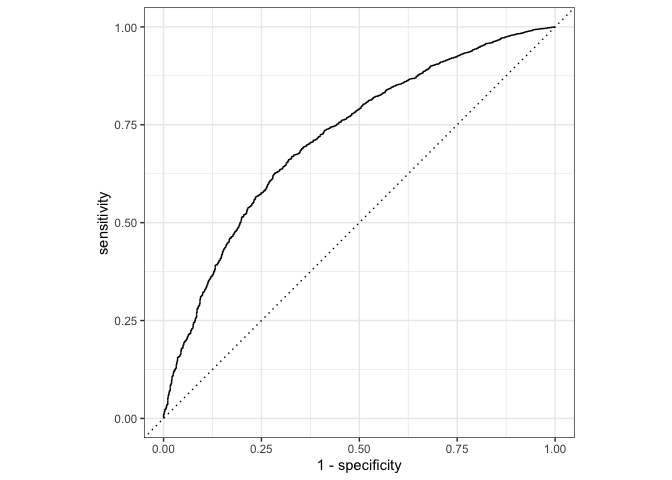
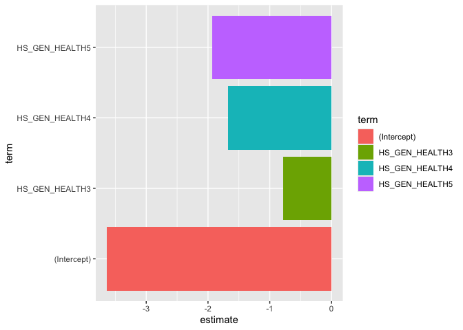
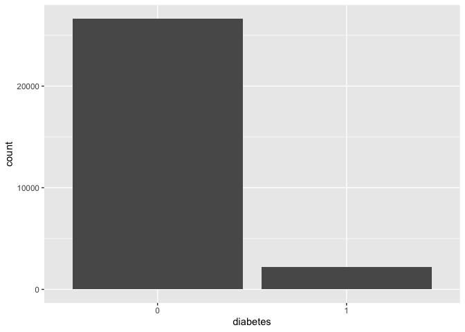
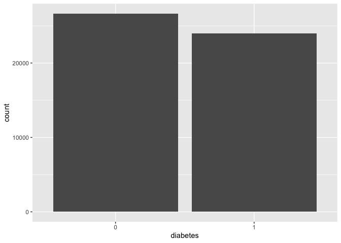
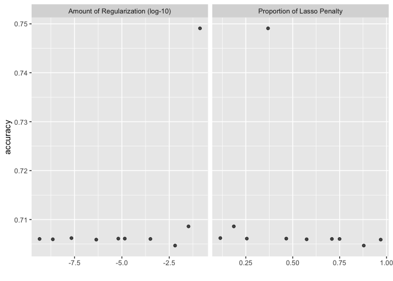

``` r
knitr::opts_chunk$set(echo = TRUE)
library(tidyverse)
library(tidymodels)
library(sjPlot)
library(finalfit)
library(knitr)
library(gtsummary)
library(mlbench)
library(vip)
library(rsample)
library(tune)
library(recipes)
library(yardstick)
library(parsnip)
library(glmnet)
library(themis)
library(microbenchmark)
```

# Logistic Regression - The Machine Learning Way

## Research question and data

We are using an imputed (ie. no missing data) version of the CanPath student dataset [https://canpath.ca/student-dataset/](https://canpath.ca/student-dataset/). The nice thing about this dataset is that it's pretty big in terms of sample size, has lots of variables, and we can use it for free. 

Our research question is:  

- **Can we develop a model that will predict type 2 diabetes**

### Reading in data

Here are reading in data and getting organized to run our models. 


``` r
data <- read_csv("mice_all_imp.csv")
```

```
## Rows: 41187 Columns: 93
## ── Column specification ────────────────────────────────────────────────────────
## Delimiter: ","
## chr  (1): ID
## dbl (92): ADM_STUDY_ID, SDC_GENDER, SDC_AGE_CALC, SDC_MARITAL_STATUS, SDC_ED...
## 
## ℹ Use `spec()` to retrieve the full column specification for this data.
## ℹ Specify the column types or set `show_col_types = FALSE` to quiet this message.
```

``` r
data <- data %>% mutate_at(3, factor)
data <- data %>% mutate_at(5:6, factor)
data <- data %>% mutate_at(8:12, factor)
data <- data %>% mutate_at(15:81, factor)
data <- data %>% mutate_at(83:93, factor)

table(data$DIS_DIAB_EVER)
```

```
## 
##     0     1     2 
## 36714  3114  1359
```

``` r
data <- data %>%
	mutate(diabetes = case_when(
		DIS_DIAB_EVER == 0 ~ 0,
		DIS_DIAB_EVER == 1 ~ 1,
		DIS_DIAB_EVER == 2 ~ 0)) %>%
		mutate(diabetes = as.factor(diabetes))

table(data$DIS_DIAB_EVER, data$diabetes)
```

```
##    
##         0     1
##   0 36714     0
##   1     0  3114
##   2  1359     0
```

``` r
data$DIS_DIAB_EVER <- NULL
```

#### Simplifying the data

Here I'm simplifying the data because the models take a long time to run and for teaching purposes we need models that run in a reasonable amount of time. 


``` r
data_small <- select(data, diabetes, SDC_AGE_CALC, SDC_EDU_LEVEL, PM_BMI_SR, HS_GEN_HEALTH, WRK_FULL_TIME, SMK_CIG_EVER, SDC_INCOME, PA_TOTAL_SHORT, HS_ROUTINE_VISIT_EVER, PSE_ADULT_WRK_DURATION, DIS_RESP_SLEEP_APNEA_EVER, SDC_EDU_LEVEL_AGE, SDC_GENDER)
```

## Machine Learning - Logistic Regression 

In a machine learning approach, in general, our interest is less on the specific associations we see between individual variables and the outcome and more on the overall performance of the model in terms of predicting the outcome. You might remember this like AIC, BIC, or -2Log-Likelihood, or Pseudo-R2 for model fit in logistic regression. 

### Resampling - Data Split approach (Part 1)

More machine learning we need a way to split the data into a training set and a test set. There are a few different approaches too this. Here we are going to use an 70/30 split with 70% of the data going to training and 30 going to testing. This is sort of an older way to split data and I would say that a k-fold cross validation is probably more in line with modern practice. We will test this out later.  


``` r
# Fix the random numbers by setting the seed 
# This enables the analysis to be reproducible when random numbers are used 
set.seed(10)

data_split <- initial_split(data_small, prop = 0.70, strata = diabetes)

# Create data frames for the two sets:
train_data <- training(data_split)
table(train_data$diabetes)
```

```
## 
##     0     1 
## 26640  2190
```

``` r
test_data  <- testing(data_split)
table(test_data$diabetes)
```

```
## 
##     0     1 
## 11433   924
```

Now we have split the data, we want to create the model for the training data and save it so it can be applied to the testing set. This is basically exactly what we did before. __Note that we only run the model on the training data__ Not all of the data like would in a traditional logistic regression. Here we won't get the exact same result as our original logistic regression because we don't have the same data. We expect there will be some variation but that the results should relatively similar. 

**Another note. I've added variables to this model compared to our previous model. The previous model did a very poor job of predicting diabetes overall. In fact, it had a sensitivity of ZERO! Meaning it did not predict a single case of diabetes in the test set. That's bad so I've added variables to try and increase our prediction ability. This is a key difference in typical etiologic epidemiology versus machine learning focused analyses. 

### Running the regression


``` r
table(data$diabetes)
```

```
## 
##     0     1 
## 38073  3114
```

``` r
logistic_model <- logistic_reg() %>%
        set_engine("glm") %>%
        set_mode("classification") %>% 
        fit(diabetes ~ ., data = train_data)
```

### Test the trained model

Once we `train the model` we want to understand how well our trained model works on new data the model has not seen. This is where the testing data comes in. We can use the `predict` feature for this. What we are doing here is predicting if someone has diabetes (yes/no) from the model we trained using the training data, on the testing data. We had 4293 observations in the training with 4077 people with on diabetes and 216 people with diabetes. Much of this example comes from [https://medium.com/the-researchers-guide/modelling-binary-logistic-regression-using-tidymodels-library-in-r-part-1-c1bdce0ac055](https://medium.com/the-researchers-guide/modelling-binary-logistic-regression-using-tidymodels-library-in-r-part-1-c1bdce0ac055)

The code below outputs the predict class `diabetes (yes/no)` for the test data. 


``` r
pred_class <- predict(logistic_model,
                      new_data = test_data,
                      type = "class")
table(pred_class$.pred_class)
```

```
## 
##     0     1 
## 12348     9
```

``` r
table(test_data$diabetes)
```

```
## 
##     0     1 
## 11433   924
```

Our model predicts that we have 4206 people with diabetes and 4 people with diabetes. Not looking good for our model! 

Now we want to generated the predicted probabilities for the model. That is, how well does our model think it does for each person. 


``` r
pred_prob <- predict(logistic_model,
                      new_data = test_data,
                      type = "prob")
head(pred_prob)
```

```
## # A tibble: 6 × 2
##   .pred_0 .pred_1
##     <dbl>   <dbl>
## 1   0.975  0.0246
## 2   0.928  0.0715
## 3   0.979  0.0206
## 4   0.936  0.0638
## 5   0.972  0.0281
## 6   0.774  0.226
```

This is not very informative in terms of results but we will discuss this more later. 

Now we want to combine all of our results into one dataframe and just do a quick check. 


``` r
diabetes_results <- test_data %>%
  select(diabetes) %>%
  bind_cols(pred_class, pred_prob)

head(diabetes_results)
```

```
## # A tibble: 6 × 4
##   diabetes .pred_class .pred_0 .pred_1
##   <fct>    <fct>         <dbl>   <dbl>
## 1 0        0             0.975  0.0246
## 2 0        0             0.928  0.0715
## 3 0        0             0.979  0.0206
## 4 0        0             0.936  0.0638
## 5 0        0             0.972  0.0281
## 6 0        0             0.774  0.226
```

Here we can see the first 6 rows of data data all negative for diabetes and are predicted as negative. The model is very confident in these predictions, with over 90% negative prediction in all six observations. 

### Model evaluation

There are a number of different methods we must use to evaluate machine learning models. We will walk through those. 

#### Confusion Matrix

We can generate a confusion matrix by using the `conf_mat()` function by supplying the final data frame (`diabetes_results`), the truth column `diabetes` and predicted class `.pred_class` in the estimate attribute.

A confusion matrix is sort of a 2x2 table with the true values on one side and predicted values in another column. If we look on the diagonal we see when the model correctly predicts the values `yes/no` and off diagonal is when the model does not predict the correct value. So this model correctly predicts that 4075 cases of diabetes and incorrectly predicts that 212 people do not have diabetes when they do have it. The model correctly predicts 4 cases of diabetes. It also incorrectly predicts that two people who do not have diabetes do have diabetes. 


``` r
conf_mat(diabetes_results, truth = diabetes,
         estimate = .pred_class)
```

```
##           Truth
## Prediction     0     1
##          0 11428   920
##          1     5     4
```

#### Accuracy

We can calculate the classification accuracy by using the `accuracy()` function by supplying the final data frame `diabetes_results`, the truth column `diabetes` and predicted class `.pred_class` in the estimate attribute. The model classification accuracy on test dataset is about ~94%. This looks good but it's a bit of fake result as we will see later. 


``` r
accuracy(diabetes_results, truth = diabetes,
         estimate = .pred_class)
```

```
## # A tibble: 1 × 3
##   .metric  .estimator .estimate
##   <chr>    <chr>          <dbl>
## 1 accuracy binary         0.925
```

#### Sensitivity

The sensitivity (also known as __Recall__) of a classifier is the ratio between what was correctly identified as positive (True Positives) and all positives (False Negative + True Positive).

__Sensitivity = TP / FN + TP__

The sensitivity value is 1.0 indicating that we are able to correctly detect 100% of the positive values. 


``` r
sens(diabetes_results, truth = diabetes,
    estimate = .pred_class)
```

```
## # A tibble: 1 × 3
##   .metric .estimator .estimate
##   <chr>   <chr>          <dbl>
## 1 sens    binary          1.00
```

#### Specificity

Specificity of a classifier is the ratio between what was classified as negative (True Negatives) and all negative values (False Positive + True Native)

__Specificity = TN / FP + TN__

The specificity value is 0.004. Meaning that we correctly classify 0.4% of the negative values, which is pretty terrible. 


``` r
spec(diabetes_results, truth = diabetes,
    estimate = .pred_class)
```

```
## # A tibble: 1 × 3
##   .metric .estimator .estimate
##   <chr>   <chr>          <dbl>
## 1 spec    binary       0.00433
```

#### Precision

What percent of values are correctly classified as positive (True Positives) out of all positives (True Positive + False Positive)?

__Precision = TP / TP + FP__

The precision is 0.94, meaning we identify 81.8% of true positives compared to all positives. 


``` r
precision(diabetes_results, truth = diabetes,
    estimate = .pred_class)
```

```
## # A tibble: 1 × 3
##   .metric   .estimator .estimate
##   <chr>     <chr>          <dbl>
## 1 precision binary         0.925
```

#### F-Score

F-score is the mean of precision and sensitivity. The value ranges from 1 (the best score) and 0 (the worst score). F-score gives us the balance between precision and sensitivity. The F1 score is about 0.97, which indicates that the trained model has a classification strength of 97%.


``` r
f_meas(diabetes_results, truth = diabetes,
       estimate = .pred_class)
```

```
## # A tibble: 1 × 3
##   .metric .estimator .estimate
##   <chr>   <chr>          <dbl>
## 1 f_meas  binary         0.961
```

#### ROC Curve

The ROC curve is plotted with `sensitivity` against `1 - Specificity`, where `sensitivity` is on the y-axis and `1 - Specificity` is on the x-axis. A line is drawn diagonally to denote 50–50 partitioning of the graph. If the curve is more close to the line, lower the performance of the classifier, which is no better than a mere random guess.

You can generate a ROC Curve using the `roc_curve()` function where you need to supply the truth column `diabetes` and predicted probabilities for the positive class `.pred_pos`.

Our model has got a ROC-AUC score of 0.227 indicating a good model that cannot distinguish between patients with diabetes and no diabetes.


``` r
roc_auc(diabetes_results,
        truth = diabetes,
        .pred_0)
```

```
## # A tibble: 1 × 3
##   .metric .estimator .estimate
##   <chr>   <chr>          <dbl>
## 1 roc_auc binary         0.719
```

``` r
roc_curve <- diabetes_results %>%
  roc_curve(truth = diabetes, .pred_0) %>%
  autoplot()

plot(roc_curve)
```

<!-- -->

#### All the metrics 

We can produce all of the metrics using the `metric_set` function. 


``` r
metrics <- metric_set(accuracy, sens, spec, precision, recall, f_meas)

all_metrics_lr <- metrics(diabetes_results,
               truth = diabetes,
               estimate = .pred_class)
               
kable(all_metrics_lr)
```


|.metric   |.estimator | .estimate|
|:---------|:----------|---------:|
|accuracy  |binary     | 0.9251436|
|sens      |binary     | 0.9995627|
|spec      |binary     | 0.0043290|
|precision |binary     | 0.9254940|
|recall    |binary     | 0.9995627|
|f_meas    |binary     | 0.9611034|

#### Feature Importance

Feature importance is the one way that ML models examine which variables are important to the predictions overall. It's not super common to see, except for people like Epi folks who think about specific associations between variables. 


``` r
coeff <- tidy(logistic_model) %>% 
  arrange(desc(abs(estimate))) %>% 
  filter(abs(estimate) > 0.5)

kable(coeff)
```


|term           |  estimate| std.error|  statistic| p.value|
|:--------------|---------:|---------:|----------:|-------:|
|(Intercept)    | -3.638060| 0.5831930|  -6.238175|       0|
|HS_GEN_HEALTH5 | -1.932474| 0.1354990| -14.261910|       0|
|HS_GEN_HEALTH4 | -1.672357| 0.1154920| -14.480284|       0|
|HS_GEN_HEALTH3 | -0.781757| 0.1101688|  -7.095992|       0|

#### Plot of feature importance


``` r
ggplot(coeff, aes(x = term, y = estimate, fill = term)) + geom_col() + coord_flip()
```

<!-- -->

#### Model interpretation

So now we have to interpret the model. General guidelines to think about the bias variance trade off and weather our model performs well. Based on the evaluation metrics how do we fell about this model? 
Typically in ML types of problems a model with less than 80-90% accuracy is consider ok, but it depends a bit on the problem. Our model has an accuracy of 95%... maybe that's good. HOWEVER, when we look at the sensitivity it's 1 and the specificity is 0.4%. A sensitivity of 1 (perfect) is suspect and our specificity is very very bad.

Overall, this model is not very good. We don't have a sufficient number of features (variables) to do a good job with prediction. We have a high bias, our model underfits the data. The variance is also high. 

### Up-Sampling

OK. So our model is terrible. There are a number of reasons for this that we are going to explore now. These are standard machine learning explorations that we would normally do as part of machine learning analysis workflow. First, we are going to explore up-sampling. One of the main problems with the diabetes data we have is the prevalence of diabetes is relatively low in the dataset. This is good normally in biostatistics approaches as we want the OR to approximate the RR in a case control study. BUT that's terrible for prediction. 

One thing that we can do is up-scale the lowest class (or classes) or the outcome variable. There are a bunch of different methods to do this and we are using the `themis` package [https://themis.tidymodels.org/reference/index.html](https://themis.tidymodels.org/reference/index.html). Here we are using the `step_upsample()` function. We only want to use the up scaling methods on the training set. We don't use it on the test set because that would create a false model performance. 

#### Up-sampling Example


``` r
### Showing the distribution of diabetes (yes/no) in the real data
table(train_data$diabetes)
```

```
## 
##     0     1 
## 26640  2190
```

``` r
ggplot(train_data) + 
    geom_bar(aes(diabetes))
```

<!-- -->

``` r
### Creating a recipe were we upsample the diabetes yes category to be 50% of the diabetes no category. This is an arbitrary number and you will need to play with this.

diabetes_rec_oversamp <- 
  recipe(diabetes ~ ., data = train_data) %>%
  step_smotenc(diabetes, over_ratio = 0.9) %>%
  step_unknown() %>%
  step_dummy(all_nominal_predictors()) %>%
  step_normalize(all_numeric_predictors()) %>% ### Mean center and standardize (z-score) the numeric predictors
  step_zv(all_predictors()) 

### Visualization of the 30% ratio
recipe(~., train_data) %>%
  step_upsample(diabetes, over_ratio = 0.9) %>%
  prep() %>%
  bake(new_data = NULL) %>%
  ggplot(aes(diabetes)) +
  geom_bar()
```

<!-- -->

Here we upscale the `diabetes-Yes` category to 50% of the of the `diabetes-No` category. The figures show the differences but we go from 1514 cases of diabetes in the training set to over ~12000 cases of diabetes. 

**Up-scaling regression**

Setup the recipe and metrics. Here we are specifying the model we want to use. 


``` r
logistic_m <- logistic_reg(
                mode = "classification",
                engine = "glm"
              )
```

Logistic regression results based on up-scaling. Here we setup the workflow. A workflow must includ the following

* A Recipe `add_recipe` which is how we tell the workflow to process the data. 
* A Model `add_model` which specifies the model paramaters

Once we save the workflow we can run the same model in different ways. More on this later. 


``` r
diabetes_wflow_oversamp <- 
  workflow() %>% 
  add_model(logistic_m) %>% 
  add_recipe(diabetes_rec_oversamp)

diabetes_wflow_oversamp
```

```
## ══ Workflow ════════════════════════════════════════════════════════════════════
## Preprocessor: Recipe
## Model: logistic_reg()
## 
## ── Preprocessor ────────────────────────────────────────────────────────────────
## 5 Recipe Steps
## 
## • step_smotenc()
## • step_unknown()
## • step_dummy()
## • step_normalize()
## • step_zv()
## 
## ── Model ───────────────────────────────────────────────────────────────────────
## Logistic Regression Model Specification (classification)
## 
## Computational engine: glm
```

Now we will actually fit the model to the data using the recipe and `fit` command. 


``` r
diabetes_fit_oversamp <- 
  diabetes_wflow_oversamp %>% 
  fit(data = train_data)
```


``` r
diabetes_fit_oversamp %>% 
  extract_fit_parsnip() %>% 
  tidy()
```

```
## # A tibble: 30 × 5
##    term                   estimate std.error statistic   p.value
##    <chr>                     <dbl>     <dbl>     <dbl>     <dbl>
##  1 (Intercept)             -0.135    0.00990    -13.7  1.53e- 42
##  2 SDC_AGE_CALC             0.389    0.0118      32.9  1.25e-237
##  3 PM_BMI_SR                0.175    0.0102      17.0  3.80e- 65
##  4 PA_TOTAL_SHORT          -0.0981   0.0101      -9.66 4.26e- 22
##  5 PSE_ADULT_WRK_DURATION   0.0631   0.0112       5.62 1.94e-  8
##  6 SDC_EDU_LEVEL_AGE        0.0270   0.0112       2.41 1.59e-  2
##  7 SDC_EDU_LEVEL_X1         0.202    0.0556       3.64 2.77e-  4
##  8 SDC_EDU_LEVEL_X2         0.937    0.198        4.73 2.30e-  6
##  9 SDC_EDU_LEVEL_X3         0.641    0.140        4.59 4.40e-  6
## 10 SDC_EDU_LEVEL_X4         1.03     0.212        4.88 1.04e-  6
## # ℹ 20 more rows
```

``` r
diabetes_aug_oversamp <- 
  augment(diabetes_fit_oversamp, test_data)

diabetes_fit_oversamp_all_metrics <- metrics(diabetes_aug_oversamp,
               truth = diabetes,
               estimate = .pred_class)
               
kable(diabetes_fit_oversamp_all_metrics)
```


|.metric   |.estimator | .estimate|
|:---------|:----------|---------:|
|accuracy  |binary     | 0.7053492|
|sens      |binary     | 0.7154728|
|spec      |binary     | 0.5800866|
|precision |binary     | 0.9547152|
|recall    |binary     | 0.7154728|
|f_meas    |binary     | 0.8179591|

Here we have dramatically improved our specificity from 0.004 to 0.28. Overall, our accuracy and other metrics have gone down... which is good. This model is much better and less suspect than our previous model. Our up-sampling has done well here. We could test more up-sampling but you get the idea here. 


``` r
kable(all_metrics_lr)
```


|.metric   |.estimator | .estimate|
|:---------|:----------|---------:|
|accuracy  |binary     | 0.9251436|
|sens      |binary     | 0.9995627|
|spec      |binary     | 0.0043290|
|precision |binary     | 0.9254940|
|recall    |binary     | 0.9995627|
|f_meas    |binary     | 0.9611034|

### Resampling (part 2)

So we know that the up-scaling worked well to improve the model. Another thing we always want to test with an ML model is using a different type of resampling (validation) approach. Originally, we used a 70/30 split in the data, which is not the optimal approach. A better general approach is k-fold cross validation. This approach is very common. There is some discussion of a bunch of other approaches here [https://www.stepbystepdatascience.com/ml-with-tidymodels](https://www.stepbystepdatascience.com/ml-with-tidymodels).

Here we will use our new up-scaled data and apply 10 fold cross-validation approach. We have already set the seed for the analysis in line 105. Setting that will make sure that we get a reproducible result. This resmapling approach 


``` r
folds <- vfold_cv(train_data, v = 5) ## normally you would do at least 10 folds. Just doing 5 because it's faster.

diabetes_fit_kfold <- 
      diabetes_wflow_oversamp %>% 
      fit_resamples(folds)

diabetes_fit_kfold
```

```
## # Resampling results
## # 5-fold cross-validation 
## # A tibble: 5 × 4
##   splits               id    .metrics         .notes          
##   <list>               <chr> <list>           <list>          
## 1 <split [23064/5766]> Fold1 <tibble [3 × 4]> <tibble [0 × 3]>
## 2 <split [23064/5766]> Fold2 <tibble [3 × 4]> <tibble [0 × 3]>
## 3 <split [23064/5766]> Fold3 <tibble [3 × 4]> <tibble [0 × 3]>
## 4 <split [23064/5766]> Fold4 <tibble [3 × 4]> <tibble [0 × 3]>
## 5 <split [23064/5766]> Fold5 <tibble [3 × 4]> <tibble [0 × 3]>
```

``` r
collect_metrics(diabetes_fit_kfold)
```

```
## # A tibble: 3 × 6
##   .metric     .estimator  mean     n  std_err .config             
##   <chr>       <chr>      <dbl> <int>    <dbl> <chr>               
## 1 accuracy    binary     0.706     5 0.00201  Preprocessor1_Model1
## 2 brier_class binary     0.194     5 0.000869 Preprocessor1_Model1
## 3 roc_auc     binary     0.713     5 0.00763  Preprocessor1_Model1
```

``` r
accuracy(diabetes_aug_oversamp, truth = diabetes,
         estimate = .pred_class)
```

```
## # A tibble: 1 × 3
##   .metric  .estimator .estimate
##   <chr>    <chr>          <dbl>
## 1 accuracy binary         0.705
```

Note that our accuracy and other metrics did not change. BUT now because we did a cross-validation, meaning we replicated the analysis many times on sub-sets of the data, we can estimate a standard error for our metrics. This is another big advantage of using bootstraps or cross-validation approaches. We get some idea of potential error in our metrics. 

### Hyperparamater specification 

Depending on the ML model there are different hyperparameters we might want to test. There are a different number of hyperparameters depending on the model. For logistic regression we can use ridge, lasso, and elastic net penalizations to see how model performance changes. These appraoches are important because they deal with lots of variables in the model and account for having too many variables in the model in different ways. Penalized logistic regression imposes a penalty to the logistic model for having too many variables. This results in shrinking the coefficients of the less contributive variables toward zero. This is also known as regularization. The most commonly used penalized regression include:

* Ridge regression: variables with minor contribution have their coefficients close to zero. However, all the variables are incorporated in the model. This is useful when all variables need to be incorporated in the model according to domain knowledge.
* Lasso regression: the coefficients of some less contributive variables are forced to be exactly zero. Only the most significant variables are kept in the final model.
* Elastic net regression: the combination of ridge and lasso regression. It shrinks some coefficients toward zero (like ridge regression) and set some coefficients to exactly zero (like lasso regression)

Here we are going to use the same setup as before with our up-sampled and 10 fold cross validation approach and add in the hyperparameter testing. We will go from using the `glm` engine in R to the `glmnet` package for estimates. From the package description

> Extremely efficient procedures for fitting the entire lasso or elastic-net regularization path for linear regression, logistic and multinomial regression models, Poisson regression, Cox model, multiple-response Gaussian, and the grouped multinomial regression; see [https://doi.org/10.18637/jss.v033.i01](https://doi.org/10.18637/jss.v033.i01) and [https://doi.org/10.18637/jss.v039.i05](https://doi.org/10.18637/jss.v039.i05). 


``` r
logistic_m_mixture <- logistic_reg(
                mode = "classification",
                engine = "glmnet",
                penalty = tune(),
                mixture = tune()
              )

diabetes_wflow_oversamp_tune <- workflow() %>% 
          add_model(logistic_m_mixture) %>% 
          add_recipe(diabetes_rec_oversamp) %>% 
          tune_grid(resamples = folds,
                    control = control_grid(save_pred = TRUE, 
                                            verbose = FALSE)) ## Edit for running live

collect_metrics(diabetes_wflow_oversamp_tune) 
```

```
## # A tibble: 30 × 8
##         penalty mixture .metric     .estimator  mean     n  std_err .config     
##           <dbl>   <dbl> <chr>       <chr>      <dbl> <int>    <dbl> <chr>       
##  1 0.0000000217   0.114 accuracy    binary     0.706     5 0.00188  Preprocesso…
##  2 0.0000000217   0.114 brier_class binary     0.194     5 0.000875 Preprocesso…
##  3 0.0000000217   0.114 roc_auc     binary     0.715     5 0.00788  Preprocesso…
##  4 0.0327         0.186 accuracy    binary     0.709     5 0.00223  Preprocesso…
##  5 0.0327         0.186 brier_class binary     0.194     5 0.000663 Preprocesso…
##  6 0.0327         0.186 roc_auc     binary     0.717     5 0.00768  Preprocesso…
##  7 0.0000142      0.255 accuracy    binary     0.706     5 0.00192  Preprocesso…
##  8 0.0000142      0.255 brier_class binary     0.194     5 0.000862 Preprocesso…
##  9 0.0000142      0.255 roc_auc     binary     0.715     5 0.00790  Preprocesso…
## 10 0.132          0.368 accuracy    binary     0.749     5 0.00278  Preprocesso…
## # ℹ 20 more rows
```

``` r
show_best(diabetes_wflow_oversamp_tune, metric='accuracy', n=5)  # only show the results for the best 5 models
```

```
## # A tibble: 5 × 8
##        penalty mixture .metric  .estimator  mean     n std_err .config          
##          <dbl>   <dbl> <chr>    <chr>      <dbl> <int>   <dbl> <chr>            
## 1 0.132          0.368 accuracy binary     0.749     5 0.00278 Preprocessor1_Mo…
## 2 0.0327         0.186 accuracy binary     0.709     5 0.00223 Preprocessor1_Mo…
## 3 0.0000000217   0.114 accuracy binary     0.706     5 0.00188 Preprocessor1_Mo…
## 4 0.0000142      0.255 accuracy binary     0.706     5 0.00192 Preprocessor1_Mo…
## 5 0.00000646     0.466 accuracy binary     0.706     5 0.00194 Preprocessor1_Mo…
```

``` r
autoplot(diabetes_wflow_oversamp_tune, metric = 'accuracy') 
```

<!-- -->

Here we can see that based on tuning the model accuracy ranges from 0.904 to 0.945. That's a 4% improvement! I have seen hyperparameter tuning improve models by more than 10% so this is a reasonable improvement. We also get the specific values for the penalty and mixutre that we can run in a final model. 
### Benchmarks 

We can check how long each model took to run using the `microbenchmark` package. These are nanoseconds, so there is no real difference here but this is a simple model with small data. 


``` r
microbenchmark(logistic_model, diabetes_wflow_oversamp, diabetes_wflow_oversamp_tune)
```

```
## Unit: nanoseconds
##                          expr min lq mean median uq max neval cld
##                logistic_model   0  0 3.28      0  0 328   100   a
##       diabetes_wflow_oversamp   0  0 3.69      0  0 328   100   a
##  diabetes_wflow_oversamp_tune   0  0 2.87      0  0 287   100   a
```

## Session Info


``` r
sessionInfo()
```

```
## R version 4.4.2 (2024-10-31)
## Platform: aarch64-apple-darwin20
## Running under: macOS Sequoia 15.3
## 
## Matrix products: default
## BLAS:   /Library/Frameworks/R.framework/Versions/4.4-arm64/Resources/lib/libRblas.0.dylib 
## LAPACK: /Library/Frameworks/R.framework/Versions/4.4-arm64/Resources/lib/libRlapack.dylib;  LAPACK version 3.12.0
## 
## locale:
## [1] en_US.UTF-8/en_US.UTF-8/en_US.UTF-8/C/en_US.UTF-8/en_US.UTF-8
## 
## time zone: America/Regina
## tzcode source: internal
## 
## attached base packages:
## [1] stats     graphics  grDevices utils     datasets  methods   base     
## 
## other attached packages:
##  [1] microbenchmark_1.5.0 themis_1.0.2         glmnet_4.1-8        
##  [4] Matrix_1.7-1         vip_0.4.1            mlbench_2.1-5       
##  [7] gtsummary_2.0.3      knitr_1.49           finalfit_1.0.8      
## [10] sjPlot_2.8.16        yardstick_1.3.1      workflowsets_1.1.0  
## [13] workflows_1.1.4      tune_1.2.1           rsample_1.2.1       
## [16] recipes_1.1.0        parsnip_1.2.1        modeldata_1.4.0     
## [19] infer_1.0.7          dials_1.3.0          scales_1.3.0        
## [22] broom_1.0.7          tidymodels_1.2.0     lubridate_1.9.3     
## [25] forcats_1.0.0        stringr_1.5.1        dplyr_1.1.4         
## [28] purrr_1.0.2          readr_2.1.5          tidyr_1.3.1         
## [31] tibble_3.2.1         ggplot2_3.5.1        tidyverse_2.0.0     
## 
## loaded via a namespace (and not attached):
##  [1] sandwich_3.1-1      rlang_1.1.4         magrittr_2.0.3     
##  [4] multcomp_1.4-26     furrr_0.3.1         compiler_4.4.2     
##  [7] vctrs_0.6.5         lhs_1.2.0           crayon_1.5.3       
## [10] pkgconfig_2.0.3     shape_1.4.6.1       fastmap_1.2.0      
## [13] backports_1.5.0     labeling_0.4.3      utf8_1.2.4         
## [16] rmarkdown_2.29      prodlim_2024.06.25  tzdb_0.4.0         
## [19] nloptr_2.1.1        bit_4.5.0           jomo_2.7-6         
## [22] xfun_0.49           cachem_1.1.0        jsonlite_1.8.9     
## [25] pan_1.9             sjmisc_2.8.10       ggeffects_1.7.2    
## [28] parallel_4.4.2      R6_2.5.1            bslib_0.8.0        
## [31] stringi_1.8.4       boot_1.3-31         parallelly_1.39.0  
## [34] rpart_4.1.23        jquerylib_0.1.4     Rcpp_1.0.13-1      
## [37] iterators_1.0.14    future.apply_1.11.3 zoo_1.8-12         
## [40] splines_4.4.2       nnet_7.3-19         timechange_0.3.0   
## [43] tidyselect_1.2.1    rstudioapi_0.17.1   yaml_2.3.10        
## [46] timeDate_4041.110   codetools_0.2-20    sjlabelled_1.2.0   
## [49] listenv_0.9.1       lattice_0.22-6      withr_3.0.2        
## [52] evaluate_1.0.1      future_1.34.0       survival_3.7-0     
## [55] pillar_1.9.0        mice_3.16.0         foreach_1.5.2      
## [58] insight_1.0.0       generics_0.1.3      vroom_1.6.5        
## [61] hms_1.1.3           munsell_0.5.1       minqa_1.2.8        
## [64] globals_0.16.3      class_7.3-22        glue_1.8.0         
## [67] ROSE_0.0-4          tools_4.4.2         data.table_1.16.2  
## [70] lme4_1.1-35.5       gower_1.0.1         mvtnorm_1.3-2      
## [73] grid_4.4.2          datawizard_0.13.0   ipred_0.9-15       
## [76] colorspace_2.1-1    nlme_3.1-166        performance_0.12.4 
## [79] cli_3.6.3           DiceDesign_1.10     fansi_1.0.6        
## [82] lava_1.8.0          sjstats_0.19.0      gtable_0.3.6       
## [85] GPfit_1.0-8         sass_0.4.9          digest_0.6.37      
## [88] TH.data_1.1-2       farver_2.1.2        htmltools_0.5.8.1  
## [91] lifecycle_1.0.4     hardhat_1.4.0       mitml_0.4-5        
## [94] bit64_4.5.2         MASS_7.3-61
```

