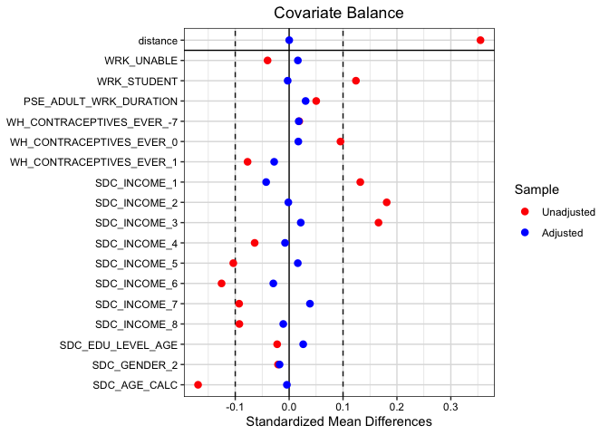
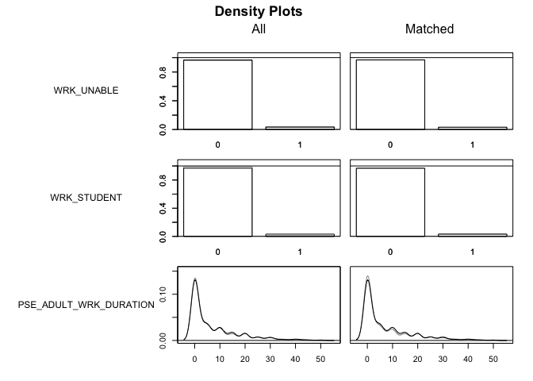
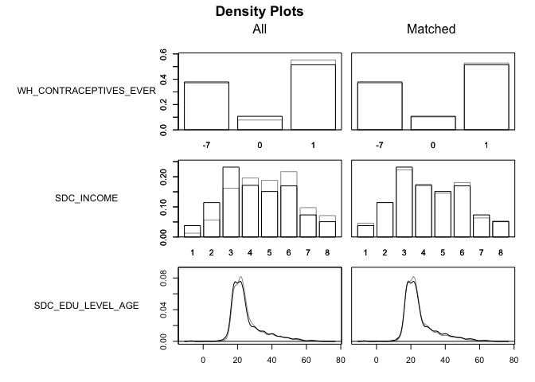
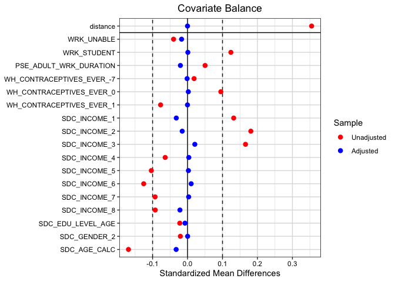
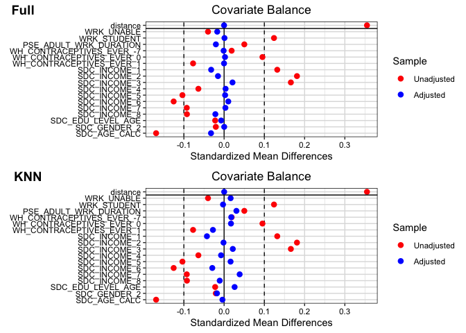
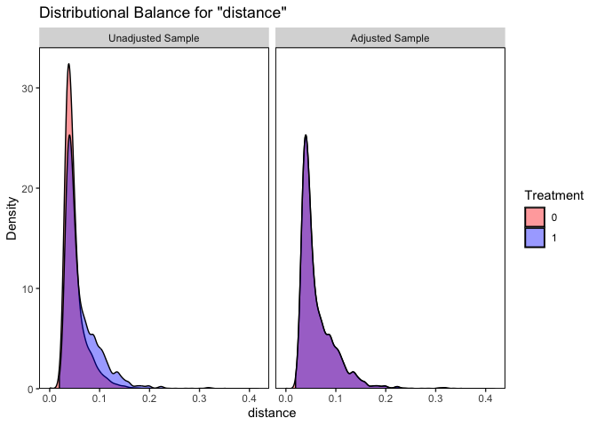
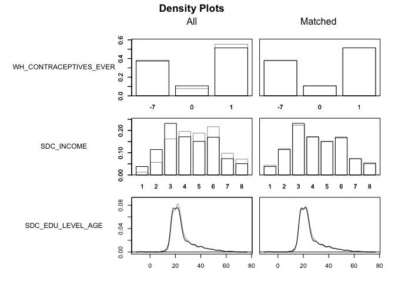
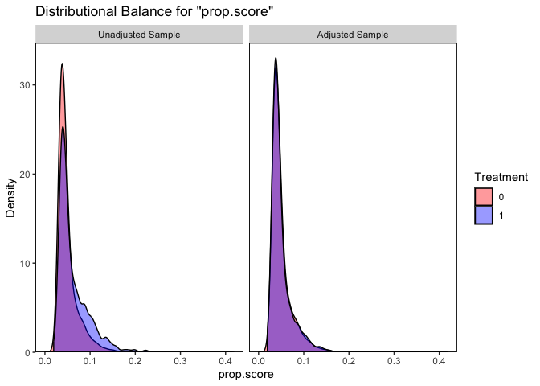

``` r
knitr::opts_chunk$set(echo = TRUE)
library(tidyverse)
library(adjustedCurves)
library(boot)
library(broom)
library(geepack)
library(here)
library(MatchIt)
library(tableone)
library(sjPlot)
library(survey)
library(episensr) 
library(epitools)
library(gtsummary)
library(cobalt)
library(cowplot)
library(geepack)
library(WeightIt)
```

# Matching Methods

Research question of interest. __Is unemployment (treatment) associated with type 2 diabetes in our sample?__

Why might this be relevant for our sample? It's hard to randomize employment because it's not feasible to make people not work/not earn money. Also, unemployed people might have quite different characteristics than other people or the general population. Also, remember that we have a sample here that is from the same source population so it's appropriate to think about matching as a potential analysis method. 


``` r
data <- read_csv("mice_all_imp.csv")
```

```
## Rows: 41187 Columns: 93
## ── Column specification ────────────────────────────────────────────────────────
## Delimiter: ","
## chr  (1): ID
## dbl (92): ADM_STUDY_ID, SDC_GENDER, SDC_AGE_CALC, SDC_MARITAL_STATUS, SDC_ED...
## 
## ℹ Use `spec()` to retrieve the full column specification for this data.
## ℹ Specify the column types or set `show_col_types = FALSE` to quiet this message.
```

``` r
data <- data %>% mutate_at(3, factor)
data <- data %>% mutate_at(5:6, factor)
data <- data %>% mutate_at(8:12, factor)
data <- data %>% mutate_at(15:81, factor)
data <- data %>% mutate_at(83:93, factor)
```

### Some data cleaning

#### Diabetes

Diabetes = 0 (No diabetes ever), Diabetes = 1 (Yes diabetes ever)


``` r
table(data$DIS_DIAB_EVER)
```

```
## 
##     0     1     2 
## 36714  3114  1359
```

``` r
data <- data %>%
	mutate(diabetes = case_when(
		DIS_DIAB_EVER == 0 ~ 0,
		DIS_DIAB_EVER == 1 ~ 1,
		DIS_DIAB_EVER == 2 ~ 0)) %>%
		mutate(diabetes = as.factor(diabetes))

table(data$DIS_DIAB_EVER, data$diabetes)
```

```
##    
##         0     1
##   0 36714     0
##   1     0  3114
##   2  1359     0
```

``` r
data$DIS_DIAB_EVER <- NULL
```

#### Unemployed

unemployed = 0 (Not unemployed), unemployed = 1 (Unemployed)


``` r
table(data$WRK_UNEMPLOYED)
```

```
## 
##     0     1 
## 39100  2087
```

``` r
data <- data %>%
	mutate(unemployed = case_when(
		WRK_UNEMPLOYED == 0 ~ 0,
		WRK_UNEMPLOYED == 1 ~ 1)) %>%
		mutate(unemployed = as.factor(unemployed))

table(data$WRK_UNEMPLOYED, data$unemployed)
```

```
##    
##         0     1
##   0 39100     0
##   1     0  2087
```

``` r
data$WRK_UNEMPLOYED <- NULL
```

## Unadjusted / Non-matched models

### Examine association between treatment and outcome


``` r
table(data$unemployed, data$diabetes)
```

```
##    
##         0     1
##   0 36176  2924
##   1  1897   190
```

``` r
#### Epi tools method
unemp <- c("No", "Yes")
outc <- c("Case", "Control")
dat <- matrix(c(2924, 36176, 190, 1897),2,2,byrow=TRUE)
dimnames(dat) <- list("Unemployed" = unemp, "Outcome" = outc)
oddsratio(dat, rev="c")
```

```
## $data
##           Outcome
## Unemployed Control Case Total
##      No      36176 2924 39100
##      Yes      1897  190  2087
##      Total   38073 3114 41187
## 
## $measure
##           odds ratio with 95% C.I.
## Unemployed estimate    lower    upper
##        No  1.000000       NA       NA
##        Yes 1.240063 1.060143 1.442388
## 
## $p.value
##           two-sided
## Unemployed  midp.exact fisher.exact  chi.square
##        No           NA           NA          NA
##        Yes 0.007565155   0.00738618 0.006196459
## 
## $correction
## [1] FALSE
## 
## attr(,"method")
## [1] "median-unbiased estimate & mid-p exact CI"
```

``` r
#### Logistic regression
lr <- glm(diabetes ~ unemployed, data = data, family = "binomial")

tab_model(lr)
```

```
## Profiled confidence intervals may take longer time to compute.
##   Use `ci_method="wald"` for faster computation of CIs.
```

<table style="border-collapse:collapse; border:none;">
<tr>
<th style="border-top: double; text-align:center; font-style:normal; font-weight:bold; padding:0.2cm;  text-align:left; ">&nbsp;</th>
<th colspan="3" style="border-top: double; text-align:center; font-style:normal; font-weight:bold; padding:0.2cm; ">diabetes</th>
</tr>
<tr>
<td style=" text-align:center; border-bottom:1px solid; font-style:italic; font-weight:normal;  text-align:left; ">Predictors</td>
<td style=" text-align:center; border-bottom:1px solid; font-style:italic; font-weight:normal;  ">Odds Ratios</td>
<td style=" text-align:center; border-bottom:1px solid; font-style:italic; font-weight:normal;  ">CI</td>
<td style=" text-align:center; border-bottom:1px solid; font-style:italic; font-weight:normal;  ">p</td>
</tr>
<tr>
<td style=" padding:0.2cm; text-align:left; vertical-align:top; text-align:left; ">(Intercept)</td>
<td style=" padding:0.2cm; text-align:left; vertical-align:top; text-align:center;  ">0.08</td>
<td style=" padding:0.2cm; text-align:left; vertical-align:top; text-align:center;  ">0.08&nbsp;&ndash;&nbsp;0.08</td>
<td style=" padding:0.2cm; text-align:left; vertical-align:top; text-align:center;  "><strong>&lt;0.001</strong></td>
</tr>
<tr>
<td style=" padding:0.2cm; text-align:left; vertical-align:top; text-align:left; ">unemployed [1]</td>
<td style=" padding:0.2cm; text-align:left; vertical-align:top; text-align:center;  ">1.24</td>
<td style=" padding:0.2cm; text-align:left; vertical-align:top; text-align:center;  ">1.06&nbsp;&ndash;&nbsp;1.44</td>
<td style=" padding:0.2cm; text-align:left; vertical-align:top; text-align:center;  "><strong>0.006</strong></td>
</tr>
<tr>
<td style=" padding:0.2cm; text-align:left; vertical-align:top; text-align:left; padding-top:0.1cm; padding-bottom:0.1cm; border-top:1px solid;">Observations</td>
<td style=" padding:0.2cm; text-align:left; vertical-align:top; padding-top:0.1cm; padding-bottom:0.1cm; text-align:left; border-top:1px solid;" colspan="3">41187</td>
</tr>
<tr>
<td style=" padding:0.2cm; text-align:left; vertical-align:top; text-align:left; padding-top:0.1cm; padding-bottom:0.1cm;">R<sup>2</sup> Tjur</td>
<td style=" padding:0.2cm; text-align:left; vertical-align:top; padding-top:0.1cm; padding-bottom:0.1cm; text-align:left;" colspan="3">0.000</td>
</tr>

</table>

The naive analysis here suggests that unemployed people are 1.24x more likely to have diabetes compared to employed people. 

## Define closeness

### Variables to include

Se we need to define variables are associated with the treatment (unemployment/employment) in order to create a model that can help us define what causes treatment. General rule we want to include more variables than less in our propensity score. Except, do not be included variables that may have been affected by the treatment of interest in matching.

We would define a DAG here that could be helpful in general to understand the problem. For this purpose though we are just going to select a set of variables we think cause unemployment. 

* WRK_UNABLE: Unable to work
* WRK_STUDENT: Student
* PSE_ADULT_WRK_DURATION: Total duration of passive smoking exposure during adulthood at work.
* WH_CONTRACEPTIVES_EVER: Indicator of whether the female participant has ever used hormonal contraceptives.
* SDC_INCOME: Income
* SDC_EDU_LEVEL_AGE: Age at which the participant completed the highest level of education.
* SDC_GENDER: Gender
* SDC_AGE_CALC: Age

### Summary statistics of baseline variables by treatment status


``` r
covariates <- select(data, WRK_UNABLE, WRK_STUDENT, PSE_ADULT_WRK_DURATION, WH_CONTRACEPTIVES_EVER, SDC_INCOME, SDC_EDU_LEVEL_AGE, SDC_GENDER, SDC_AGE_CALC)
baselines <- colnames(covariates)
baselines
```

```
## [1] "WRK_UNABLE"             "WRK_STUDENT"            "PSE_ADULT_WRK_DURATION"
## [4] "WH_CONTRACEPTIVES_EVER" "SDC_INCOME"             "SDC_EDU_LEVEL_AGE"     
## [7] "SDC_GENDER"             "SDC_AGE_CALC"
```

``` r
tab_baseline <- CreateTableOne(vars = baselines,
                       data = data, 
                       strata = "unemployed", 
                       test = FALSE, #mute P-value calculation;
                       smd = TRUE,
                       addOverall = TRUE)

kableone(tab_baseline, smd = TRUE, showAllLevels = FALSE )
```


|                                   |Overall       |0             |1             |SMD   |
|:----------------------------------|:-------------|:-------------|:-------------|:-----|
|n                                  |41187         |39100         |2087          |      |
|WRK_UNABLE = 1 (%)                 |1620 ( 3.9)   |1552 ( 4.0)   |68 ( 3.3)     |0.038 |
|WRK_STUDENT = 1 (%)                |468 ( 1.1)    |401 ( 1.0)    |67 ( 3.2)     |0.152 |
|PSE_ADULT_WRK_DURATION (mean (SD)) |6.69 (9.48)   |6.66 (9.45)   |7.16 (10.01)  |0.052 |
|WH_CONTRACEPTIVES_EVER (%)         |              |              |              |0.111 |
|-7                                 |15236 (37.0)  |14446 (36.9)  |790 (37.9)    |      |
|0                                  |3268 ( 7.9)   |3044 ( 7.8)   |224 (10.7)    |      |
|1                                  |22683 (55.1)  |21610 (55.3)  |1073 (51.4)   |      |
|SDC_INCOME (%)                     |              |              |              |0.359 |
|1                                  |574 ( 1.4)    |495 ( 1.3)    |79 ( 3.8)     |      |
|2                                  |2447 ( 5.9)   |2209 ( 5.6)   |238 (11.4)    |      |
|3                                  |6815 (16.5)   |6331 (16.2)   |484 (23.2)    |      |
|4                                  |8008 (19.4)   |7650 (19.6)   |358 (17.2)    |      |
|5                                  |7667 (18.6)   |7352 (18.8)   |315 (15.1)    |      |
|6                                  |8826 (21.4)   |8472 (21.7)   |354 (17.0)    |      |
|7                                  |3965 ( 9.6)   |3812 ( 9.7)   |153 ( 7.3)    |      |
|8                                  |2885 ( 7.0)   |2779 ( 7.1)   |106 ( 5.1)    |      |
|SDC_EDU_LEVEL_AGE (mean (SD))      |25.34 (9.17)  |25.35 (9.15)  |25.14 (9.53)  |0.023 |
|SDC_GENDER = 2 (%)                 |25987 (63.1)  |24690 (63.1)  |1297 (62.1)   |0.021 |
|SDC_AGE_CALC (mean (SD))           |51.48 (10.80) |51.57 (10.81) |49.79 (10.54) |0.167 |

## Naive regression

If we were not doing matching we would adjust the treatment variable & covariates as in a typical regression analysis. 


``` r
fit_naive <- glm(diabetes ~ unemployed + WRK_UNABLE + WRK_STUDENT + PSE_ADULT_WRK_DURATION + WH_CONTRACEPTIVES_EVER + SDC_INCOME + SDC_EDU_LEVEL_AGE + SDC_GENDER + SDC_AGE_CALC, family = "binomial", data = data)

tab_model(fit_naive)
```

```
## Profiled confidence intervals may take longer time to compute.
##   Use `ci_method="wald"` for faster computation of CIs.
```

<table style="border-collapse:collapse; border:none;">
<tr>
<th style="border-top: double; text-align:center; font-style:normal; font-weight:bold; padding:0.2cm;  text-align:left; ">&nbsp;</th>
<th colspan="3" style="border-top: double; text-align:center; font-style:normal; font-weight:bold; padding:0.2cm; ">diabetes</th>
</tr>
<tr>
<td style=" text-align:center; border-bottom:1px solid; font-style:italic; font-weight:normal;  text-align:left; ">Predictors</td>
<td style=" text-align:center; border-bottom:1px solid; font-style:italic; font-weight:normal;  ">Odds Ratios</td>
<td style=" text-align:center; border-bottom:1px solid; font-style:italic; font-weight:normal;  ">CI</td>
<td style=" text-align:center; border-bottom:1px solid; font-style:italic; font-weight:normal;  ">p</td>
</tr>
<tr>
<td style=" padding:0.2cm; text-align:left; vertical-align:top; text-align:left; ">(Intercept)</td>
<td style=" padding:0.2cm; text-align:left; vertical-align:top; text-align:center;  ">0.02</td>
<td style=" padding:0.2cm; text-align:left; vertical-align:top; text-align:center;  ">0.01&nbsp;&ndash;&nbsp;0.02</td>
<td style=" padding:0.2cm; text-align:left; vertical-align:top; text-align:center;  "><strong>&lt;0.001</strong></td>
</tr>
<tr>
<td style=" padding:0.2cm; text-align:left; vertical-align:top; text-align:left; ">unemployed [1]</td>
<td style=" padding:0.2cm; text-align:left; vertical-align:top; text-align:center;  ">1.23</td>
<td style=" padding:0.2cm; text-align:left; vertical-align:top; text-align:center;  ">1.05&nbsp;&ndash;&nbsp;1.43</td>
<td style=" padding:0.2cm; text-align:left; vertical-align:top; text-align:center;  "><strong>0.011</strong></td>
</tr>
<tr>
<td style=" padding:0.2cm; text-align:left; vertical-align:top; text-align:left; ">WRK UNABLE [1]</td>
<td style=" padding:0.2cm; text-align:left; vertical-align:top; text-align:center;  ">2.36</td>
<td style=" padding:0.2cm; text-align:left; vertical-align:top; text-align:center;  ">2.05&nbsp;&ndash;&nbsp;2.70</td>
<td style=" padding:0.2cm; text-align:left; vertical-align:top; text-align:center;  "><strong>&lt;0.001</strong></td>
</tr>
<tr>
<td style=" padding:0.2cm; text-align:left; vertical-align:top; text-align:left; ">WRK STUDENT [1]</td>
<td style=" padding:0.2cm; text-align:left; vertical-align:top; text-align:center;  ">1.64</td>
<td style=" padding:0.2cm; text-align:left; vertical-align:top; text-align:center;  ">1.18&nbsp;&ndash;&nbsp;2.22</td>
<td style=" padding:0.2cm; text-align:left; vertical-align:top; text-align:center;  "><strong>0.002</strong></td>
</tr>
<tr>
<td style=" padding:0.2cm; text-align:left; vertical-align:top; text-align:left; ">PSE ADULT WRK DURATION</td>
<td style=" padding:0.2cm; text-align:left; vertical-align:top; text-align:center;  ">1.02</td>
<td style=" padding:0.2cm; text-align:left; vertical-align:top; text-align:center;  ">1.01&nbsp;&ndash;&nbsp;1.02</td>
<td style=" padding:0.2cm; text-align:left; vertical-align:top; text-align:center;  "><strong>&lt;0.001</strong></td>
</tr>
<tr>
<td style=" padding:0.2cm; text-align:left; vertical-align:top; text-align:left; ">WH CONTRACEPTIVES EVER<br>[0]</td>
<td style=" padding:0.2cm; text-align:left; vertical-align:top; text-align:center;  ">0.63</td>
<td style=" padding:0.2cm; text-align:left; vertical-align:top; text-align:center;  ">0.24&nbsp;&ndash;&nbsp;2.17</td>
<td style=" padding:0.2cm; text-align:left; vertical-align:top; text-align:center;  ">0.400</td>
</tr>
<tr>
<td style=" padding:0.2cm; text-align:left; vertical-align:top; text-align:left; ">WH CONTRACEPTIVES EVER<br>[1]</td>
<td style=" padding:0.2cm; text-align:left; vertical-align:top; text-align:center;  ">0.58</td>
<td style=" padding:0.2cm; text-align:left; vertical-align:top; text-align:center;  ">0.22&nbsp;&ndash;&nbsp;1.96</td>
<td style=" padding:0.2cm; text-align:left; vertical-align:top; text-align:center;  ">0.308</td>
</tr>
<tr>
<td style=" padding:0.2cm; text-align:left; vertical-align:top; text-align:left; ">SDC INCOME [2]</td>
<td style=" padding:0.2cm; text-align:left; vertical-align:top; text-align:center;  ">1.08</td>
<td style=" padding:0.2cm; text-align:left; vertical-align:top; text-align:center;  ">0.81&nbsp;&ndash;&nbsp;1.48</td>
<td style=" padding:0.2cm; text-align:left; vertical-align:top; text-align:center;  ">0.597</td>
</tr>
<tr>
<td style=" padding:0.2cm; text-align:left; vertical-align:top; text-align:left; ">SDC INCOME [3]</td>
<td style=" padding:0.2cm; text-align:left; vertical-align:top; text-align:center;  ">0.87</td>
<td style=" padding:0.2cm; text-align:left; vertical-align:top; text-align:center;  ">0.66&nbsp;&ndash;&nbsp;1.17</td>
<td style=" padding:0.2cm; text-align:left; vertical-align:top; text-align:center;  ">0.343</td>
</tr>
<tr>
<td style=" padding:0.2cm; text-align:left; vertical-align:top; text-align:left; ">SDC INCOME [4]</td>
<td style=" padding:0.2cm; text-align:left; vertical-align:top; text-align:center;  ">0.76</td>
<td style=" padding:0.2cm; text-align:left; vertical-align:top; text-align:center;  ">0.57&nbsp;&ndash;&nbsp;1.02</td>
<td style=" padding:0.2cm; text-align:left; vertical-align:top; text-align:center;  ">0.061</td>
</tr>
<tr>
<td style=" padding:0.2cm; text-align:left; vertical-align:top; text-align:left; ">SDC INCOME [5]</td>
<td style=" padding:0.2cm; text-align:left; vertical-align:top; text-align:center;  ">0.69</td>
<td style=" padding:0.2cm; text-align:left; vertical-align:top; text-align:center;  ">0.52&nbsp;&ndash;&nbsp;0.93</td>
<td style=" padding:0.2cm; text-align:left; vertical-align:top; text-align:center;  "><strong>0.012</strong></td>
</tr>
<tr>
<td style=" padding:0.2cm; text-align:left; vertical-align:top; text-align:left; ">SDC INCOME [6]</td>
<td style=" padding:0.2cm; text-align:left; vertical-align:top; text-align:center;  ">0.62</td>
<td style=" padding:0.2cm; text-align:left; vertical-align:top; text-align:center;  ">0.47&nbsp;&ndash;&nbsp;0.84</td>
<td style=" padding:0.2cm; text-align:left; vertical-align:top; text-align:center;  "><strong>0.001</strong></td>
</tr>
<tr>
<td style=" padding:0.2cm; text-align:left; vertical-align:top; text-align:left; ">SDC INCOME [7]</td>
<td style=" padding:0.2cm; text-align:left; vertical-align:top; text-align:center;  ">0.64</td>
<td style=" padding:0.2cm; text-align:left; vertical-align:top; text-align:center;  ">0.47&nbsp;&ndash;&nbsp;0.87</td>
<td style=" padding:0.2cm; text-align:left; vertical-align:top; text-align:center;  "><strong>0.004</strong></td>
</tr>
<tr>
<td style=" padding:0.2cm; text-align:left; vertical-align:top; text-align:left; ">SDC INCOME [8]</td>
<td style=" padding:0.2cm; text-align:left; vertical-align:top; text-align:center;  ">0.56</td>
<td style=" padding:0.2cm; text-align:left; vertical-align:top; text-align:center;  ">0.41&nbsp;&ndash;&nbsp;0.78</td>
<td style=" padding:0.2cm; text-align:left; vertical-align:top; text-align:center;  "><strong>&lt;0.001</strong></td>
</tr>
<tr>
<td style=" padding:0.2cm; text-align:left; vertical-align:top; text-align:left; ">SDC EDU LEVEL AGE</td>
<td style=" padding:0.2cm; text-align:left; vertical-align:top; text-align:center;  ">1.01</td>
<td style=" padding:0.2cm; text-align:left; vertical-align:top; text-align:center;  ">1.00&nbsp;&ndash;&nbsp;1.01</td>
<td style=" padding:0.2cm; text-align:left; vertical-align:top; text-align:center;  "><strong>&lt;0.001</strong></td>
</tr>
<tr>
<td style=" padding:0.2cm; text-align:left; vertical-align:top; text-align:left; ">SDC GENDER [2]</td>
<td style=" padding:0.2cm; text-align:left; vertical-align:top; text-align:center;  ">1.48</td>
<td style=" padding:0.2cm; text-align:left; vertical-align:top; text-align:center;  ">0.43&nbsp;&ndash;&nbsp;3.82</td>
<td style=" padding:0.2cm; text-align:left; vertical-align:top; text-align:center;  ">0.467</td>
</tr>
<tr>
<td style=" padding:0.2cm; text-align:left; vertical-align:top; text-align:left; ">SDC AGE CALC</td>
<td style=" padding:0.2cm; text-align:left; vertical-align:top; text-align:center;  ">1.03</td>
<td style=" padding:0.2cm; text-align:left; vertical-align:top; text-align:center;  ">1.03&nbsp;&ndash;&nbsp;1.03</td>
<td style=" padding:0.2cm; text-align:left; vertical-align:top; text-align:center;  "><strong>&lt;0.001</strong></td>
</tr>
<tr>
<td style=" padding:0.2cm; text-align:left; vertical-align:top; text-align:left; padding-top:0.1cm; padding-bottom:0.1cm; border-top:1px solid;">Observations</td>
<td style=" padding:0.2cm; text-align:left; vertical-align:top; padding-top:0.1cm; padding-bottom:0.1cm; text-align:left; border-top:1px solid;" colspan="3">41187</td>
</tr>
<tr>
<td style=" padding:0.2cm; text-align:left; vertical-align:top; text-align:left; padding-top:0.1cm; padding-bottom:0.1cm;">R<sup>2</sup> Tjur</td>
<td style=" padding:0.2cm; text-align:left; vertical-align:top; padding-top:0.1cm; padding-bottom:0.1cm; text-align:left;" colspan="3">0.023</td>
</tr>

</table>

## Matching Nearest Neighbour

Here were are using the `MatchIt` package which has a number of implementations of different matching methods. Here we are using this package because it helps us keep track of the matches and let's us use more suffisticated methods. We could just estimate the proposensity score using a standard logistic regression and extract the results. That works too but it's a bit more cumbersome once we want to do anything advanced. 


``` r
# 1:1 NN PS matching w/o replacement
kkn_1_1 <- matchit(unemployed ~ WRK_UNABLE + WRK_STUDENT + PSE_ADULT_WRK_DURATION + WH_CONTRACEPTIVES_EVER + SDC_INCOME + SDC_EDU_LEVEL_AGE + SDC_GENDER + SDC_AGE_CALC,
                  data = data,
                  method = "nearest",
                  distance = "glm")

summary(kkn_1_1, un = FALSE)
```

```
## 
## Call:
## matchit(formula = unemployed ~ WRK_UNABLE + WRK_STUDENT + PSE_ADULT_WRK_DURATION + 
##     WH_CONTRACEPTIVES_EVER + SDC_INCOME + SDC_EDU_LEVEL_AGE + 
##     SDC_GENDER + SDC_AGE_CALC, data = data, method = "nearest", 
##     distance = "glm")
## 
## Summary of Balance for Matched Data:
##                          Means Treated Means Control Std. Mean Diff. Var. Ratio
## distance                        0.0631        0.0631          0.0002     1.0018
## WRK_UNABLE0                     0.9674        0.9703         -0.0162          .
## WRK_UNABLE1                     0.0326        0.0297          0.0162          .
## WRK_STUDENT0                    0.9679        0.9674          0.0027          .
## WRK_STUDENT1                    0.0321        0.0326         -0.0027          .
## PSE_ADULT_WRK_DURATION          7.1639        6.8582          0.0305     1.0092
## WH_CONTRACEPTIVES_EVER-7        0.3785        0.3699          0.0178          .
## WH_CONTRACEPTIVES_EVER0         0.1073        0.1021          0.0170          .
## WH_CONTRACEPTIVES_EVER1         0.5141        0.5280         -0.0278          .
## SDC_INCOME1                     0.0379        0.0460         -0.0427          .
## SDC_INCOME2                     0.1140        0.1145         -0.0015          .
## SDC_INCOME3                     0.2319        0.2228          0.0216          .
## SDC_INCOME4                     0.1715        0.1744         -0.0076          .
## SDC_INCOME5                     0.1509        0.1452          0.0161          .
## SDC_INCOME6                     0.1696        0.1806         -0.0294          .
## SDC_INCOME7                     0.0733        0.0632          0.0386          .
## SDC_INCOME8                     0.0508        0.0532         -0.0109          .
## SDC_EDU_LEVEL_AGE              25.1418       24.8931          0.0261     1.1173
## SDC_GENDER1                     0.3785        0.3699          0.0178          .
## SDC_GENDER2                     0.6215        0.6301         -0.0178          .
## SDC_AGE_CALC                   49.7897       49.8337         -0.0042     0.9123
##                          eCDF Mean eCDF Max Std. Pair Dist.
## distance                    0.0000   0.0019          0.0007
## WRK_UNABLE0                 0.0029   0.0029          0.2591
## WRK_UNABLE1                 0.0029   0.0029          0.2591
## WRK_STUDENT0                0.0005   0.0005          0.2310
## WRK_STUDENT1                0.0005   0.0005          0.2310
## PSE_ADULT_WRK_DURATION      0.0094   0.0379          0.7241
## WH_CONTRACEPTIVES_EVER-7    0.0086   0.0086          0.7409
## WH_CONTRACEPTIVES_EVER0     0.0053   0.0053          0.5341
## WH_CONTRACEPTIVES_EVER1     0.0139   0.0139          0.7238
## SDC_INCOME1                 0.0081   0.0081          0.2435
## SDC_INCOME2                 0.0005   0.0005          0.3844
## SDC_INCOME3                 0.0091   0.0091          0.3644
## SDC_INCOME4                 0.0029   0.0029          0.4322
## SDC_INCOME5                 0.0057   0.0057          0.3855
## SDC_INCOME6                 0.0110   0.0110          0.4022
## SDC_INCOME7                 0.0101   0.0101          0.3144
## SDC_INCOME8                 0.0024   0.0024          0.2990
## SDC_EDU_LEVEL_AGE           0.0076   0.0264          0.7967
## SDC_GENDER1                 0.0086   0.0086          0.7409
## SDC_GENDER2                 0.0086   0.0086          0.7409
## SDC_AGE_CALC                0.0121   0.0316          0.7195
## 
## Sample Sizes:
##           Control Treated
## All         39100    2087
## Matched      2087    2087
## Unmatched   37013       0
## Discarded       0       0
```

``` r
knn_data <- match.data(kkn_1_1)
```

We can see which participants are matched to which with the `match.matrix`


``` r
head(kkn_1_1$match.matrix)
```

```
##     [,1]   
## 36  "19705"
## 58  "13991"
## 168 "35544"
## 247 "38486"
## 289 "1845" 
## 312 "16078"
```

Here we have a 1:1 match with 2087 treated (unemployed people) matched to the same number of employed people based on the variables we think are associated with the treatment. We can see that the SMD is much better for the matched data compared to the treatment/control comparison we did previously.

### Visualizaing matches

There are a few different ways to visualize the matches. We can show the propensity score by matched and unmatched groups as below.


``` r
love_knn <- love.plot(kkn_1_1, 
          binary = "std", 
          grid = TRUE,
          thresholds = c(m = .1),
          colors = c("red","blue"))  

plot(love_knn)
```

<!-- -->

We can show the histogram of the propensity score for each of the treatment groups. 


``` r
bal.plot(kkn_1_1,
         var.name="distance",
         which="both",
         type = "density",
         colors = c("red","blue"))
```

<!-- -->

Remember that the propensity score is a summary metric of the probability so it's a number ranging from 0-1 for all of the variabels we include in the model. If we want to see how well the matching does on individual covariates we can show that as well. 


``` r
plot(kkn_1_1, type = "density", interactive = FALSE,
     which.xs = ~WRK_UNABLE + WRK_STUDENT + PSE_ADULT_WRK_DURATION + WH_CONTRACEPTIVES_EVER + SDC_INCOME + SDC_EDU_LEVEL_AGE)
```

<!-- --><!-- -->

## Generalized Full matching


``` r
full <- matchit(unemployed ~ WRK_UNABLE + WRK_STUDENT + PSE_ADULT_WRK_DURATION + WH_CONTRACEPTIVES_EVER + SDC_INCOME + SDC_EDU_LEVEL_AGE + SDC_GENDER + SDC_AGE_CALC,
                  data = data,
                  method = "quick",
                  distance = "glm")
full
```

```
## A `matchit` object
##  - method: Generalized full matching
##  - distance: Propensity score
##              - estimated with logistic regression
##  - number of obs.: 41187 (original), 41187 (matched)
##  - target estimand: ATT
##  - covariates: WRK_UNABLE, WRK_STUDENT, PSE_ADULT_WRK_DURATION, WH_CONTRACEPTIVES_EVER, SDC_INCOME, SDC_EDU_LEVEL_AGE, SDC_GENDER, SDC_AGE_CALC
```

``` r
summary(full, un = FALSE)
```

```
## 
## Call:
## matchit(formula = unemployed ~ WRK_UNABLE + WRK_STUDENT + PSE_ADULT_WRK_DURATION + 
##     WH_CONTRACEPTIVES_EVER + SDC_INCOME + SDC_EDU_LEVEL_AGE + 
##     SDC_GENDER + SDC_AGE_CALC, data = data, method = "quick", 
##     distance = "glm")
## 
## Summary of Balance for Matched Data:
##                          Means Treated Means Control Std. Mean Diff. Var. Ratio
## distance                        0.0631        0.0631         -0.0001     0.9952
## WRK_UNABLE0                     0.9674        0.9644          0.0171          .
## WRK_UNABLE1                     0.0326        0.0356         -0.0171          .
## WRK_STUDENT0                    0.9679        0.9681         -0.0009          .
## WRK_STUDENT1                    0.0321        0.0319          0.0009          .
## PSE_ADULT_WRK_DURATION          7.1639        7.3686         -0.0205     0.9907
## WH_CONTRACEPTIVES_EVER-7        0.3785        0.3791         -0.0012          .
## WH_CONTRACEPTIVES_EVER0         0.1073        0.1066          0.0022          .
## WH_CONTRACEPTIVES_EVER1         0.5141        0.5142         -0.0002          .
## SDC_INCOME1                     0.0379        0.0440         -0.0322          .
## SDC_INCOME2                     0.1140        0.1189         -0.0153          .
## SDC_INCOME3                     0.2319        0.2231          0.0208          .
## SDC_INCOME4                     0.1715        0.1702          0.0036          .
## SDC_INCOME5                     0.1509        0.1500          0.0025          .
## SDC_INCOME6                     0.1696        0.1657          0.0103          .
## SDC_INCOME7                     0.0733        0.0725          0.0032          .
## SDC_INCOME8                     0.0508        0.0556         -0.0217          .
## SDC_EDU_LEVEL_AGE              25.1418       25.2117         -0.0073     1.0592
## SDC_GENDER1                     0.3785        0.3786         -0.0002          .
## SDC_GENDER2                     0.6215        0.6214          0.0002          .
## SDC_AGE_CALC                   49.7897       50.1329         -0.0326     0.8827
##                          eCDF Mean eCDF Max Std. Pair Dist.
## distance                    0.0002   0.0019          0.0017
## WRK_UNABLE0                 0.0030   0.0030          0.3547
## WRK_UNABLE1                 0.0030   0.0030          0.3547
## WRK_STUDENT0                0.0002   0.0002          0.0844
## WRK_STUDENT1                0.0002   0.0002          0.0844
## PSE_ADULT_WRK_DURATION      0.0058   0.0169          0.8867
## WH_CONTRACEPTIVES_EVER-7    0.0006   0.0006          0.9089
## WH_CONTRACEPTIVES_EVER0     0.0007   0.0007          0.4394
## WH_CONTRACEPTIVES_EVER1     0.0001   0.0001          0.9028
## SDC_INCOME1                 0.0061   0.0061          0.0831
## SDC_INCOME2                 0.0048   0.0048          0.2258
## SDC_INCOME3                 0.0088   0.0088          0.3563
## SDC_INCOME4                 0.0014   0.0014          0.7799
## SDC_INCOME5                 0.0009   0.0009          0.7972
## SDC_INCOME6                 0.0039   0.0039          0.8287
## SDC_INCOME7                 0.0008   0.0008          0.6468
## SDC_INCOME8                 0.0048   0.0048          0.5347
## SDC_EDU_LEVEL_AGE           0.0063   0.0271          0.9652
## SDC_GENDER1                 0.0001   0.0001          0.9070
## SDC_GENDER2                 0.0001   0.0001          0.9070
## SDC_AGE_CALC                0.0163   0.0617          0.9292
## 
## Sample Sizes:
##               Control Treated
## All           39100.     2087
## Matched (ESS) 13411.8    2087
## Matched       39100.     2087
## Unmatched         0.        0
## Discarded         0.        0
```

### Visualizaing matches

There are a few different ways to visualize the matches. We can show the propensity score by matched and unmatched groups as below.


``` r
love_full <- love.plot(full, 
                binary = "std", 
                grid = TRUE,
                thresholds = c(m = .1),
                colors = c("red","blue"))

plot(love_full)
```

<!-- -->

Comparison with KNN


``` r
plot_grid(love_full, love_knn, ncol = 1, nrow = 2, labels = c('Full', 'KNN'))
```

<!-- -->

We can show the histogram of the propensity score for each of the treatment groups. 


``` r
bal.plot(full,
         var.name="distance",
         which="both",
         type = "density",
         colors = c("red","blue"))
```

<!-- -->

Remember that the propensity score is a summary metric of the probability so it's a number ranging from 0-1 for all of the variabels we include in the model. If we want to see how well the matching does on individual covariates we can show that as well. 


``` r
plot(full, type = "density", interactive = FALSE,
     which.xs = ~WRK_UNABLE + WRK_STUDENT + PSE_ADULT_WRK_DURATION + WH_CONTRACEPTIVES_EVER + SDC_INCOME + SDC_EDU_LEVEL_AGE)
```

<!-- --><!-- -->

## Analysis of the outcome and estimation of the treatment effect

### Regression no covariates


``` r
full_data <- match.data(full)
table(full_data$diabetes)
```

```
## 
##     0     1 
## 38073  3114
```

``` r
full_data$diabetes <- as.numeric(full_data$diabetes)
full_data <- full_data %>%
	mutate(diabetes = case_when(
		diabetes == 1 ~ 0,
		diabetes == 2 ~ 1)) 
```


``` r
fit_no_cov <- geeglm(diabetes ~ unemployed, family=binomial("log"), 
              data=full_data,
              weights=weights, 
              std.err = 'san.se', 
              id=subclass, 
              corstr="independence") 
```

```
## Warning in eval(family$initialize): non-integer #successes in a binomial glm!
```

``` r
tab_model(fit_no_cov)
```

```
## Profiled confidence intervals may take longer time to compute.
##   Use `ci_method="wald"` for faster computation of CIs.
```

<table style="border-collapse:collapse; border:none;">
<tr>
<th style="border-top: double; text-align:center; font-style:normal; font-weight:bold; padding:0.2cm;  text-align:left; ">&nbsp;</th>
<th colspan="3" style="border-top: double; text-align:center; font-style:normal; font-weight:bold; padding:0.2cm; ">diabetes</th>
</tr>
<tr>
<td style=" text-align:center; border-bottom:1px solid; font-style:italic; font-weight:normal;  text-align:left; ">Predictors</td>
<td style=" text-align:center; border-bottom:1px solid; font-style:italic; font-weight:normal;  ">Risk Ratios</td>
<td style=" text-align:center; border-bottom:1px solid; font-style:italic; font-weight:normal;  ">CI</td>
<td style=" text-align:center; border-bottom:1px solid; font-style:italic; font-weight:normal;  ">p</td>
</tr>
<tr>
<td style=" padding:0.2cm; text-align:left; vertical-align:top; text-align:left; ">(Intercept)</td>
<td style=" padding:0.2cm; text-align:left; vertical-align:top; text-align:center;  ">0.08</td>
<td style=" padding:0.2cm; text-align:left; vertical-align:top; text-align:center;  ">0.07&nbsp;&ndash;&nbsp;0.08</td>
<td style=" padding:0.2cm; text-align:left; vertical-align:top; text-align:center;  "><strong>&lt;0.001</strong></td>
</tr>
<tr>
<td style=" padding:0.2cm; text-align:left; vertical-align:top; text-align:left; ">unemployed [1]</td>
<td style=" padding:0.2cm; text-align:left; vertical-align:top; text-align:center;  ">1.18</td>
<td style=" padding:0.2cm; text-align:left; vertical-align:top; text-align:center;  ">1.01&nbsp;&ndash;&nbsp;1.37</td>
<td style=" padding:0.2cm; text-align:left; vertical-align:top; text-align:center;  "><strong>0.036</strong></td>
</tr>

<tr>
<td style=" padding:0.2cm; text-align:left; vertical-align:top; text-align:left; padding-top:0.1cm; padding-bottom:0.1cm;">N <sub>subclass</sub></td>
<td style=" padding:0.2cm; text-align:left; vertical-align:top; padding-top:0.1cm; padding-bottom:0.1cm; text-align:left;" colspan="3">2067</td>
<tr>
<td style=" padding:0.2cm; text-align:left; vertical-align:top; text-align:left; padding-top:0.1cm; padding-bottom:0.1cm; border-top:1px solid;">Observations</td>
<td style=" padding:0.2cm; text-align:left; vertical-align:top; padding-top:0.1cm; padding-bottom:0.1cm; text-align:left; border-top:1px solid;" colspan="3">41187</td>
</tr>

</table>

### Inverse probability of treatment weighting (IPTW)


``` r
IPTW <- weightit(unemployed ~ WRK_UNABLE + WRK_STUDENT + PSE_ADULT_WRK_DURATION + WH_CONTRACEPTIVES_EVER + SDC_INCOME + SDC_EDU_LEVEL_AGE + SDC_GENDER + SDC_AGE_CALC,
                 data = data,
                 method = "glm", #using the default logistic regression;
                 stabilize = TRUE,
                 estimand = "ATE")

IPTW
```

```
## A weightit object
##  - method: "glm" (propensity score weighting with GLM)
##  - number of obs.: 41187
##  - sampling weights: none
##  - treatment: 2-category
##  - estimand: ATE
##  - covariates: WRK_UNABLE, WRK_STUDENT, PSE_ADULT_WRK_DURATION, WH_CONTRACEPTIVES_EVER, SDC_INCOME, SDC_EDU_LEVEL_AGE, SDC_GENDER, SDC_AGE_CALC
```

``` r
summary(IPTW)
```

```
##                   Summary of weights
## 
## - Weight ranges:
## 
##      Min                                  Max
## 0 0.9493          |------|             1.6317
## 1 0.1440 |---------------------------| 2.6104
## 
## - Units with the 5 most extreme weights by group:
##                                      
##     29966  33927  22039  24539  35075
##  0 1.4633 1.4858 1.5447 1.5471 1.6317
##     12585  11515  29143   6571  41148
##  1 2.2477 2.2507 2.3805 2.4486 2.6104
## 
## - Weight statistics:
## 
##   Coef of Var   MAD Entropy # Zeros
## 0       0.028 0.018   0.000       0
## 1       0.405 0.340   0.086       0
## 
## - Effective Sample Sizes:
## 
##                   0      1
## Unweighted 39100.   2087. 
## Weighted   39069.45 1792.6
```


``` r
bal.plot(IPTW,
         which="both",
         type = "density",
         colors = c("red","blue"))
```

```
## No `var.name` was provided. Displaying balance for prop.score.
```

<!-- -->


``` r
bal.tab(IPTW, un=TRUE, thresholds = c(m=0.1))
```

```
## Balance Measures
##                               Type Diff.Un Diff.Adj    M.Threshold
## prop.score                Distance  0.4208  -0.0041 Balanced, <0.1
## WRK_UNABLE                  Binary -0.0071   0.0053 Balanced, <0.1
## WRK_STUDENT                 Binary  0.0218   0.0008 Balanced, <0.1
## PSE_ADULT_WRK_DURATION     Contin.  0.0516   0.0053 Balanced, <0.1
## WH_CONTRACEPTIVES_EVER_-7   Binary  0.0091  -0.0118 Balanced, <0.1
## WH_CONTRACEPTIVES_EVER_0    Binary  0.0295   0.0020 Balanced, <0.1
## WH_CONTRACEPTIVES_EVER_1    Binary -0.0386   0.0098 Balanced, <0.1
## SDC_INCOME_1                Binary  0.0252  -0.0002 Balanced, <0.1
## SDC_INCOME_2                Binary  0.0575  -0.0019 Balanced, <0.1
## SDC_INCOME_3                Binary  0.0700  -0.0028 Balanced, <0.1
## SDC_INCOME_4                Binary -0.0241   0.0046 Balanced, <0.1
## SDC_INCOME_5                Binary -0.0371  -0.0031 Balanced, <0.1
## SDC_INCOME_6                Binary -0.0471   0.0027 Balanced, <0.1
## SDC_INCOME_7                Binary -0.0242  -0.0000 Balanced, <0.1
## SDC_INCOME_8                Binary -0.0203   0.0006 Balanced, <0.1
## SDC_EDU_LEVEL_AGE          Contin. -0.0227  -0.0157 Balanced, <0.1
## SDC_GENDER_2                Binary -0.0100   0.0109 Balanced, <0.1
## SDC_AGE_CALC               Contin. -0.1668   0.0054 Balanced, <0.1
## 
## Balance tally for mean differences
##                    count
## Balanced, <0.1        18
## Not Balanced, >0.1     0
## 
## Variable with the greatest mean difference
##           Variable Diff.Adj    M.Threshold
##  SDC_EDU_LEVEL_AGE  -0.0157 Balanced, <0.1
## 
## Effective sample sizes
##             Control Treated
## Unadjusted 39100.    2087. 
## Adjusted   39069.45  1792.6
```


``` r
model_iptw <- glm_weightit(diabetes ~ unemployed, 
            family = "binomial",
            weightit = IPTW,
            data = data)

tab_model(model_iptw)
```

```
## Profiled confidence intervals may take longer time to compute.
##   Use `ci_method="wald"` for faster computation of CIs.
```

<table style="border-collapse:collapse; border:none;">
<tr>
<th style="border-top: double; text-align:center; font-style:normal; font-weight:bold; padding:0.2cm;  text-align:left; ">&nbsp;</th>
<th colspan="3" style="border-top: double; text-align:center; font-style:normal; font-weight:bold; padding:0.2cm; ">diabetes</th>
</tr>
<tr>
<td style=" text-align:center; border-bottom:1px solid; font-style:italic; font-weight:normal;  text-align:left; ">Predictors</td>
<td style=" text-align:center; border-bottom:1px solid; font-style:italic; font-weight:normal;  ">Odds Ratios</td>
<td style=" text-align:center; border-bottom:1px solid; font-style:italic; font-weight:normal;  ">CI</td>
<td style=" text-align:center; border-bottom:1px solid; font-style:italic; font-weight:normal;  ">p</td>
</tr>
<tr>
<td style=" padding:0.2cm; text-align:left; vertical-align:top; text-align:left; ">(Intercept)</td>
<td style=" padding:0.2cm; text-align:left; vertical-align:top; text-align:center;  ">0.08</td>
<td style=" padding:0.2cm; text-align:left; vertical-align:top; text-align:center;  ">0.08&nbsp;&ndash;&nbsp;0.08</td>
<td style=" padding:0.2cm; text-align:left; vertical-align:top; text-align:center;  "><strong>&lt;0.001</strong></td>
</tr>
<tr>
<td style=" padding:0.2cm; text-align:left; vertical-align:top; text-align:left; ">unemployed [1]</td>
<td style=" padding:0.2cm; text-align:left; vertical-align:top; text-align:center;  ">1.23</td>
<td style=" padding:0.2cm; text-align:left; vertical-align:top; text-align:center;  ">1.05&nbsp;&ndash;&nbsp;1.46</td>
<td style=" padding:0.2cm; text-align:left; vertical-align:top; text-align:center;  "><strong>0.012</strong></td>
</tr>
<tr>
<td style=" padding:0.2cm; text-align:left; vertical-align:top; text-align:left; padding-top:0.1cm; padding-bottom:0.1cm; border-top:1px solid;">Observations</td>
<td style=" padding:0.2cm; text-align:left; vertical-align:top; padding-top:0.1cm; padding-bottom:0.1cm; text-align:left; border-top:1px solid;" colspan="3">41187</td>
</tr>
<tr>
<td style=" padding:0.2cm; text-align:left; vertical-align:top; text-align:left; padding-top:0.1cm; padding-bottom:0.1cm;">R<sup>2</sup> Tjur</td>
<td style=" padding:0.2cm; text-align:left; vertical-align:top; padding-top:0.1cm; padding-bottom:0.1cm; text-align:left;" colspan="3">0.000</td>
</tr>

</table>

## All models together


``` r
tab_model(fit_naive, fit_no_cov, model_iptw)
```

```
## Profiled confidence intervals may take longer time to compute.
##   Use `ci_method="wald"` for faster computation of CIs.
## Profiled confidence intervals may take longer time to compute.
##   Use `ci_method="wald"` for faster computation of CIs.
## Profiled confidence intervals may take longer time to compute.
##   Use `ci_method="wald"` for faster computation of CIs.
```

<table style="border-collapse:collapse; border:none;">
<tr>
<th style="border-top: double; text-align:center; font-style:normal; font-weight:bold; padding:0.2cm;  text-align:left; ">&nbsp;</th>
<th colspan="3" style="border-top: double; text-align:center; font-style:normal; font-weight:bold; padding:0.2cm; ">diabetes</th>
<th colspan="3" style="border-top: double; text-align:center; font-style:normal; font-weight:bold; padding:0.2cm; ">diabetes</th>
<th colspan="3" style="border-top: double; text-align:center; font-style:normal; font-weight:bold; padding:0.2cm; ">diabetes</th>
</tr>
<tr>
<td style=" text-align:center; border-bottom:1px solid; font-style:italic; font-weight:normal;  text-align:left; ">Predictors</td>
<td style=" text-align:center; border-bottom:1px solid; font-style:italic; font-weight:normal;  ">Odds Ratios</td>
<td style=" text-align:center; border-bottom:1px solid; font-style:italic; font-weight:normal;  ">CI</td>
<td style=" text-align:center; border-bottom:1px solid; font-style:italic; font-weight:normal;  ">p</td>
<td style=" text-align:center; border-bottom:1px solid; font-style:italic; font-weight:normal;  ">Risk Ratios</td>
<td style=" text-align:center; border-bottom:1px solid; font-style:italic; font-weight:normal;  ">CI</td>
<td style=" text-align:center; border-bottom:1px solid; font-style:italic; font-weight:normal;  col7">p</td>
<td style=" text-align:center; border-bottom:1px solid; font-style:italic; font-weight:normal;  col8">Odds Ratios</td>
<td style=" text-align:center; border-bottom:1px solid; font-style:italic; font-weight:normal;  col9">CI</td>
<td style=" text-align:center; border-bottom:1px solid; font-style:italic; font-weight:normal;  0">p</td>
</tr>
<tr>
<td style=" padding:0.2cm; text-align:left; vertical-align:top; text-align:left; ">(Intercept)</td>
<td style=" padding:0.2cm; text-align:left; vertical-align:top; text-align:center;  ">0.02</td>
<td style=" padding:0.2cm; text-align:left; vertical-align:top; text-align:center;  ">0.01&nbsp;&ndash;&nbsp;0.02</td>
<td style=" padding:0.2cm; text-align:left; vertical-align:top; text-align:center;  "><strong>&lt;0.001</strong></td>
<td style=" padding:0.2cm; text-align:left; vertical-align:top; text-align:center;  ">0.08</td>
<td style=" padding:0.2cm; text-align:left; vertical-align:top; text-align:center;  ">0.07&nbsp;&ndash;&nbsp;0.08</td>
<td style=" padding:0.2cm; text-align:left; vertical-align:top; text-align:center;  col7"><strong>&lt;0.001</strong></td>
<td style=" padding:0.2cm; text-align:left; vertical-align:top; text-align:center;  col8">0.08</td>
<td style=" padding:0.2cm; text-align:left; vertical-align:top; text-align:center;  col9">0.08&nbsp;&ndash;&nbsp;0.08</td>
<td style=" padding:0.2cm; text-align:left; vertical-align:top; text-align:center;  0"><strong>&lt;0.001</strong></td>
</tr>
<tr>
<td style=" padding:0.2cm; text-align:left; vertical-align:top; text-align:left; ">unemployed [1]</td>
<td style=" padding:0.2cm; text-align:left; vertical-align:top; text-align:center;  ">1.23</td>
<td style=" padding:0.2cm; text-align:left; vertical-align:top; text-align:center;  ">1.05&nbsp;&ndash;&nbsp;1.43</td>
<td style=" padding:0.2cm; text-align:left; vertical-align:top; text-align:center;  "><strong>0.011</strong></td>
<td style=" padding:0.2cm; text-align:left; vertical-align:top; text-align:center;  ">1.18</td>
<td style=" padding:0.2cm; text-align:left; vertical-align:top; text-align:center;  ">1.01&nbsp;&ndash;&nbsp;1.37</td>
<td style=" padding:0.2cm; text-align:left; vertical-align:top; text-align:center;  col7"><strong>0.036</strong></td>
<td style=" padding:0.2cm; text-align:left; vertical-align:top; text-align:center;  col8">1.23</td>
<td style=" padding:0.2cm; text-align:left; vertical-align:top; text-align:center;  col9">1.05&nbsp;&ndash;&nbsp;1.46</td>
<td style=" padding:0.2cm; text-align:left; vertical-align:top; text-align:center;  0"><strong>0.012</strong></td>
</tr>
<tr>
<td style=" padding:0.2cm; text-align:left; vertical-align:top; text-align:left; ">WRK UNABLE [1]</td>
<td style=" padding:0.2cm; text-align:left; vertical-align:top; text-align:center;  ">2.36</td>
<td style=" padding:0.2cm; text-align:left; vertical-align:top; text-align:center;  ">2.05&nbsp;&ndash;&nbsp;2.70</td>
<td style=" padding:0.2cm; text-align:left; vertical-align:top; text-align:center;  "><strong>&lt;0.001</strong></td>
<td style=" padding:0.2cm; text-align:left; vertical-align:top; text-align:center;  "></td>
<td style=" padding:0.2cm; text-align:left; vertical-align:top; text-align:center;  "></td>
<td style=" padding:0.2cm; text-align:left; vertical-align:top; text-align:center;  col7"></td>
<td style=" padding:0.2cm; text-align:left; vertical-align:top; text-align:center;  col8"></td>
<td style=" padding:0.2cm; text-align:left; vertical-align:top; text-align:center;  col9"></td>
<td style=" padding:0.2cm; text-align:left; vertical-align:top; text-align:center;  0"></td>
</tr>
<tr>
<td style=" padding:0.2cm; text-align:left; vertical-align:top; text-align:left; ">WRK STUDENT [1]</td>
<td style=" padding:0.2cm; text-align:left; vertical-align:top; text-align:center;  ">1.64</td>
<td style=" padding:0.2cm; text-align:left; vertical-align:top; text-align:center;  ">1.18&nbsp;&ndash;&nbsp;2.22</td>
<td style=" padding:0.2cm; text-align:left; vertical-align:top; text-align:center;  "><strong>0.002</strong></td>
<td style=" padding:0.2cm; text-align:left; vertical-align:top; text-align:center;  "></td>
<td style=" padding:0.2cm; text-align:left; vertical-align:top; text-align:center;  "></td>
<td style=" padding:0.2cm; text-align:left; vertical-align:top; text-align:center;  col7"></td>
<td style=" padding:0.2cm; text-align:left; vertical-align:top; text-align:center;  col8"></td>
<td style=" padding:0.2cm; text-align:left; vertical-align:top; text-align:center;  col9"></td>
<td style=" padding:0.2cm; text-align:left; vertical-align:top; text-align:center;  0"></td>
</tr>
<tr>
<td style=" padding:0.2cm; text-align:left; vertical-align:top; text-align:left; ">PSE ADULT WRK DURATION</td>
<td style=" padding:0.2cm; text-align:left; vertical-align:top; text-align:center;  ">1.02</td>
<td style=" padding:0.2cm; text-align:left; vertical-align:top; text-align:center;  ">1.01&nbsp;&ndash;&nbsp;1.02</td>
<td style=" padding:0.2cm; text-align:left; vertical-align:top; text-align:center;  "><strong>&lt;0.001</strong></td>
<td style=" padding:0.2cm; text-align:left; vertical-align:top; text-align:center;  "></td>
<td style=" padding:0.2cm; text-align:left; vertical-align:top; text-align:center;  "></td>
<td style=" padding:0.2cm; text-align:left; vertical-align:top; text-align:center;  col7"></td>
<td style=" padding:0.2cm; text-align:left; vertical-align:top; text-align:center;  col8"></td>
<td style=" padding:0.2cm; text-align:left; vertical-align:top; text-align:center;  col9"></td>
<td style=" padding:0.2cm; text-align:left; vertical-align:top; text-align:center;  0"></td>
</tr>
<tr>
<td style=" padding:0.2cm; text-align:left; vertical-align:top; text-align:left; ">WH CONTRACEPTIVES EVER<br>[0]</td>
<td style=" padding:0.2cm; text-align:left; vertical-align:top; text-align:center;  ">0.63</td>
<td style=" padding:0.2cm; text-align:left; vertical-align:top; text-align:center;  ">0.24&nbsp;&ndash;&nbsp;2.17</td>
<td style=" padding:0.2cm; text-align:left; vertical-align:top; text-align:center;  ">0.400</td>
<td style=" padding:0.2cm; text-align:left; vertical-align:top; text-align:center;  "></td>
<td style=" padding:0.2cm; text-align:left; vertical-align:top; text-align:center;  "></td>
<td style=" padding:0.2cm; text-align:left; vertical-align:top; text-align:center;  col7"></td>
<td style=" padding:0.2cm; text-align:left; vertical-align:top; text-align:center;  col8"></td>
<td style=" padding:0.2cm; text-align:left; vertical-align:top; text-align:center;  col9"></td>
<td style=" padding:0.2cm; text-align:left; vertical-align:top; text-align:center;  0"></td>
</tr>
<tr>
<td style=" padding:0.2cm; text-align:left; vertical-align:top; text-align:left; ">WH CONTRACEPTIVES EVER<br>[1]</td>
<td style=" padding:0.2cm; text-align:left; vertical-align:top; text-align:center;  ">0.58</td>
<td style=" padding:0.2cm; text-align:left; vertical-align:top; text-align:center;  ">0.22&nbsp;&ndash;&nbsp;1.96</td>
<td style=" padding:0.2cm; text-align:left; vertical-align:top; text-align:center;  ">0.308</td>
<td style=" padding:0.2cm; text-align:left; vertical-align:top; text-align:center;  "></td>
<td style=" padding:0.2cm; text-align:left; vertical-align:top; text-align:center;  "></td>
<td style=" padding:0.2cm; text-align:left; vertical-align:top; text-align:center;  col7"></td>
<td style=" padding:0.2cm; text-align:left; vertical-align:top; text-align:center;  col8"></td>
<td style=" padding:0.2cm; text-align:left; vertical-align:top; text-align:center;  col9"></td>
<td style=" padding:0.2cm; text-align:left; vertical-align:top; text-align:center;  0"></td>
</tr>
<tr>
<td style=" padding:0.2cm; text-align:left; vertical-align:top; text-align:left; ">SDC INCOME [2]</td>
<td style=" padding:0.2cm; text-align:left; vertical-align:top; text-align:center;  ">1.08</td>
<td style=" padding:0.2cm; text-align:left; vertical-align:top; text-align:center;  ">0.81&nbsp;&ndash;&nbsp;1.48</td>
<td style=" padding:0.2cm; text-align:left; vertical-align:top; text-align:center;  ">0.597</td>
<td style=" padding:0.2cm; text-align:left; vertical-align:top; text-align:center;  "></td>
<td style=" padding:0.2cm; text-align:left; vertical-align:top; text-align:center;  "></td>
<td style=" padding:0.2cm; text-align:left; vertical-align:top; text-align:center;  col7"></td>
<td style=" padding:0.2cm; text-align:left; vertical-align:top; text-align:center;  col8"></td>
<td style=" padding:0.2cm; text-align:left; vertical-align:top; text-align:center;  col9"></td>
<td style=" padding:0.2cm; text-align:left; vertical-align:top; text-align:center;  0"></td>
</tr>
<tr>
<td style=" padding:0.2cm; text-align:left; vertical-align:top; text-align:left; ">SDC INCOME [3]</td>
<td style=" padding:0.2cm; text-align:left; vertical-align:top; text-align:center;  ">0.87</td>
<td style=" padding:0.2cm; text-align:left; vertical-align:top; text-align:center;  ">0.66&nbsp;&ndash;&nbsp;1.17</td>
<td style=" padding:0.2cm; text-align:left; vertical-align:top; text-align:center;  ">0.343</td>
<td style=" padding:0.2cm; text-align:left; vertical-align:top; text-align:center;  "></td>
<td style=" padding:0.2cm; text-align:left; vertical-align:top; text-align:center;  "></td>
<td style=" padding:0.2cm; text-align:left; vertical-align:top; text-align:center;  col7"></td>
<td style=" padding:0.2cm; text-align:left; vertical-align:top; text-align:center;  col8"></td>
<td style=" padding:0.2cm; text-align:left; vertical-align:top; text-align:center;  col9"></td>
<td style=" padding:0.2cm; text-align:left; vertical-align:top; text-align:center;  0"></td>
</tr>
<tr>
<td style=" padding:0.2cm; text-align:left; vertical-align:top; text-align:left; ">SDC INCOME [4]</td>
<td style=" padding:0.2cm; text-align:left; vertical-align:top; text-align:center;  ">0.76</td>
<td style=" padding:0.2cm; text-align:left; vertical-align:top; text-align:center;  ">0.57&nbsp;&ndash;&nbsp;1.02</td>
<td style=" padding:0.2cm; text-align:left; vertical-align:top; text-align:center;  ">0.061</td>
<td style=" padding:0.2cm; text-align:left; vertical-align:top; text-align:center;  "></td>
<td style=" padding:0.2cm; text-align:left; vertical-align:top; text-align:center;  "></td>
<td style=" padding:0.2cm; text-align:left; vertical-align:top; text-align:center;  col7"></td>
<td style=" padding:0.2cm; text-align:left; vertical-align:top; text-align:center;  col8"></td>
<td style=" padding:0.2cm; text-align:left; vertical-align:top; text-align:center;  col9"></td>
<td style=" padding:0.2cm; text-align:left; vertical-align:top; text-align:center;  0"></td>
</tr>
<tr>
<td style=" padding:0.2cm; text-align:left; vertical-align:top; text-align:left; ">SDC INCOME [5]</td>
<td style=" padding:0.2cm; text-align:left; vertical-align:top; text-align:center;  ">0.69</td>
<td style=" padding:0.2cm; text-align:left; vertical-align:top; text-align:center;  ">0.52&nbsp;&ndash;&nbsp;0.93</td>
<td style=" padding:0.2cm; text-align:left; vertical-align:top; text-align:center;  "><strong>0.012</strong></td>
<td style=" padding:0.2cm; text-align:left; vertical-align:top; text-align:center;  "></td>
<td style=" padding:0.2cm; text-align:left; vertical-align:top; text-align:center;  "></td>
<td style=" padding:0.2cm; text-align:left; vertical-align:top; text-align:center;  col7"></td>
<td style=" padding:0.2cm; text-align:left; vertical-align:top; text-align:center;  col8"></td>
<td style=" padding:0.2cm; text-align:left; vertical-align:top; text-align:center;  col9"></td>
<td style=" padding:0.2cm; text-align:left; vertical-align:top; text-align:center;  0"></td>
</tr>
<tr>
<td style=" padding:0.2cm; text-align:left; vertical-align:top; text-align:left; ">SDC INCOME [6]</td>
<td style=" padding:0.2cm; text-align:left; vertical-align:top; text-align:center;  ">0.62</td>
<td style=" padding:0.2cm; text-align:left; vertical-align:top; text-align:center;  ">0.47&nbsp;&ndash;&nbsp;0.84</td>
<td style=" padding:0.2cm; text-align:left; vertical-align:top; text-align:center;  "><strong>0.001</strong></td>
<td style=" padding:0.2cm; text-align:left; vertical-align:top; text-align:center;  "></td>
<td style=" padding:0.2cm; text-align:left; vertical-align:top; text-align:center;  "></td>
<td style=" padding:0.2cm; text-align:left; vertical-align:top; text-align:center;  col7"></td>
<td style=" padding:0.2cm; text-align:left; vertical-align:top; text-align:center;  col8"></td>
<td style=" padding:0.2cm; text-align:left; vertical-align:top; text-align:center;  col9"></td>
<td style=" padding:0.2cm; text-align:left; vertical-align:top; text-align:center;  0"></td>
</tr>
<tr>
<td style=" padding:0.2cm; text-align:left; vertical-align:top; text-align:left; ">SDC INCOME [7]</td>
<td style=" padding:0.2cm; text-align:left; vertical-align:top; text-align:center;  ">0.64</td>
<td style=" padding:0.2cm; text-align:left; vertical-align:top; text-align:center;  ">0.47&nbsp;&ndash;&nbsp;0.87</td>
<td style=" padding:0.2cm; text-align:left; vertical-align:top; text-align:center;  "><strong>0.004</strong></td>
<td style=" padding:0.2cm; text-align:left; vertical-align:top; text-align:center;  "></td>
<td style=" padding:0.2cm; text-align:left; vertical-align:top; text-align:center;  "></td>
<td style=" padding:0.2cm; text-align:left; vertical-align:top; text-align:center;  col7"></td>
<td style=" padding:0.2cm; text-align:left; vertical-align:top; text-align:center;  col8"></td>
<td style=" padding:0.2cm; text-align:left; vertical-align:top; text-align:center;  col9"></td>
<td style=" padding:0.2cm; text-align:left; vertical-align:top; text-align:center;  0"></td>
</tr>
<tr>
<td style=" padding:0.2cm; text-align:left; vertical-align:top; text-align:left; ">SDC INCOME [8]</td>
<td style=" padding:0.2cm; text-align:left; vertical-align:top; text-align:center;  ">0.56</td>
<td style=" padding:0.2cm; text-align:left; vertical-align:top; text-align:center;  ">0.41&nbsp;&ndash;&nbsp;0.78</td>
<td style=" padding:0.2cm; text-align:left; vertical-align:top; text-align:center;  "><strong>&lt;0.001</strong></td>
<td style=" padding:0.2cm; text-align:left; vertical-align:top; text-align:center;  "></td>
<td style=" padding:0.2cm; text-align:left; vertical-align:top; text-align:center;  "></td>
<td style=" padding:0.2cm; text-align:left; vertical-align:top; text-align:center;  col7"></td>
<td style=" padding:0.2cm; text-align:left; vertical-align:top; text-align:center;  col8"></td>
<td style=" padding:0.2cm; text-align:left; vertical-align:top; text-align:center;  col9"></td>
<td style=" padding:0.2cm; text-align:left; vertical-align:top; text-align:center;  0"></td>
</tr>
<tr>
<td style=" padding:0.2cm; text-align:left; vertical-align:top; text-align:left; ">SDC EDU LEVEL AGE</td>
<td style=" padding:0.2cm; text-align:left; vertical-align:top; text-align:center;  ">1.01</td>
<td style=" padding:0.2cm; text-align:left; vertical-align:top; text-align:center;  ">1.00&nbsp;&ndash;&nbsp;1.01</td>
<td style=" padding:0.2cm; text-align:left; vertical-align:top; text-align:center;  "><strong>&lt;0.001</strong></td>
<td style=" padding:0.2cm; text-align:left; vertical-align:top; text-align:center;  "></td>
<td style=" padding:0.2cm; text-align:left; vertical-align:top; text-align:center;  "></td>
<td style=" padding:0.2cm; text-align:left; vertical-align:top; text-align:center;  col7"></td>
<td style=" padding:0.2cm; text-align:left; vertical-align:top; text-align:center;  col8"></td>
<td style=" padding:0.2cm; text-align:left; vertical-align:top; text-align:center;  col9"></td>
<td style=" padding:0.2cm; text-align:left; vertical-align:top; text-align:center;  0"></td>
</tr>
<tr>
<td style=" padding:0.2cm; text-align:left; vertical-align:top; text-align:left; ">SDC GENDER [2]</td>
<td style=" padding:0.2cm; text-align:left; vertical-align:top; text-align:center;  ">1.48</td>
<td style=" padding:0.2cm; text-align:left; vertical-align:top; text-align:center;  ">0.43&nbsp;&ndash;&nbsp;3.82</td>
<td style=" padding:0.2cm; text-align:left; vertical-align:top; text-align:center;  ">0.467</td>
<td style=" padding:0.2cm; text-align:left; vertical-align:top; text-align:center;  "></td>
<td style=" padding:0.2cm; text-align:left; vertical-align:top; text-align:center;  "></td>
<td style=" padding:0.2cm; text-align:left; vertical-align:top; text-align:center;  col7"></td>
<td style=" padding:0.2cm; text-align:left; vertical-align:top; text-align:center;  col8"></td>
<td style=" padding:0.2cm; text-align:left; vertical-align:top; text-align:center;  col9"></td>
<td style=" padding:0.2cm; text-align:left; vertical-align:top; text-align:center;  0"></td>
</tr>
<tr>
<td style=" padding:0.2cm; text-align:left; vertical-align:top; text-align:left; ">SDC AGE CALC</td>
<td style=" padding:0.2cm; text-align:left; vertical-align:top; text-align:center;  ">1.03</td>
<td style=" padding:0.2cm; text-align:left; vertical-align:top; text-align:center;  ">1.03&nbsp;&ndash;&nbsp;1.03</td>
<td style=" padding:0.2cm; text-align:left; vertical-align:top; text-align:center;  "><strong>&lt;0.001</strong></td>
<td style=" padding:0.2cm; text-align:left; vertical-align:top; text-align:center;  "></td>
<td style=" padding:0.2cm; text-align:left; vertical-align:top; text-align:center;  "></td>
<td style=" padding:0.2cm; text-align:left; vertical-align:top; text-align:center;  col7"></td>
<td style=" padding:0.2cm; text-align:left; vertical-align:top; text-align:center;  col8"></td>
<td style=" padding:0.2cm; text-align:left; vertical-align:top; text-align:center;  col9"></td>
<td style=" padding:0.2cm; text-align:left; vertical-align:top; text-align:center;  0"></td>
</tr>

<tr>
<td style=" padding:0.2cm; text-align:left; vertical-align:top; text-align:left; padding-top:0.1cm; padding-bottom:0.1cm;">N</td>
<td style=" padding:0.2cm; text-align:left; vertical-align:top; padding-top:0.1cm; padding-bottom:0.1cm; text-align:left;" colspan="3">&nbsp;</td>
<td style=" padding:0.2cm; text-align:left; vertical-align:top; padding-top:0.1cm; padding-bottom:0.1cm; text-align:left;" colspan="3">2067 <sub>subclass</sub></td>
<td style=" padding:0.2cm; text-align:left; vertical-align:top; padding-top:0.1cm; padding-bottom:0.1cm; text-align:left;" colspan="3">&nbsp;</td>
<tr>
<td style=" padding:0.2cm; text-align:left; vertical-align:top; text-align:left; padding-top:0.1cm; padding-bottom:0.1cm; border-top:1px solid;">Observations</td>
<td style=" padding:0.2cm; text-align:left; vertical-align:top; padding-top:0.1cm; padding-bottom:0.1cm; text-align:left; border-top:1px solid;" colspan="3">41187</td>
<td style=" padding:0.2cm; text-align:left; vertical-align:top; padding-top:0.1cm; padding-bottom:0.1cm; text-align:left; border-top:1px solid;" colspan="3">41187</td>
<td style=" padding:0.2cm; text-align:left; vertical-align:top; padding-top:0.1cm; padding-bottom:0.1cm; text-align:left; border-top:1px solid;" colspan="3">41187</td>
</tr>
<tr>
<td style=" padding:0.2cm; text-align:left; vertical-align:top; text-align:left; padding-top:0.1cm; padding-bottom:0.1cm;">R<sup>2</sup> Tjur</td>
<td style=" padding:0.2cm; text-align:left; vertical-align:top; padding-top:0.1cm; padding-bottom:0.1cm; text-align:left;" colspan="3">0.023</td>
<td style=" padding:0.2cm; text-align:left; vertical-align:top; padding-top:0.1cm; padding-bottom:0.1cm; text-align:left;" colspan="3">NA</td>
<td style=" padding:0.2cm; text-align:left; vertical-align:top; padding-top:0.1cm; padding-bottom:0.1cm; text-align:left;" colspan="3">0.000</td>
</tr>

</table>

## Ressources

1. Tutorial on Causal Inference Using Machine Learning Methods. Kuan Liu.[https://kuan-liu.github.io/ai4ph2023/](https://kuan-liu.github.io/ai4ph2023/)
2. MatchIt: Getting Started. Noah Greifer. [https://kosukeimai.github.io/MatchIt/articles/MatchIt.html](https://kosukeimai.github.io/MatchIt/articles/MatchIt.html)
3. Propensity Score Analyses in Complex Surveys. Ehsan Karim. [https://ehsanx.github.io/PS-survey/](https://ehsanx.github.io/PS-survey/)

## Session Info


``` r
sessionInfo()
```

```
## R version 4.4.2 (2024-10-31)
## Platform: aarch64-apple-darwin20
## Running under: macOS Sequoia 15.3.1
## 
## Matrix products: default
## BLAS:   /Library/Frameworks/R.framework/Versions/4.4-arm64/Resources/lib/libRblas.0.dylib 
## LAPACK: /Library/Frameworks/R.framework/Versions/4.4-arm64/Resources/lib/libRlapack.dylib;  LAPACK version 3.12.0
## 
## locale:
## [1] en_US.UTF-8/en_US.UTF-8/en_US.UTF-8/C/en_US.UTF-8/en_US.UTF-8
## 
## time zone: America/Regina
## tzcode source: internal
## 
## attached base packages:
## [1] grid      stats     graphics  grDevices utils     datasets  methods  
## [8] base     
## 
## other attached packages:
##  [1] WeightIt_1.4.0        cowplot_1.1.3         cobalt_4.5.5         
##  [4] gtsummary_2.0.4       epitools_0.5-10.1     episensr_1.3.0       
##  [7] survey_4.4-2          survival_3.7-0        Matrix_1.7-1         
## [10] sjPlot_2.8.17         tableone_0.13.2       MatchIt_4.7.1        
## [13] here_1.0.1            geepack_1.3.12        broom_1.0.7          
## [16] boot_1.3-31           adjustedCurves_0.11.2 lubridate_1.9.4      
## [19] forcats_1.0.0         stringr_1.5.1         dplyr_1.1.4          
## [22] purrr_1.0.2           readr_2.1.5           tidyr_1.3.1          
## [25] tibble_3.2.1          ggplot2_3.5.1         tidyverse_2.0.0      
## 
## loaded via a namespace (and not attached):
##  [1] DBI_1.2.3          ggdag_0.2.13       sandwich_3.1-1     rlang_1.1.5       
##  [5] magrittr_2.0.3     multcomp_1.4-26    quickmatch_0.2.3   e1071_1.7-16      
##  [9] compiler_4.4.2     vctrs_0.6.5        pkgconfig_2.0.3    crayon_1.5.3      
## [13] fastmap_1.2.0      backports_1.5.0    labeling_0.4.3     effectsize_1.0.0  
## [17] rmarkdown_2.29     tzdb_0.4.0         haven_2.5.4        bit_4.5.0.1       
## [21] xfun_0.50          labelled_2.14.0    cachem_1.1.0       jsonlite_1.8.9    
## [25] chk_0.10.0         sjmisc_2.8.10      ggeffects_2.1.0    parallel_4.4.2    
## [29] R6_2.5.1           bslib_0.8.0        stringi_1.8.4      jquerylib_0.1.4   
## [33] estimability_1.5.1 Rcpp_1.0.14        iterators_1.0.14   knitr_1.49        
## [37] zoo_1.8-12         parameters_0.24.1  splines_4.4.2      igraph_2.1.4      
## [41] timechange_0.3.0   tidyselect_1.2.1   rstudioapi_0.17.1  yaml_2.3.10       
## [45] codetools_0.2-20   sjlabelled_1.2.0   curl_6.2.0         dagitty_0.3-4     
## [49] doRNG_1.8.6.1      lattice_0.22-6     withr_3.0.2        bayestestR_0.15.0 
## [53] coda_0.19-4.1      evaluate_1.0.3     proxy_0.4-27       pillar_1.10.1     
## [57] rngtools_1.5.2     foreach_1.5.2      insight_1.0.1      generics_0.1.3    
## [61] vroom_1.6.5        rprojroot_2.0.4    hms_1.1.3          munsell_0.5.1     
## [65] scales_1.3.0       xtable_1.8-4       class_7.3-22       glue_1.8.0        
## [69] emmeans_1.10.6     tools_4.4.2        distances_0.1.11   mvtnorm_1.3-3     
## [73] tidygraph_1.3.1    mitools_2.4        datawizard_1.0.0   colorspace_2.1-1  
## [77] performance_0.13.0 cli_3.6.3          sjstats_0.19.0     V8_6.0.0          
## [81] gtable_0.3.6       scclust_0.2.5      sass_0.4.9         digest_0.6.37     
## [85] TH.data_1.1-3      farver_2.1.2       htmltools_0.5.8.1  lifecycle_1.0.4   
## [89] bit64_4.6.0-1      MASS_7.3-61
```

