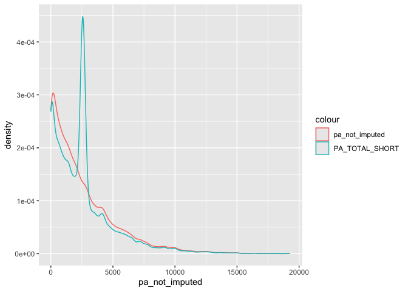

## Missing data


``` r
data <- read_csv("can_path_data.csv")
```

```
## Warning: One or more parsing issues, call `problems()` on your data frame for details,
## e.g.:
##   dat <- vroom(...)
##   problems(dat)
```

```
## Rows: 41187 Columns: 440
## ── Column specification ────────────────────────────────────────────────────────
## Delimiter: ","
## chr   (5): ID, MSD11_PR, MSD11_REG, MSD11_ZONE, MSD11_CMA
## dbl (425): ADM_STUDY_ID, SDC_GENDER, SDC_AGE_CALC, SDC_MARITAL_STATUS, SDC_E...
## lgl  (10): DIS_MH_BIPOLAR_EVER, DIS_GEN_DS_EVER, DIS_GEN_SCA_EVER, DIS_GEN_T...
## 
## ℹ Use `spec()` to retrieve the full column specification for this data.
## ℹ Specify the column types or set `show_col_types = FALSE` to quiet this message.
```

``` r
data <- data %>% select(ID:HS_GEN_HEALTH, PA_TOTAL_SHORT, PM_BMI_SR, contains("_EVER"), contains("WRK_"))
```

### We want a quick summary of missing data for each variable. This function is from the `naniar` package. We have lots of variables so let's save this as a table that we inspect a little easier. 


``` r
missing_table <- miss_var_summary(data)
missing_table
```

```
## # A tibble: 195 × 3
##    variable                       n_miss pct_miss
##    <chr>                           <int>    <num>
##  1 DIS_MH_BIPOLAR_EVER             41171    100. 
##  2 DIS_GEN_DS_EVER                 41143     99.9
##  3 DIS_GEN_AIS_EVER                41143     99.9
##  4 DIS_GEN_HEMOPHILIA_EVER         41143     99.9
##  5 DIS_GEN_KS_EVER                 41143     99.9
##  6 DIS_GEN_TS_EVER                 41143     99.9
##  7 DIS_GEN_CAH_EVER                41141     99.9
##  8 DIS_GEN_CF_EVER                 41138     99.9
##  9 DIS_GEN_THALASSEMIA_EVER        41107     99.8
## 10 DIS_CARDIO_PREM_HD_FEMALE_EVER  41081     99.7
## # ℹ 185 more rows
```

We can see that we have around 100 variables with more than 85% missing. In general it will be hard to salvage those data with missing data techniques because we won't really have enough non-missing data to do much, and simple imputations (like mean) probably won't be meaningful because the sample mean with some data is probably very far away from the population mean. In missing data words, the data are MNAR (Missing Not at Random). Another possibility here for these data is that the participants did not have this outcome but it's coded as missing when maybe in real life it should be zero. The data from the data dictionary are coded as

* 0	Never had `diease`
* 1	Ever had `diease`
* 2	Presumed - Never had `diease`

But most of these variables have 99.9% missing. Let's take `DIS_GEN_DS_EVER` as an example 


``` r
table(data$DIS_GEN_DS_EVER)
```

```
## 
## FALSE 
##    44
```

OK. Interesting. This is read as logical by `read_csv` and there are 44 cells with `FALSE` as the contents and nothing else. So we don't even actually have data here. Let's see the other columns read as logical. 


``` r
data %>% 
  select_if(is_logical) %>% 
  glimpse()
```

```
## Rows: 41,187
## Columns: 10
## $ DIS_MH_BIPOLAR_EVER      <lgl> NA, NA, NA, NA, NA, NA, NA, NA, NA, NA, NA, N…
## $ DIS_GEN_DS_EVER          <lgl> NA, NA, NA, NA, NA, NA, NA, NA, NA, NA, NA, N…
## $ DIS_GEN_SCA_EVER         <lgl> NA, NA, NA, NA, NA, NA, NA, NA, NA, NA, NA, N…
## $ DIS_GEN_THALASSEMIA_EVER <lgl> NA, NA, NA, NA, NA, NA, NA, NA, NA, NA, NA, N…
## $ DIS_GEN_CAH_EVER         <lgl> NA, NA, NA, NA, NA, NA, NA, NA, NA, NA, NA, N…
## $ DIS_GEN_AIS_EVER         <lgl> NA, NA, NA, NA, NA, NA, NA, NA, NA, NA, NA, N…
## $ DIS_GEN_HEMOPHILIA_EVER  <lgl> NA, NA, NA, NA, NA, NA, NA, NA, NA, NA, NA, N…
## $ DIS_GEN_CF_EVER          <lgl> NA, NA, NA, NA, NA, NA, NA, NA, NA, NA, NA, N…
## $ DIS_GEN_KS_EVER          <lgl> NA, NA, NA, NA, NA, NA, NA, NA, NA, NA, NA, N…
## $ DIS_GEN_TS_EVER          <lgl> NA, NA, NA, NA, NA, NA, NA, NA, NA, NA, NA, N…
```

We have 10 variables that are logical so let's get rid of those.


``` r
### Select specific columns
logical_cols <- c("DIS_MH_BIPOLAR_EVER", "DIS_GEN_DS_EVER", "DIS_GEN_SCA_EVER", "DIS_GEN_THALASSEMIA_EVER", "DIS_GEN_CAH_EVER", "DIS_GEN_AIS_EVER", "DIS_GEN_HEMOPHILIA_EVER", "DIS_GEN_CF_EVER", "DIS_GEN_KS_EVER", "DIS_GEN_TS_EVER")

data <- data %>% select(!(logical_cols))
```

```
## Warning: Using an external vector in selections was deprecated in tidyselect 1.1.0.
## ℹ Please use `all_of()` or `any_of()` instead.
##   # Was:
##   data %>% select(logical_cols)
## 
##   # Now:
##   data %>% select(all_of(logical_cols))
## 
## See <https://tidyselect.r-lib.org/reference/faq-external-vector.html>.
## This warning is displayed once every 8 hours.
## Call `lifecycle::last_lifecycle_warnings()` to see where this warning was
## generated.
```

Now let's review again and filter out all variables with more than 85% missing. 


``` r
missing_table <- miss_var_summary(data)
```


``` r
data <- data %>%
          select(where(~sum(is.na(.x))/length(.x) < 0.85))

missing_table <- miss_var_summary(data)
```

We have now reduced our dataset to 92 variables down from the 184 we started with. We were not going to be able to do much with those variables anyway so not the end of the world. Hopefully, in your data you have a much higher quality on average. 

Now that we have a more manageable dataframe let's visualize missing with the package `visdat` to quickly visualize the entire dataframe and check missing.


``` r
vis_dat(data, warn_large_data = FALSE)
```

<!-- -->

We have fixed the problem with logical variables and those with too much missing to do anything with really. Now let's move on to what we can actually do. 

## You got some SPSS data! 

When you are dealing with missing values, you might want to replace values with a missing values (NA). This is useful in cases when you know the origin of the data and can be certain which values should be missing. For example, you might know that all values of “N/A”, “N A”, and “Not Available”, or -99, or -1 are supposed to be missing.

naniar provides functions to specifically work on this type of problem using the function replace_with_na. This function is the compliment to tidyr::replace_na, which replaces an NA value with a specified value, whereas naniar::replace_with_na replaces a value with an NA:

* `tidyr::replace_na`: Missing values turns into a value (NA –> -99)
* `naniar::replace_with_na`: Value becomes a missing value (-99 –> NA)

### A new geom 

The `naniar` package has a new geom we can use called `geom_miss_point()`. Recall when we did the age by physical activity scatter plot that `tidyverse` was removing 6763 rows due to missing. `geom_miss_point()` lets us visualize is happening. This is great for key exposure and outcome associations you are interested in testing. 


``` r
scatter_plot_miss <- ggplot(data, aes(x = SDC_AGE_CALC, y = PA_TOTAL_SHORT)) + 
                  geom_point(alpha = 0.2) + 
                  geom_smooth(colour = "red") + 
                  geom_smooth(method = "lm", colour = "#088da5") +
                  labs(x = "Age", y = "Physical Activity")
plot(scatter_plot_miss)
```

```
## `geom_smooth()` using method = 'gam' and formula = 'y ~ s(x, bs = "cs")'
```

```
## Warning: Removed 6763 rows containing non-finite outside the scale range
## (`stat_smooth()`).
```

```
## `geom_smooth()` using formula = 'y ~ x'
```

```
## Warning: Removed 6763 rows containing non-finite outside the scale range
## (`stat_smooth()`).
```

```
## Warning: Removed 6763 rows containing missing values or values outside the scale range
## (`geom_point()`).
```

<!-- -->


``` r
scatter_plot_no_miss <- ggplot(data, aes(x = SDC_AGE_CALC, y = PA_TOTAL_SHORT)) + 
                          geom_miss_point(alpha = 0.2) +                 
                          labs(x = "Age", y = "Physical Activity")
plot(scatter_plot_no_miss)
```

<!-- -->

There are missing across the entire association but it looks like perhaps fewer missing among people who are older than 70. 

### Shadow Matrix

`naniar` has a function to create what it calls a shadow matrix. Essentially, a dummy variable for each column that identifies missing yes/no and appends that variable to the dataframe. The new columns have a `_NA` label to identify them. This doubles the number of columns but lets you quickly visualize missing. 


``` r
data_shadow <- data %>% 
  bind_shadow()

## names(data_shadow) Not run
```

### Imputing missing data

Now we have a good idea what our missing data looks like. We could have made some different decisions depending on our study for the filtering of missing >85% but let's just keep moving for teaching purposes. Now we need to deal with our missing data. We know that for the most part the data are being read as numeric but are actually factor. That's ok so far but it's going to become a challenge in a minute. 

### Summarizing data with missing

By default R does not summarize well with missing data. We need to use list wise deletion to calculate means or medians.


``` r
summary(data$PA_TOTAL_SHORT)
```

```
##    Min. 1st Qu.  Median    Mean 3rd Qu.    Max.    NA's 
##       0     600    1782    2574    3732   19278    6763
```

``` r
data %>% summarise(n_pa = n_distinct(PA_TOTAL_SHORT),
          na_pa = sum(is.na(PA_TOTAL_SHORT)),
          median_pa = median(PA_TOTAL_SHORT), 
          mean_pa = median(PA_TOTAL_SHORT))
```

```
## # A tibble: 1 × 4
##    n_pa na_pa median_pa mean_pa
##   <int> <int>     <dbl>   <dbl>
## 1  3421  6763        NA      NA
```

Not that we get `NA` for median_pa and mean_pa. This is not because we don't have data but because R does not calculate the summary statistics if there are missing data. Now with `na.rm = TRUE`


``` r
data %>% summarise(n_pa = n_distinct(PA_TOTAL_SHORT),
          na_pa = sum(is.na(PA_TOTAL_SHORT)),
          median_pa = median(PA_TOTAL_SHORT, na.rm = TRUE), 
          mean_pa = median(PA_TOTAL_SHORT, na.rm = TRUE))
```

```
## # A tibble: 1 × 4
##    n_pa na_pa median_pa mean_pa
##   <int> <int>     <dbl>   <dbl>
## 1  3421  6763      1782    1782
```

Now we get a value for median and mean but we just removed all of the missing so we need to be careful here with just removing the data. 

### Mean imputation

The mean can be imputed using `impute_mean` from `naniar`, and is useful to explore structure in missingness, but are not recommended for use in analysis. 

#### Impute mean for a specific variable


``` r
data_shadow$pa_not_imputed <- data_shadow$PA_TOTAL_SHORT
data_shadow <- impute_mean_at(data_shadow, .vars = vars(PA_TOTAL_SHORT)) 
median(data_shadow$pa_not_imputed, na.rm = TRUE)
```

```
## [1] 1782
```

``` r
median(data_shadow$PA_TOTAL_SHORT)
```

```
## [1] 2379
```

``` r
ggplot(data_shadow, aes(x = pa_not_imputed, y = PA_TOTAL_SHORT, colour = PA_TOTAL_SHORT_NA)) + 
        geom_miss_point(alpha = 0.2)
```

<!-- -->

When we input the mean we don't change the mean so it's not really worth looking at differences in the mean. But we look at the median we can see differences. Also, I plotted the imputed data `PA_TOTAL_SHORT` and the not imputed data `pa_not_imputed`. We can see they are almost identical but there are values imputed with the mean for `PA_TOTAL_SHORT`. 

###  Multivariate Imputation by Chained Equations (MICE)

https://amices.org/Winnipeg/Practicals/Practical_I.html


https://amices.org/mice/ 

Some examples for impute_mean are now given:

### Other ways R encodes missing(ish) data

#### NaN and Inf are related to NA.

##### NaN

NaN represents `Not a Number`. NaN can be generated, for example, by taking the log of a negative number. They can be tested for with is.nan()


``` r
x <- log(c(1, -1, NA))
```

```
## Warning in log(c(1, -1, NA)): NaNs produced
```

``` r
x
```

```
## [1]   0 NaN  NA
```

``` r
is.nan(x)
```

```
## [1] FALSE  TRUE FALSE
```

##### Inf

Inf and -Inf represent positive and negative infinite numbers respectively. These can be generated, for example, by dividing by zero, and tested for with is.infinite()


``` r
y <- c(-Inf, 0, Inf)
is.infinite(y)
```

```
## [1]  TRUE FALSE  TRUE
```

#### Comparison of missing types

The test is.finite() it TRUE if the value is numeric and not NA, NaN, Inf or -Inf.

| value |	is.na |	is.nan |	is.infinite |	is.finite |
| ----- | ------ | ------ | ------ |
| 1 	| FALSE |	FALSE |	FALSE |	TRUE
| NA 	| TRUE |	FALSE |	FALSE |	FALSE
| NaN |	TRUE |	TRUE |	FALSE |	FALSE
| Inf |	FALSE |	FALSE |	TRUE |	FALSE
| -Inf |	FALSE |	FALSE |	TRUE |	FALSE


https://cran.r-project.org/web/views/MissingData.html

https://cran.r-project.org/web/packages/naniar/vignettes/getting-started-w-naniar.html

https://towardsdatascience.com/smart-handling-of-missing-data-in-r-6425f8a559f2

https://cran.r-project.org/web/packages/missCompare/vignettes/misscompare.html

https://biostats-r.github.io/biostats/workingInR/050_missing_values.html

https://epirhandbook.com/new_pages/missing_data.html
