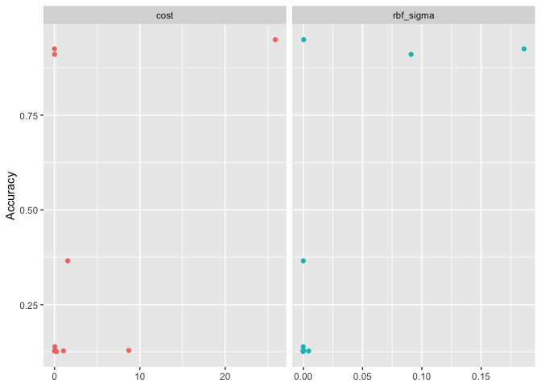

``` r
knitr::opts_chunk$set(echo = TRUE)
library(tidyverse)
library(tidymodels)
library(sjPlot)
library(finalfit)
library(knitr)
library(gtsummary)
library(mlbench)
library(kernlab)
library(vip)
library(rsample)
library(tune)
library(recipes)
library(yardstick)
library(parsnip)
library(glmnet)
library(themis)
library(microbenchmark)
library(palmerpenguins)
```

# Support Vector Machines

## Research question and data

We are using an imputed (ie. no missing data) version of the CanPath student dataset [https://canpath.ca/student-dataset/](https://canpath.ca/student-dataset/). The nice thing about this dataset is that it's pretty big in terms of sample size, has lots of variables, and we can use it for free. 

Our research question is:  

- **Can we develop a model that will predict type 2 diabetes**

### Reading in data

Here are reading in data and getting organized to run our models. 


``` r
data <- read_csv("mice_all_imp.csv")
```

```
## Rows: 41187 Columns: 93
## ── Column specification ────────────────────────────────────────────────────────
## Delimiter: ","
## chr  (1): ID
## dbl (92): ADM_STUDY_ID, SDC_GENDER, SDC_AGE_CALC, SDC_MARITAL_STATUS, SDC_ED...
## 
## ℹ Use `spec()` to retrieve the full column specification for this data.
## ℹ Specify the column types or set `show_col_types = FALSE` to quiet this message.
```

``` r
data <- data %>% mutate_at(3, factor)
data <- data %>% mutate_at(5:6, factor)
data <- data %>% mutate_at(8:9, factor)
data <- data %>% mutate_at(12:13, factor)
data <- data %>% mutate_at(15:81, factor)
data <- data %>% mutate_at(83:93, factor)

table(data$DIS_DIAB_EVER)
```

```
## 
##     0     1     2 
## 36714  3114  1359
```

``` r
data <- data %>%
	mutate(diabetes = case_when(
		DIS_DIAB_EVER == 0 ~ 0,
		DIS_DIAB_EVER == 1 ~ 1,
		DIS_DIAB_EVER == 2 ~ 0)) %>%
		mutate(diabetes = as.factor(diabetes))

table(data$DIS_DIAB_EVER, data$diabetes)
```

```
##    
##         0     1
##   0 36714     0
##   1     0  3114
##   2  1359     0
```

``` r
data$DIS_DIAB_EVER <- NULL
```


``` r
data <- select(data, diabetes, SDC_AGE_CALC, SDC_EDU_LEVEL, PM_BMI_SR, HS_GEN_HEALTH, WRK_FULL_TIME, SMK_CIG_EVER, SDC_INCOME, PA_TOTAL_SHORT, HS_ROUTINE_VISIT_EVER, PSE_ADULT_WRK_DURATION, DIS_RESP_SLEEP_APNEA_EVER, SDC_EDU_LEVEL_AGE, SDC_GENDER)
```

# Support Vector Machine

### Creating training and testing data


``` r
set.seed(10)

#### Cross Validation Split
cv_split <- initial_validation_split(data, 
                            strata = diabetes, 
                            prop = c(0.70, 0.20))

# Create data frames for the two sets:
train_data <- training(cv_split)
table(train_data$diabetes)
```

```
## 
##     0     1 
## 26640  2190
```

``` r
test_data  <- testing(cv_split)
table(test_data$diabetes)
```

```
## 
##    0    1 
## 3813  306
```

### V folds


``` r
folds <- vfold_cv(training(cv_split), v = 5, strata = diabetes)
```

## Recipe


``` r
svm_recipe <- 
  recipe(diabetes ~ ., data = train_data) %>%
  step_dummy(all_nominal_predictors()) %>%
  step_zv(all_predictors(), -all_outcomes()) %>%
  step_normalize(all_numeric_predictors())
```

step_smotenc(diabetes, over_ratio = 0.9) %>%

### Model 

Here we use the tidy models to setup a model using `kernlab` and `classification` and we call the specific model we want to fit. 

* __cost__ (default: 1.0): A positive number for the cost of predicting a sample within or on the wrong side of the margin. 
Low cost, points that are misclassified are penalized less than with a higher cost. 
How much do we are about misclassification? 
* __margin__ (default: 0.1): Insensitivity margin, how wide a margin do we want to make to select the support vectors. (Does not apply in classification)
* __rbf_sigma__  rbf_sigma (no default – estimated based on data) : A positive number for the radial basis function. Tune me!


``` r
svm_model <- svm_poly(degree = 1) %>% 
  set_mode("classification") %>%
  set_engine("kernlab")
svm_model
```

```
## Polynomial Support Vector Machine Model Specification (classification)
## 
## Main Arguments:
##   degree = 1
## 
## Computational engine: kernlab
```

### Workflow

```{}
svm_grid <- grid_regular(
              rbf_sigma(range = c(-2, 2)),
              levels = 2  
            )
```


``` r
roc_res <- metric_set(roc_auc) 
```

##### NOT RUN

```{}
svm_workflow <- 
  workflow() %>% 
  add_model(svm_model) %>% 
  add_recipe(svm_recipe) %>% 
    tune_grid(resamples = folds,
              metrics = roc_res,
                control = control_grid(save_pred = FALSE, 
                verbose = TRUE)) ## Edit for running live
```

```{}
collect_metrics(svm_initial)
```

### Pivot to toy data

Data example is a combination of the R4 Data Science tutorial and the Emil Hvitfeldt one. 


``` r
penguins_df <- penguins %>%
  filter(!is.na(sex)) %>% # discarding NA obs
  select(-year, -island) # not useful

cv_split <- initial_validation_split(penguins_df, 
                            strata = sex, 
                            prop = c(0.70, 0.20))

# Create data frames for the two sets:
train_data <- training(cv_split)
table(train_data$sex)
```

```
## 
## female   male 
##    115    117
```

``` r
test_data  <- testing(cv_split)
table(test_data$sex)
```

```
## 
## female   male 
##     17     17
```

``` r
folds <- vfold_cv(training(cv_split), v = 5, strata = sex)

roc_res <- metric_set(roc_auc) # accuracy, a classification metric
```


``` r
svm_recipe <- 
  recipe(sex ~ ., data = train_data) %>%
  step_dummy(all_nominal_predictors()) %>%
  step_zv(all_predictors(), -all_outcomes()) %>%
  step_normalize(all_numeric_predictors())
```


``` r
svm_model <-
  svm_rbf(cost = tune(), rbf_sigma = tune()) %>%
  set_mode("classification") %>%
  set_engine("kernlab")
```


``` r
svm_grid <- grid_regular(
              rbf_sigma(range = c(0, 5)),
              cost(range = c(5, 20)),
              levels = 2  
            )
```


``` r
svm_workflow <- 
  workflow() %>% 
  add_model(svm_model) %>% 
  add_recipe(svm_recipe) %>% 
    tune_grid(resamples = folds,
              metrics = roc_res,
                control = control_grid(save_pred = TRUE, 
                verbose = FALSE)) ## Edit for running live

collect_metrics(svm_workflow)
```

```
## # A tibble: 10 × 8
##        cost rbf_sigma .metric .estimator  mean     n std_err .config            
##       <dbl>     <dbl> <chr>   <chr>      <dbl> <int>   <dbl> <chr>              
##  1  1.06     5.48e- 6 roc_auc binary     0.128     5  0.0404 Preprocessor1_Mode…
##  2 25.9      3.66e- 4 roc_auc binary     0.949     5  0.0165 Preprocessor1_Mode…
##  3  0.00410  1.86e- 1 roc_auc binary     0.925     5  0.0245 Preprocessor1_Mode…
##  4  1.56     3.58e- 5 roc_auc binary     0.366     5  0.178  Preprocessor1_Mode…
##  5  8.71     7.14e- 8 roc_auc binary     0.129     5  0.0403 Preprocessor1_Mode…
##  6  0.0875   1.53e- 7 roc_auc binary     0.128     5  0.0404 Preprocessor1_Mode…
##  7  0.00860  9.09e- 2 roc_auc binary     0.910     5  0.0292 Preprocessor1_Mode…
##  8  0.00125  4.54e- 3 roc_auc binary     0.128     5  0.0398 Preprocessor1_Mode…
##  9  0.239    5.63e- 9 roc_auc binary     0.127     5  0.0392 Preprocessor1_Mode…
## 10  0.0444   2.57e-10 roc_auc binary     0.139     5  0.0423 Preprocessor1_Mode…
```


``` r
svm_workflow %>%
  collect_metrics() %>%
  filter(.metric == "roc_auc") %>%
  select(mean, cost, rbf_sigma) %>%
  pivot_longer(cost:rbf_sigma,
    values_to = "value",
    names_to = "parameter"
  ) %>%
  ggplot(aes(value, mean, color = parameter)) +
  geom_point(show.legend = FALSE) +
  facet_wrap(~parameter, scales = "free_x") +
  labs(x = NULL, y = "Accuracy")
```

<!-- -->


``` r
svm_best <- 
  svm_workflow %>% 
  select_best(metric = "roc_auc")

svm_best
```

```
## # A tibble: 1 × 3
##    cost rbf_sigma .config              
##   <dbl>     <dbl> <chr>                
## 1  25.9  0.000366 Preprocessor1_Model02
```

``` r
svm_auc_fit <- 
  svm_workflow %>% 
  collect_predictions(parameters = svm_best) 
```


``` r
final_model <- finalize_model(
                  svm_model,
                  svm_best
                )

final_model
```

```
## Radial Basis Function Support Vector Machine Model Specification (classification)
## 
## Main Arguments:
##   cost = 25.8650214195144
##   rbf_sigma = 0.000365583793705718
## 
## Computational engine: kernlab
```

### Variable Importance

```{}

```

### Final Model Fit


``` r
final_svm_workflow <- workflow() %>%
                      add_recipe(svm_recipe) %>%
                      add_model(final_model)

final_results <- final_svm_workflow %>%
                    last_fit(cv_split)

final_results %>%
  collect_metrics()
```

```
## # A tibble: 3 × 4
##   .metric     .estimator .estimate .config             
##   <chr>       <chr>          <dbl> <chr>               
## 1 accuracy    binary        0.941  Preprocessor1_Model1
## 2 roc_auc     binary        0.993  Preprocessor1_Model1
## 3 brier_class binary        0.0352 Preprocessor1_Model1
```

# Resources

1. https://r4ds.github.io/bookclub-tmwr/svm-model-as-motivating-example.html
2. https://emilhvitfeldt.github.io/ISLR-tidymodels-labs/09-support-vector-machines.html

## Session Info


``` r
sessionInfo()
```

```
## R version 4.4.2 (2024-10-31)
## Platform: aarch64-apple-darwin20
## Running under: macOS Sequoia 15.3.2
## 
## Matrix products: default
## BLAS:   /Library/Frameworks/R.framework/Versions/4.4-arm64/Resources/lib/libRblas.0.dylib 
## LAPACK: /Library/Frameworks/R.framework/Versions/4.4-arm64/Resources/lib/libRlapack.dylib;  LAPACK version 3.12.0
## 
## locale:
## [1] en_US.UTF-8/en_US.UTF-8/en_US.UTF-8/C/en_US.UTF-8/en_US.UTF-8
## 
## time zone: America/Regina
## tzcode source: internal
## 
## attached base packages:
## [1] stats     graphics  grDevices utils     datasets  methods   base     
## 
## other attached packages:
##  [1] palmerpenguins_0.1.1 microbenchmark_1.5.0 themis_1.0.3        
##  [4] glmnet_4.1-8         Matrix_1.7-1         vip_0.4.1           
##  [7] kernlab_0.9-33       mlbench_2.1-6        gtsummary_2.0.4     
## [10] knitr_1.49           finalfit_1.0.8       sjPlot_2.8.17       
## [13] yardstick_1.3.2      workflowsets_1.1.0   workflows_1.1.4     
## [16] tune_1.2.1           rsample_1.2.1        recipes_1.1.0       
## [19] parsnip_1.2.1        modeldata_1.4.0      infer_1.0.7         
## [22] dials_1.3.0          scales_1.3.0         broom_1.0.7         
## [25] tidymodels_1.2.0     lubridate_1.9.4      forcats_1.0.0       
## [28] stringr_1.5.1        dplyr_1.1.4          purrr_1.0.2         
## [31] readr_2.1.5          tidyr_1.3.1          tibble_3.2.1        
## [34] ggplot2_3.5.1        tidyverse_2.0.0     
## 
## loaded via a namespace (and not attached):
##  [1] Rdpack_2.6.2        rlang_1.1.5         magrittr_2.0.3     
##  [4] furrr_0.3.1         compiler_4.4.2      vctrs_0.6.5        
##  [7] lhs_1.2.0           crayon_1.5.3        pkgconfig_2.0.3    
## [10] shape_1.4.6.1       fastmap_1.2.0       backports_1.5.0    
## [13] labeling_0.4.3      utf8_1.2.4          rmarkdown_2.29     
## [16] prodlim_2024.06.25  tzdb_0.4.0          nloptr_2.1.1       
## [19] bit_4.5.0.1         jomo_2.7-6          xfun_0.50          
## [22] cachem_1.1.0        jsonlite_1.8.9      pan_1.9            
## [25] sjmisc_2.8.10       ggeffects_2.1.0     parallel_4.4.2     
## [28] R6_2.5.1            bslib_0.8.0         stringi_1.8.4      
## [31] boot_1.3-31         parallelly_1.41.0   rpart_4.1.23       
## [34] jquerylib_0.1.4     Rcpp_1.0.14         iterators_1.0.14   
## [37] future.apply_1.11.3 splines_4.4.2       nnet_7.3-19        
## [40] timechange_0.3.0    tidyselect_1.2.1    rstudioapi_0.17.1  
## [43] yaml_2.3.10         timeDate_4041.110   codetools_0.2-20   
## [46] sjlabelled_1.2.0    listenv_0.9.1       lattice_0.22-6     
## [49] withr_3.0.2         evaluate_1.0.3      future_1.34.0      
## [52] survival_3.7-0      pillar_1.10.1       mice_3.17.0        
## [55] foreach_1.5.2       reformulas_0.4.0    insight_1.0.1      
## [58] generics_0.1.3      vroom_1.6.5         hms_1.1.3          
## [61] munsell_0.5.1       minqa_1.2.8         globals_0.16.3     
## [64] class_7.3-22        glue_1.8.0          ROSE_0.0-4         
## [67] tools_4.4.2         data.table_1.16.4   lme4_1.1-36        
## [70] gower_1.0.2         grid_4.4.2          rbibutils_2.3      
## [73] datawizard_1.0.0    ipred_0.9-15        colorspace_2.1-1   
## [76] nlme_3.1-166        performance_0.13.0  cli_3.6.3          
## [79] DiceDesign_1.10     lava_1.8.1          sjstats_0.19.0     
## [82] gtable_0.3.6        GPfit_1.0-8         sass_0.4.9         
## [85] digest_0.6.37       farver_2.1.2        htmltools_0.5.8.1  
## [88] lifecycle_1.0.4     hardhat_1.4.0       mitml_0.4-5        
## [91] bit64_4.6.0-1       MASS_7.3-61
```


